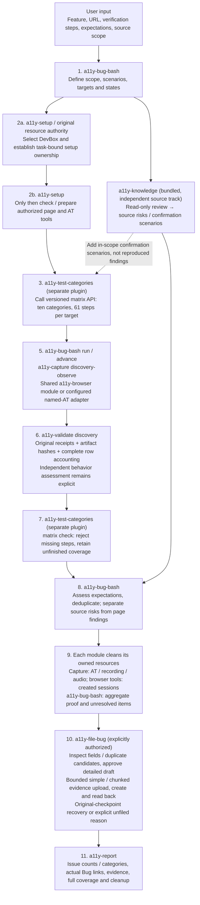
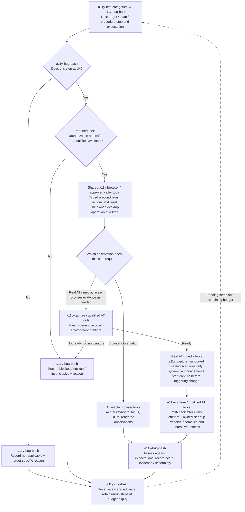

# Bug Bash plugin design

**English** | [简体中文](BUG-BASH-ARCHITECTURE.zh-CN.md)

Maintain both language versions together. This document describes what the plugin
does, its child capabilities, how they work together, and the user-facing input
and output. Current behavior and proposed extensions are marked separately.
Baseline: version 0.19.0, 2026-09-14. The source orchestration chain is implemented;
deployment and live qualification are separate. Supported adapters, not a generic
promise about every browser/AT combination, define executable coverage.

## 1. What is Bug Bash?

`a11y-bug-bash` is a feature-level accessibility discovery plugin. A user describes
a feature and how to verify it; the plugin turns that information into a coverage
plan, checks the authorized page, reviews relevant source and produces a report.

For example, an item picker is not just a dialog to scan. Its journeys include
opening, searching, navigating results, selecting, confirming, cancelling and
reopening. The plugin checks applicable keyboard, focus, semantics, visual,
dynamic-state and real assistive-technology (AT) behavior across those journeys.
It checks reachable, relevant combinations, not every theoretical combination.

Bug Bash owns feature scope, planning and coordination; `a11y-report` owns the final report. Reusable
capabilities supply knowledge, environment checks, page observations and source
analysis. The user uses one entrypoint: `/a11y-bug-bash`.

It discovers problems; it does not automatically fix code, build the product,
file Bugs, create PRs or publish evidence. Those are separately authorized tasks.
A completed round is not accessibility certification.

## 2. Which child plugins and modules does it use?

"Child plugin" here means a reusable capability in the composition, not necessarily
another installed package or another agent. **Knowledge and setup are bundled
internally. Test categories are a separately installed dependency, never copied
into Bug Bash. Filing and aggregate reporting have dedicated plugins.**

| Component | Responsibility | Input -> output | Integration and status |
|---|---|---|---|
| Bug Bash coordinator | Understand scope, plan coverage, route checks, aggregate results | Feature context + verification steps -> coverage plan + report | Skill plus durable `create/configure/run/advance/reconcile/cancel` CLI; append-only history and bounded execution |
| `a11y-knowledge` | Supply applicable A11y guidance and read-only source review | Stack/version, scoped source and question -> cited guidance or source-supported risks | Already bundled under `modules/a11y-knowledge/`; no extra install or separate agent |
| `a11y-setup` | Establish DevBox resource authority, then prepare selected tools | Task + host requirements -> original ownership, scoped inventory and preparation | Includes former resources tools; shared setup module remains bundled. No host change before authorized ownership |
| `a11y-test-categories` | Own all ten categories and every numbered step | Target/state inventory -> complete matrix and accounting | Separate installation; explicit `pluginRoots.testCategories`, version/hash-bound API. No bundled copies or live backend |
| Browser checks / shared `a11y-browser` module | Exercise keyboard, focus, rendered semantics and text | Authorized connection + typed scenario -> page observations and artifacts | Implemented in `browser/` and `runtime/browser-contract.mjs`, bundled into Bug Bash/capture; not a separate installed package |
| `a11y-capture` | Collect scenario/AT/media observations | Owned evaluator + sealed `discovery-observe` request -> row-bound evidence | Typed discovery action implemented; fresh preflight/postcheck and independent assessment required. Unsupported named-AT adapters remain gaps |
| `a11y-validate` | Validate discovery history, receipts, bytes and category accounting | Original task ID -> integrity, accepted behavior assessments and gaps | `a11y_validate_discovery`, or the same package-local `validate` CLI; evidence-v1 remains separate |
| `a11y-file-bug` | Create explicitly approved Bugs after validation | Validated finding + detailed draft + approved evidence -> actual Bug ID/URL and attachments | Process fields/duplicate candidates, bounded chunked WIT upload, correlation readback and checkpoint continuation; video still requires real playback review |
| `a11y-report` | Produce the overall report | Coverage + observations + filing results + cleanup -> private report | Independent MCP plugin; one shared generator also backs the coordinator CLI |

Planning stays in the coordinator; filing and reporting have independent entrypoints.
Browser behavior is a shared module; extract at most one new
`a11y-browser` package when independent reuse justifies it. Real-AT adapters belong
within capture, not one mandatory package per AT.

**Not supplied as generic built-ins:** NVDA/Narrator/Voice Access capture drivers,
authenticated/server-backed browser transactions, scanners/visual measurements,
cloud resource recovery and credential brokers. Their typed integration boundaries
exist, but each requires an actual deployment implementation and qualification.
The source orchestration and filing chain must not be advertised as those missing
drivers, or as complete real-world coverage merely because every matrix row exists.

Bug Bash does not require every sibling plugin to be installed. `a11y-intake` is
optional if an authorized work item supplies context. `a11y-publish`,
`a11y-workflow` and AgentOW are not discovery dependencies.

## 3. How are they composed and used?

### Current composition

Installing Bug Bash loads its public skill and bundled modules. The calling
Copilot follows that skill: it reads bundled setup/knowledge and the installed category plugin instructions and
uses tools actually available in the session. The package has no MCP server of
its own and does not automatically invoke sibling plugins by name. The calling
Copilot uses the bundled [durable CLI](BUG-BASH-RUNTIME.md) to execute accepted
plans through explicitly configured providers. `run` continues safe deterministic
steps; it yields for source analysis, pending callbacks or a bounded limit.

Before page work, the separately installed test-categories plugin expands every in-scope
target/state into all ten categories and their numbered steps. Every applicable
step must run; not-applicable steps need target-specific reasons. No representative
sampling substitutes for this inventory. Its local matrix gate rejects missing
steps and identifies unfinished coverage; actual evidence assessment remains
separate. Unknown inventory completeness, unavailable AT or budget exhaustion
means partial, not a smaller denominator.

#### Overall flow: who performs each step?

This diagram shows default `both` mode. **Each node names its executor:
"bundled" needs no extra installation, "conditional" requires a connected capability
and supported inputs.** The calling Copilot supplies reasoning; the durable CLI
records the plan and dispatches/validates its deterministic child operations.



Missing prerequisites create gaps for affected steps, not deleted steps. Actual
ownership must precede any host preparation or live interaction; setup resource status is not acquire.
Never fabricate Bugs, leases or capture requests just to route through a named
plugin. If inventory needs live discovery, first establish readiness and ownership,
then update the original inventory and regenerate the complete matrix.

#### Within a scenario: how do page actions connect to checks?

Step 5 above is not "open a page and take one screenshot." It iterates the full matrix:



For example, to check picker search-result announcements: browser tools open the
picker, real Narrator/NVDA tools start capture, then search input triggers the
result change and the actual announcement is assessed. If a supported sealed
capture scenario owns both triggering and collection, let it execute them; do not
trigger again externally. **`a11y-capture` collects evidence rather than deciding
behavioral correctness; `a11y-validate` checks compatible evidence integrity,
not feature correctness.** Screenshots or accessibility trees cannot replace
actual speech.

The coordinator passes only scenario-specific context and returns results to the
original matrix row:

| Caller -> executor | Input | Output |
|---|---|---|
| Bug Bash -> `a11y-setup` | Task, DevBox and required page/AT capabilities | Original resource authority first, then scoped preparation and gaps |
| Bug Bash -> `a11y-test-categories` | Target/state inventory; original inventory and full result matrix at reconciliation | All ten category procedures; coverage accounting, not behavioral PASS |
| Bug Bash -> `a11y-knowledge` | Scoped source, revision and stack | Source risks and confirmation scenarios, not reproduced page findings |
| Bug Bash -> shared `a11y-browser` module | Typed preconditions, action sequence, target state and reset | Scenario-bound browser observations and per-capture health artifacts |
| Bug Bash -> AT/media tools (conditional `a11y-capture`) | Owned evaluator, real tools, supported scenario and evidence requirements | Actual output/artifacts, or why execution was unavailable |
| Bug Bash -> `a11y-validate` discovery | Original task ID and private operation store | Verified receipts/bytes, category accounting and separately identified trusted behavior assessments |
| Bug Bash -> each module/tool, then original resource authority | Original operation/ownership identity and state changed by this run | Module-owned cleanup proof, unresolved effects and separately authorized release results |
| Bug Bash -> `a11y-file-bug` | Validated finding, detailed environment/cause/reproduction and explicit hash-bound approval | Actual Bug and reviewed attachments, or a precise skip/failure |
| Bug Bash -> `a11y-report` -> user | All results, filing receipts, evidence, gaps and cleanup | Concise issue-count/category summary, Bug links and immutable private report |

**Cleanup belongs to the capability that created or changed the resource.**
Capture owns recording/AT/audio lifecycle, including fresh preflight and
postchecks after every attempt, not just the first setup or successful captures.
Browser tools own created sessions and temporary state, not borrowed authenticated
contexts or foreign tabs. Bug Bash aggregates actual proof and unresolved items.
The original resource authority still owns token-bound release.

There is no standalone operations plugin. Narrow media/NVDA exception recovery
belongs to `a11y-capture`; full-workflow progress and cleanup coordination belong
to optional `a11y-workflow`, which is not a Bug Bash prerequisite. Pending-effect
reconciliation remains shared internal code. These boundaries do not add a
generic live provider: only qualified connections can execute the capture
lifecycle, and an unknown outcome never authorizes re-triggering capture.

The diagrams show `both`, not mandatory execution in every mode: `page-only`
omits the source track; `source-only` reads source without browser, AT or host
setup; `plan-only` delivers after planning and matrix generation without executing
procedures. Source risks need runtime observation to become page findings, and
source/build binding to establish the page's root cause.

Source analysis may proceed independently of page work. Browser, focus, AT and
recording operations sharing one desktop are serial. Missing AT blocks its rows,
not unrelated browser checks; missing page access does not block authorized source
review. Gaps remain in the report.

### Executable composition

The package-local dispatcher resolves stable capability contracts to configured providers,
validates inputs and pins the selected versions for the run. It carries a versioned
coverage plan through child operations and reconciles their results before reporting.
Providers enforce authorization and desktop ownership; retrieved skills cannot
grant either. Scenario details load only when needed.

`create` expands the inventory into every procedure step. `configure` binds
unexecuted rows to concrete scenarios; `inventory` only adds targets/states.
`run`/`advance` preserve dependencies, deadlines, gaps and original operation IDs.
Cleanup and delivery have their own receipts. Plan/source-only tasks can deliver
verified local files without any live provider. Adaptive provider learning remains
a future extension; it cannot drop required checks or alter submitted operations.

The shipped native browser module is bounded to approved anonymous/client-side
HTTPS scenarios. Authenticated transactions, scanners, visual measurement and
named real AT require explicit compatible deployment adapters; their absence is
reported, never replaced with DOM evidence or silently treated as complete.

## 4. How does a user run it?

### Install once

```powershell
copilot plugin marketplace add kaixun96/dev.A11yAssist
copilot plugin install a11y-bug-bash@a11y-assist
copilot plugin install a11y-test-categories@a11y-assist
copilot plugin install a11y-file-bug@a11y-assist
copilot plugin install a11y-report@a11y-assist
```

The commands show the complete composition: omit file-bug when not filing and
omit the standalone report install when using the coordinator's shared report CLI.
Categories must be installed separately with their real root in
`pluginRoots.testCategories`; missing dependencies fail without fallback.
Restart Copilot. Knowledge/setup need no separate installation.
Live page checks need an existing authorized Windows DevBox browser connection;
real AT needs its own usable connection and exclusive desktop ownership.
The installation supplies neither browser/AT binaries nor a live connection.
Plan/source-only work does not need Windows setup.

### Supply the feature, not a completed questionnaire

Provide what is known in natural language. Bug Bash organizes it into context and
a plan; it asks only for missing facts that block a meaningful next check.
Do not provide passwords, tokens or cookies.

| Input | When needed | Example |
|---|---|---|
| Feature purpose and scope | All modes | Users search items, choose one and confirm; exclude admin settings |
| Verification steps and expected behavior | All modes | Open, search, choose, confirm; Cancel restores focus |
| Authorized page/environment and safe data | Page checks | Test URL, disposable fixture, required flags and permissions |
| Source scope | Source review | Read-only component/style paths or supplied snippets |
| Build/source revision | When known | Actual deployed build and source commit, or explicitly unknown |
| Requested mode and priorities | Optional; default `both` | Prioritize keyboard/focus; request NVDA output if in scope |
| Existing connections and ownership | Live page/AT work | Approved browser/AT access; do not invent a connection |
| Budget and private output location | Establish before execution | 30 minutes; an authorized private directory |

### Example request

```text
/a11y-bug-bash Check the item-picker feature.
Purpose: search items, select one and confirm.
Page: <authorized test URL>; data/flags: <safe fixture>.
Verify: open, search, navigate results, select and confirm.
Also check Cancel, empty results, a recoverable error and reopen.
Expected: keyboard operation works; Cancel returns focus to the opener;
selection and search status are accessible.
Source: <read-only component/style paths>; revision: <known or unknown>.
Use my existing authorized browser connection.
Mode: both. Prioritize keyboard and focus; check NVDA if available.
Budget: 30 minutes. Save to <private output directory>.
Separate page bugs, source risks and missing coverage. Do not fix or file.
```

These are prompt fields, not CLI flags or a request to install missing tools.

| Mode | What runs | What the user receives |
|---|---|---|
| `both` (default) | Page checks and read-only source review where authorized/available | Combined report; unavailable requested track remains a gap |
| `page-only` | Authorized page checks; no product source reading | Page findings, evidence and page coverage gaps |
| `source-only` | Read-only source review; no browser or host setup | Source-supported risks and suggested runtime confirmation |
| `plan-only` | Planning only; no page/source execution or host setup | Coverage matrix, required capabilities and missing inputs |

If the budget runs out, Bug Bash reports partial coverage and prioritizes the
remaining work. It does not silently extend the run or omit unfinished rows.

## 5. What does it output?

The result is a private Markdown report with a coverage matrix and references to
actual evidence. Media exists only when the relevant tool really captured it.
The user receives the report location and a concise summary, not automatically
created Bugs or PRs.

| Report section | Content |
|---|---|
| Scope and outcome | Feature, mode, environment/build, budget, tested/excluded scope and outcome |
| Coverage matrix | Original inventory; each target/state/category/step, scenario, expectation, tool, status and evidence/gap; local accounting summary |
| Page-reproduced findings | Impact, exact steps, expected/observed behavior, repeatability and evidence |
| Source-supported risks | Source location/revision, reasoning, uncertainty and runtime confirmation needed |
| Questions and gaps | Missing context/tools, blocked/unrun/inconclusive checks and next safe action |
| Evidence index | Actual private artifact locations, timestamps, scenario/build/tool bindings and limits |
| Cleanup and resume | Restored owned resources, unresolved effects, remaining work and delivery status |

Illustrative output shape only, **not a real execution result**:

```text
Feature: Item picker
Outcome: partial
Coverage: <all inventoried target/states x all category steps>;
          <executed / applicable>, <blocked / not-run / inconclusive>
F01 [page-reproduced]: Cancel leaves focus outside the expected opener.
    Includes actual reproduction steps, expected/observed focus and evidence.
R01 [source-supported-risk]: Search status update may lack an announcement.
    Includes source location/revision; real-AT confirmation still required.
Gap: NVDA search-status check blocked because the AT connection is unavailable.
Evidence: <references to captured artifacts; do not fabricate files>
Cleanup: <actual restoration/release outcome>
Next: establish authorized AT capability and run the remaining row.
```

Rows use `planned`, `observed-no-issue`, `finding`, `blocked`, `not-run`,
`not-applicable` or `inconclusive`. Keep them all; explain non-applicability.
The report outcome is `complete`, `partial`, `blocked` or `plan-only`.
`complete` requires conclusive coverage of requested applicable rows, applicable
cleanup and delivered results. Finding defects can still complete the round.
Zero findings does not mean the feature is fully accessible.

## 6. What makes the composition reliable?

| Requirement | How it is demonstrated |
|---|---|
| Child capabilities work independently | Validate input/output contracts and supported host/provider combinations |
| The assembled flow really runs | Exercise healthy and deliberately broken fixtures, then an authorized real feature |
| Claims match evidence | Separate integrity checks from behavior assessment; real AT claims require real named-AT output |
| Missing capabilities remain visible | Keep blocked/unrun rows while continuing independent authorized checks |
| Interruptions do not lose or duplicate work | Persist rows and operation identity; reconcile unknown effects before retry; qualify supervision and task-scoped cancellation |
| Completion includes cleanup | Restore only owned settings/sessions and deliver the report; expose unresolved effects |

Implementation order is: qualify the current static path -> implement shared
discovery contracts and browser capability -> durable composition -> qualify
real-AT and real-feature profiles -> release supported combinations. Do not wait
for a new harness or adaptive skill graph before proving one end-to-end slice.
The detailed acceptance design is supporting material, not a claim of completion.

## 7. Supporting documents and references

- [Current Bug Bash contract](BUG-BASH.md): authoritative shipping behavior and boundaries.
- [Independent test-categories plugin](TEST-CATEGORIES.md): all-target procedures and local matrix gate.
- [Context template](../src/bug-bash/context.template.md), [coverage dimensions](../src/bug-bash/coverage.json)
  and [report template](../src/bug-bash/report.template.md).
- [Execution contracts and qualification](BUG-BASH-EXECUTION-DESIGN.md):
  detailed proposed schemas, ownership, recovery and acceptance gates.
- [Reusable large-plugin design method](COMPOSABLE-PLUGIN-DESIGN.md).
- [Research references and evidence limits](COMPOSABLE-PLUGIN-DESIGN.md#10-primary-sources-and-evidence-limits):
  DeepSeek Harness/Cordis and the related agent, skill-composition and memory work.
  These are background sources, not proof of implemented capability or measured gains.
