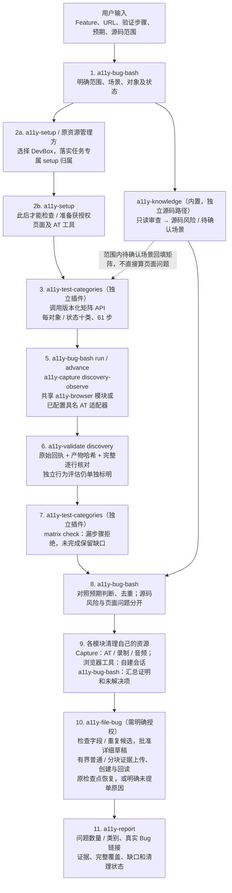
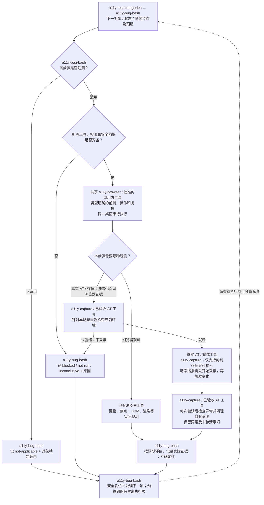

# Bug Bash 插件设计

[English](BUG-BASH-ARCHITECTURE.md) | **简体中文**

修改时同步维护中英文版本。本文说明插件是什么、有哪些子能力、如何组合，以及用户的输入和最终输出。基线：0.20.0 版本，2026-09-14；源码编排链路已实现，部署和现场验收另行进行。实际可执行范围由受支持适配器决定，不承诺任意浏览器/AT 组合都已可用。

## 1. Bug Bash 是什么？

`a11y-bug-bash` 是面向整个 feature 的无障碍问题发现插件。用户描述一个功能及其验证方式，插件将这些信息转成覆盖计划，检查获授权的页面、审查相关源码，最后给出报告。

例如，item picker 不只是一个等待扫描的对话框。它包含打开、搜索、浏览结果、选择、确认、取消、重新打开等用户路径。插件围绕这些路径检查适用的键盘、焦点、语义、视觉、动态状态，以及真实辅助技术（AT）行为。检查的是可达且相关的组合，不是所有理论组合。

Bug Bash 负责 feature 范围、计划和协调；`a11y-report` 负责最终整体报告。可复用能力提供知识、资源与环境准备、页面观测和源码分析。用户可通过 `/a11y-bug-bash` 编排这些能力。

它负责发现问题，不自动修改代码、构建产品、创建 Bug、创建 PR 或发布证据。这些属于单独授权的任务。完成一轮也不等于无障碍认证。

## 2. 包含和使用哪些子插件？

这里的“子插件”指组合中的可复用能力，不一定是另一个 Agent。**knowledge 和 setup 模块仍内置；test-categories 必须单独安装，Bug Bash 不复制规程和矩阵工具。提单与整体报告分别有专门插件。**

| 组成部分 | 负责什么 | 输入 -> 输出 | 组合方式与状态 |
|---|---|---|---|
| Bug Bash 协调器 | 理解范围、规划覆盖、分配检查、汇总结果 | Feature context + 验证步骤 -> 覆盖计划 + 报告 | Skill 加持久 `create/configure/run/advance/reconcile/cancel` CLI；追加式历史、有界执行 |
| `a11y-knowledge` | 提供适用 A11y 知识及只读源码审查 | 技术栈/版本、限定源码和问题 -> 有依据的指导或源码风险 | 已内置于 `modules/a11y-knowledge/`，无需另装或另开 Agent |
| `a11y-setup` | 先落实 DevBox 资源归属，再准备所需工具 | 任务与宿主需求 -> 原始归属、按需检查和准备 | 合并原 resources 工具；共享 setup 模块仍内置。取得实际授权归属前不变更宿主 |
| `a11y-test-categories` | 独占全部十类规程和逐步骤矩阵工具 | 完整对象/状态清单 -> 矩阵和覆盖核对 | 单独安装，明确配置 `pluginRoots.testCategories`，调用版本/哈希绑定 API；无内置副本或现场后端 |
| 浏览器检查 / 共享 `a11y-browser` 模块 | 键盘、焦点、渲染语义和文本检查 | 获授权连接 + 类型明确的场景 -> 页面观测与产物 | 已实现在 `browser/` 和 `runtime/browser-contract.mjs`，内置于 Bug Bash/capture；不是额外安装包 |
| `a11y-capture` | 采集场景/AT/媒体观测 | 自有 evaluator + 封存 `discovery-observe` 请求 -> 逐行证据 | 类型明确的 discovery 操作已实现；要求新鲜前后检查和独立评估。未支持的具名 AT 适配器保留缺口 |
| `a11y-validate` | 校验 discovery 历史、回执、字节和类别核对 | 原始任务 ID -> 完整性、已接受行为评估及缺口 | `a11y_validate_discovery`，或同源包内 `validate` CLI；与 evidence-v1 分开 |
| `a11y-file-bug` | 验证后按明确授权提单 | 已验证问题 + 详细草稿 + 已批准证据 -> 真实 Bug ID/URL 和附件 | 项目字段/重复候选检查、有界分块上传、关联回读和检查点继续；视频仍要求真实播放审阅 |
| `a11y-report` | 生成整体报告 | 覆盖、观测、提单结果、清理 -> 私有报告 | 独立 MCP 插件；与协调器 CLI 复用唯一生成实现 |

规划留在协调器；提单与报告有独立入口。浏览器能力保留共享模块，确实需要独立安装时再拆 `a11y-browser` 包。真实 AT 适配器归入 capture，不为每种 AT 增加一个必装包。

**已提供有明确范围的内置适配器：** 保持同一可见 Chromium 登录会话、明确授权的服务端请求、
固定哈希的本地 axe-core、实际 CSS 像素尺寸、NVDA/Narrator/Voice Access 原始观测、
原 recovery lease 下的 Dev Center 启动和宿主 Azure CLI 认证。
详见[执行适配器](EXECUTION-ADAPTERS.md)。原始 AT 输出不代替独立行为判断，云端开机不代替
完整环境恢复；服务端变更仍需核对原始影响和复位。部署和现场验收另行进行，
不能把矩阵行齐全当成真实场景全部执行完成。

Bug Bash 不要求安装全部兄弟插件。如果已授权工作项提供 context，可以选用 `a11y-intake`。`a11y-publish`、`a11y-workflow` 和 AgentOW 都不是问题发现的依赖。

## 3. 这些能力怎么组合、怎么调用？

### 当前组合方式

安装 Bug Bash 后，加载它的公开 skill 和内置模块。调用方 Copilot 读取内置 setup/knowledge 及单独安装的 test-categories 说明，使用当前会话中真实可用的工具。插件自身没有 MCP server；分类 API 通过明确配置的插件路径调用，不是隐式 MCP-to-MCP 调用。

调用方使用内置[持久 CLI](BUG-BASH-RUNTIME.zh-CN.md)，通过明确配置的 provider 执行已接受计划。`run` 连续推进安全的确定性步骤；遇到源码分析、待定回调或有界步数上限时交回调用方。

页面工作开始前，独立 test-categories 插件将范围内每个对象/状态展开为全部十类的每个编号步骤。适用步骤必须执行，不适用必须说明针对该对象的理由，不能用代表性抽查代替完整清单。矩阵门禁拒绝漏行并指出未完成覆盖；真实证据判断仍单独进行。清单完整性未知、缺少 AT 或预算用尽只能报告部分覆盖，不能缩小分母。

#### 总流程：谁负责哪一步？

下图展示默认 `both` 模式。**节点直接标注执行方；“内置”无需另装，“条件接入”只有连接和输入契约都支持时才调用。** Copilot 提供推理，持久 CLI 记录计划、派发并核对子操作。



环境检查发现缺能力，只为相应步骤记缺口，不删除步骤。资源归属必须在任何宿主准备和现场操作前成立；setup 中的资源 status 不能当作 acquire。不支持的输入不能为了连上插件而伪造 Bug、租约或 capture 请求。清单需要现场补全时，也必须先具备环境和归属，再更新原始清单并重新展开完整矩阵。

#### 场景内循环：操作页面与检测怎样衔接？

总流程第 5 步不是“打开页面后统一截图”。它按完整矩阵逐项执行：



例如，测试 picker 搜索结果播报：浏览器工具先打开 picker，真实 Narrator/NVDA 工具开始采集，再输入搜索并等待结果变化，最后检查真实播报。若受支持的封存 capture 场景自己负责触发与采集，就由它执行，不在外部重复触发。**`a11y-capture` 负责采集，不替代行为判断；`a11y-validate` 负责兼容证据完整性，不判断功能是否正确。** 截图或无障碍树不能代替真实播报。

协调器只传递对应场景所需的 context，并把结果归回原矩阵行：

| 调用方 → 执行方 | 传入什么 | 返回什么 |
|---|---|---|
| Bug Bash → `a11y-setup` | 任务、DevBox 和页面/AT 所需能力 | 先落实原始归属，再返回按需准备计划及缺口 |
| Bug Bash → `a11y-test-categories` | 对象/状态清单；结束时传原清单与完整结果矩阵 | 全十类步骤；覆盖核对结果，不是行为 PASS |
| Bug Bash → `a11y-knowledge` | 源码范围、版本、技术栈 | 源码风险与待确认场景，不是页面已复现问题 |
| Bug Bash → 共享 `a11y-browser` 模块 | 类型明确的前提、操作序列、目标状态、复位方式 | 场景绑定的浏览器观测及逐次采集健康产物 |
| Bug Bash → AT/媒体工具（条件 `a11y-capture`） | 自有 evaluator、真实工具、受支持场景和证据需求 | 真实输出与产物，或不能执行的原因 |
| Bug Bash → `a11y-validate` discovery | 原始任务 ID 及私有操作存储 | 核实回执/字节、类别核对；单独标明可信行为评估 |
| Bug Bash → 各模块/工具，再到原资源管理方 | 原操作/归属身份与本轮改变的状态 | 模块自有资源清理证明、未核清事项及另行授权的释放结果 |
| Bug Bash → `a11y-file-bug` | 已验证问题、详细环境/原因/复现及哈希绑定授权 | 真实 Bug 和已审阅附件，或明确跳过/失败原因 |
| Bug Bash → `a11y-report` → 用户 | 全部结果、提单回执、证据、缺口及清理 | 简洁问题数量/类别摘要、真实 Bug 链接及不可变私有报告 |

**谁创建或改变资源，谁负责收尾。** Capture 负责录制、AT、音频的生命周期：每次采集前重新检测环境，每次尝试后检查异常并收尾，包括失败和中断，而不是只在首次 setup 或成功后检查。浏览器工具负责自建会话和临时状态，不关闭借用的已认证上下文或其他任务的标签页。Bug Bash 汇总真实证明和未解决项；租约仍由原资源管理方凭原始归属证明释放。

不再单独提供 operations 插件。限定范围的录制/NVDA 异常恢复归 `a11y-capture`；完整工作流的进度和收尾协调归可选 `a11y-workflow`，后者不是 Bug Bash 的前提。防重复执行和待定操作核对保留为共享内部代码。这不新增通用实时 provider：采集生命周期只能由已验收的连接执行，结果不明不能授权重新触发采集。

图中展示 `both`，不是所有模式都走全部节点：`page-only` 去掉源码路径；`source-only` 只读源码，不操作页面、AT 或宿主 setup；`plan-only` 在计划与矩阵生成后交付，不执行测试步骤。没有运行时观测，源码风险不能变成页面 bug；断言源码根因还需要源码与页面构建绑定。

源码分析可以独立于页面工作推进。同一桌面上的浏览器、焦点、AT 和录制操作串行执行。缺少 AT 只阻塞对应行，不阻塞无关浏览器检查；缺少页面访问也不阻塞获授权的源码审查。缺口始终保留在报告中。

### 可执行组合

包内 dispatcher 将稳定能力契约解析为已配置 provider，校验输入，并为本轮固定所选版本。版本化覆盖计划贯穿子操作，汇总前核对各自结果。Provider 强制执行授权与桌面归属；检索到 skill 不能授予任何一项权限。

`create` 将清单展开为每个规程步骤；`configure` 为未执行行绑定具体场景；`inventory` 只追加对象/状态。`run`/`advance` 保留依赖、期限、缺口和原操作 ID。收尾与交付分别有回执；仅计划/源码任务无需实时 provider 就能交付核实的本地文件。自适应 provider 学习仍属后续扩展，不得删除必做检查或改变已提交操作。

原生浏览器保留匿名/客户端默认范围，policy v2 按明确授权提供持久登录会话、服务端请求、本地 axe-core 和尺寸测量。具名 AT 适配器提供原始观测，仍需已验收的场景和独立行为评估；缺失时保留缺口，不以 DOM 证据替代或悄悄算作完成。详见[执行适配器](EXECUTION-ADAPTERS.md)。

## 4. 用户怎么使用？

### 安装一次

```powershell
copilot plugin marketplace add kaixun96/dev.A11yAssist
copilot plugin install a11y-bug-bash@a11y-assist
copilot plugin install a11y-test-categories@a11y-assist
copilot plugin install a11y-file-bug@a11y-assist
copilot plugin install a11y-report@a11y-assist
```

以上展示完整组合；不提单可省略 file-bug，使用协调器共享报告 CLI 时可省略 report 的独立安装。分类插件必须单装并将真实安装路径写入 `pluginRoots.testCategories`；缺少依赖直接提示，不读取隐藏副本。安装后重启 Copilot，无需另装 knowledge/setup。现场检查仍需要已有、获授权的 Windows 工具与独占归属；安装不提供浏览器/AT 程序或实时连接。仅计划/源码工作不执行 Windows setup。

### 提供 feature 信息，不必先填完整问卷

用自然语言提供已知信息即可。Bug Bash 整理 context 和计划，只询问会阻塞下一项有意义检查的缺失事实。不要提供密码、token 或 cookie。

| 输入 | 什么时候需要 | 示例 |
|---|---|---|
| Feature 用途和范围 | 所有模式 | 用户搜索条目、选择一个并确认；不检查管理设置 |
| 验证步骤和预期行为 | 所有模式 | 打开、搜索、选择、确认；Cancel 后焦点回到打开按钮 |
| 获授权页面/环境与安全数据 | 页面检查 | 测试 URL、可丢弃样例、所需开关和权限 |
| 源码范围 | 源码审查 | 只读组件/样式路径，或提供的代码片段 |
| 构建/源码版本 | 已知时提供 | 真实部署构建与源码提交，未知则明确标注 |
| 模式和优先级 | 可选；默认 `both` | 优先键盘/焦点；范围内需要时检查 NVDA 输出 |
| 已有连接与归属 | 真实页面/AT 工作 | 批准的浏览器/AT 访问；不能虚构连接 |
| 预算和私有输出位置 | 执行前确定 | 30 分钟；获授权的私有目录 |

### 一次完整请求的例子

```text
/a11y-bug-bash 检查 item picker 功能。
用途：搜索条目、选中一个并确认。
页面：<获授权测试 URL>；数据/开关：<安全样例>。
验证：打开、搜索、浏览结果、选择并确认。
另外检查 Cancel、空结果、可恢复错误和重新打开。
预期：全程可用键盘；Cancel 后焦点回到打开按钮；
选择状态和搜索状态可被无障碍访问。
源码：<只读组件/样式路径>；版本：<已知版本或未知>。
使用我已有的获授权浏览器连接。
模式：both。优先键盘和焦点；NVDA 可用时检查。
预算：30 分钟。保存到 <私有输出目录>。
分开报告页面 bug、源码风险和覆盖缺口。不修改代码，不提单。
```

这些是提示中的信息字段，不是 CLI 参数，也不是安装缺失工具的请求。

| 模式 | 执行什么 | 用户得到什么 |
|---|---|---|
| `both`（默认） | 在获授权且可用时执行页面检查与只读源码审查 | 合并报告；请求的路径不可用时保留为缺口 |
| `page-only` | 获授权页面检查，不读取产品源码 | 页面问题、证据和页面覆盖缺口 |
| `source-only` | 只读源码审查，不开浏览器、不运行宿主 setup | 源码支持的风险和运行时确认建议 |
| `plan-only` | 只规划，不执行页面/源码检查或宿主 setup | 覆盖矩阵、所需能力和缺失输入 |

预算用尽时，报告部分覆盖并排列剩余工作的优先级，不静默延长运行，也不省略未完成行。

## 5. 最后输出什么？

输出是一份私有 Markdown 报告，包含覆盖矩阵和真实证据引用。只有相关工具确实采集过，才有相应媒体。用户收到报告位置与简明结论，不会自动得到新建的 Bug 或 PR。

| 报告部分 | 内容 |
|---|---|
| 范围与结果 | Feature、模式、环境/构建、预算、已检查/排除范围、结果状态 |
| 覆盖矩阵 | 原始清单；每个对象/状态/类别/步骤的场景、预期、工具、状态及证据/缺口；本地覆盖核对摘要 |
| 页面已复现问题 | 影响、精确步骤、预期/实际行为、可重复性、证据 |
| 源码支持的风险 | 源码位置/版本、依据、不确定性、还需哪些运行时确认 |
| 问题与缺口 | 缺失 context/工具、阻塞/未执行/无结论检查、下一项安全操作 |
| 证据索引 | 真实私有产物位置、时间、场景/构建/工具绑定和限制 |
| 清理与恢复 | 已恢复的自有资源、未核清操作、剩余工作、交付状态 |

以下仅展示输出形状，**不是实际执行结果**：

```text
Feature：Item picker
结果：partial
覆盖：<全部对象/状态 x 所有分类步骤>；
      <已执行 / 适用行>，<阻塞 / 未执行 / 无结论>
F01 [page-reproduced]：Cancel 后焦点没有回到预期打开按钮。
    包含实际复现步骤、预期/实际焦点和证据。
R01 [source-supported-risk]：搜索状态更新可能缺少播报。
    包含源码位置/版本；仍需真实 AT 确认。
缺口：NVDA 连接不可用，搜索状态播报检查阻塞。
证据：<真实采集产物的引用；不得伪造文件>
清理：<实际恢复/释放结果>
下一步：建立获授权的 AT 能力，执行剩余行。
```

行状态使用 `planned`、`observed-no-issue`、`finding`、`blocked`、`not-run`、`not-applicable` 或 `inconclusive`。全部保留；不适用必须解释原因。

报告结果为 `complete`、`partial`、`blocked` 或 `plan-only`。`complete` 要求请求的适用行都有结论、完成适用清理并交付结果；发现缺陷也可以完成本轮。没有发现问题不等于整个 feature 完全无障碍。

## 6. 怎么保证组合后能正常工作？

| 要求 | 如何证明 |
|---|---|
| 子能力独立可用 | 校验输入输出契约，以及支持的宿主/provider 组合 |
| 整条流程确实跑通 | 演练正常和刻意损坏的样例，再检查获授权的真实 feature |
| 结论有对应证据 | 完整性校验与行为评估分开；真实 AT 结论必须有真实具名 AT 输出 |
| 缺失能力不被掩盖 | 保留阻塞/未执行行，继续独立且获授权的检查 |
| 中断不丢任务、不重复作用 | 持久化覆盖行和操作身份；重试前核对未知作用；验收监督和按任务取消 |
| 完成包含清理 | 只恢复自有设置/会话并交付报告；明确未核清作用 |

实现顺序：验收当前静态路径 -> 实现共享 discovery 契约和浏览器能力 -> 持久组合 -> 验收真实 AT 与真实 feature profile -> 发布支持组合。先证明一个端到端切片，不等待新 Harness 或自适应 skill 图。详细验收设计属于配套材料，不是已完成声明。

## 7. 配套文档与参考资料

- [当前 Bug Bash 契约](BUG-BASH.md)：已交付行为与边界的权威说明。
- [独立 test-categories 插件](TEST-CATEGORIES.zh-CN.md)：全部对象的测试规程及本地矩阵门禁。
- [Context 模板](../src/bug-bash/context.template.md)、[覆盖维度](../src/bug-bash/coverage.json)和[报告模板](../src/bug-bash/report.template.md)。
- [执行契约与验收设计](BUG-BASH-EXECUTION-DESIGN.zh-CN.md)：详细拟议 schema、归属、恢复和验收门禁。
- [可复用的大型插件设计方法](COMPOSABLE-PLUGIN-DESIGN.zh-CN.md)。
- [研究引用与证据边界](COMPOSABLE-PLUGIN-DESIGN.zh-CN.md#10-一手资料与证据边界)：DeepSeek Harness/Cordis 及相关 Agent、skill 组合与记忆研究。它们是背景资料，不证明功能已实现或获得实测收益。
