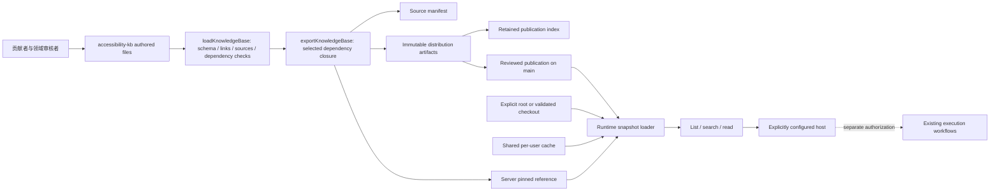
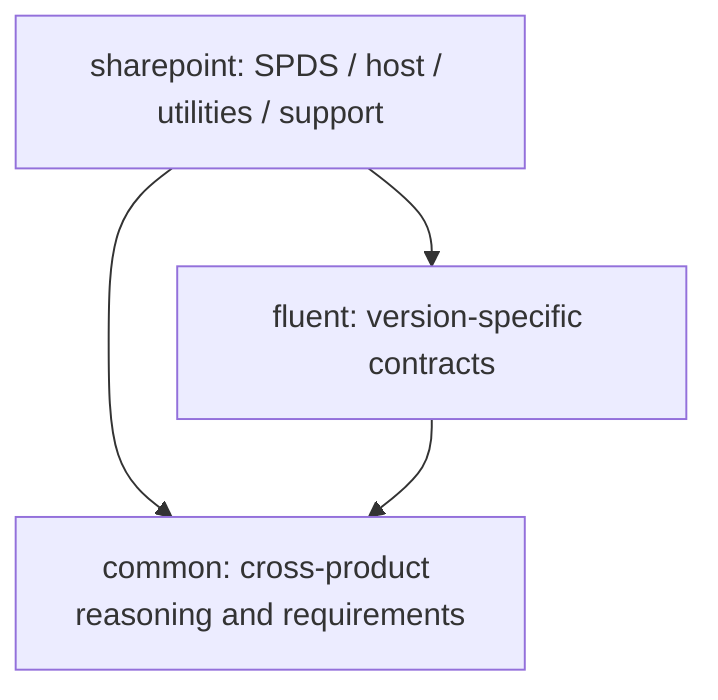

# Accessibility Knowledge Base：技术设计与协作扩展指南

本文面向内容贡献者、组件/产品专家、KB reviewer 和服务维护者。
描述当前 schema v1、独立服务 0.1.0 的实现与扩展约束，不把计划中的能力当作已交付功能。
安装和宿主注册见 [服务 README](README.md)；内容审核政策见
[贡献规范](../accessibility-kb/governance/contribution.md)。

## 1. 目标与边界

KB 将跨产品知识、框架契约和产品约束组织为可引用、可审核、可按依赖闭包分发的内容。
目标不是把所有资料放进一个长文档，而是让协作者能够回答：

- 当前任务应读哪一层、哪个版本、哪条知识？
- 一项结论来自规范、组件契约、产品支持声明，还是未经审核的方法建议？
- 缺少哪些上下文或来源，哪些验证仍需要真实环境？
- 改动一条知识后，哪些包、引用和评估需要一起更新？

**当前边界：**这是独立 KB + 只读 stdio MCP，不注册或改写任何现有插件。
已有插件的知识、skills、配置、运行日志、浏览器和工作流保持各自原有行为。
本服务不读 A11y workflow 配置，不拥有执行 provider，也不执行修复、测试、浏览器或 AT。
`procedure` 是推理和计划指导，不是可自动执行的 workflow。

**当前不提供：**官方来源自动同步、网页爬取、语义/向量检索、按任务自动挑选包、
内容自动审批、插件自动接入或已量化的 agent 效果保证。32 条初始内容均为 draft；
Common 20、Fluent 4、SharePoint 8 是当前种子集合，不是长期数量上限或完整性承诺。

## 2. 整体结构与数据流



三个不同的结构不能混淆：

1. **包依赖图**：决定导出哪些包，要求版本精确匹配且无环。
2. **条目关系图**：`relations` 指向要一起理解的知识 ID；不会自动递归读取或执行。
3. **来源记录**：`sourceIds` 指向本包来源元数据；来源 URL 不会被服务抓取。

### 2.1 目录与维护责任

| 位置 | 用途 | 谁修改 / 是否生成 |
|---|---|---|
| [KB catalog](../accessibility-kb/catalog.json) | 注册所有内容包及其描述符位置 | 新增包时修改 |
| [Common 描述符](../accessibility-kb/packages/common/package.json) | 通用知识的版本、来源、条目清单 | 通用内容贡献者 |
| [Fluent 描述符](../accessibility-kb/packages/fluent/package.json) | Fluent 版本契约、依赖和条目 | 框架专家 |
| [SharePoint 描述符](../accessibility-kb/packages/sharepoint/package.json) | SPDS、工具、宿主与支持约束 | 产品专家 |
| [包 schema](../accessibility-kb/schemas/package.schema.json) / [支持矩阵 schema](../accessibility-kb/schemas/support-matrix.schema.json) | authoring 数据形状 | 协议维护者；不是普通内容修改 |
| [贡献规范](../accessibility-kb/governance/contribution.md) / [效果评估 rubric](../accessibility-kb/evaluations/README.md) | 审核规则和知识效果的评价标准 | 内容治理与评估负责人 |
| [KB 源清单](../accessibility-kb/manifest.json) | 整个 authored KB 的内容哈希 | 构建生成，不手改 |
| [内容校验/导出](tools/knowledge-base.mjs) | Ajv schema、文件清单、关系、来源及闭包校验 | 构建维护者 |
| [引用工具](tools/knowledge-reference.mjs) | 创建 pin；维护者解析本地引用 | 构建维护者；不随最小运行时分发 |
| [独立构建器](tools/build.mjs) | 选择分发包，生成产物并保留历史 | 发布维护者 |
| [服务引用](references/knowledge.json) | 服务当前选择的版本、manifest pin、URL 和 raw pin | 构建生成，不手改 |
| [分发索引](../knowledge-distribution/index.json) | 所有保留产物的 manifest pin → raw SHA-256 | 构建生成；保留历史 |
| [运行时 loader](src/runtime/knowledge.mjs) | 位置解析、下载、缓存、语义与完整性校验 | 运行时维护者 |
| [MCP handler](src/runtime/knowledge-mcp.mjs) / [stdio 入口](cli.mjs) | 三个只读工具及传输 | 运行时维护者 |
| [独立 CI](../.github/workflows/knowledge.yml) | KB 与现有 marketplace 分别校验 | 服务维护者 |
| 本文 | 设计、扩展步骤与职责边界 | 维护者；不进入知识快照 |

**不要把独立 KB 与现有插件知识混写。**本设计的内容写入独立的
[accessibility-kb](../accessibility-kb/README.md)，不修改
[现有插件知识](../src/knowledge/README.md) 或生成的插件副本。
独立构建器也不调用 [marketplace 构建器](../tools/build.mjs)。

## 3. 知识分层：增加什么，放到哪里



箭头表示“依赖”。`common` 不允许依赖任何产品包；不能为了引用一个产品案例，
把整个产品包反向拉入 Common。Fluent 不应包含 SharePoint 专属业务前提。
依赖使用精确版本，例如 `0.1.0`，不支持 `^0.1.0`、`latest` 或版本范围。

### 3.1 内容放置速查表

以下目录是内容组织约定，不是必须一次建全的模板；具体文件要在描述符中声明。

| 想补充的内容 | 放置位置 / 现有起点 | `kind` | 应写清楚 |
|---|---|---|---|
| 通用语义、键盘、焦点、表单、动态内容、视觉原则 | Common `topics/`，如 [keyboard-focus](../accessibility-kb/packages/common/topics/keyboard-focus.md) | `topic` | 适用范围、边界与常见误用 |
| MAS/WCAG 等依据的适用性与权威差异 | Common `requirements/`，从 [authority-and-applicability](../accessibility-kb/packages/common/requirements/authority-and-applicability.md) 扩展 | `requirement-guidance` | 精确条款、版本、规范/解释区别、未接通的来源 |
| 根因定位和应该修改哪一层 | Common `analysis/`，如 [root-cause](../accessibility-kb/packages/common/analysis/root-cause.md) | `analysis` | 现象到责任层的推理，而非见到症状就加补丁 |
| 跨组件实现职责 | Common `implementation/`，如 [component-contract](../accessibility-kb/packages/common/implementation/component-contract.md) | `implementation-contract` | 组件已有能力、调用方责任、异步/错误分支 |
| 静态、动态、设计、测试验证方法 | Common `verification/` | `verification` | 能证明什么、不能证明什么、需要何种证据 |
| Find/Fix/Prevent/Review/Add-tests 的知识使用步骤 | Common `procedures/` | `procedure` | 阅读顺序、决策与验证计划；不授予执行权限 |
| 可复用正反案例 | 所属包的 `cases/` | `case` | 场景、反例、正确层次、验证及不适用情况；脱敏 |
| Fluent V8 与 V9 API/行为差异 | Fluent `v8/`、`v9/`、`selection/` | `implementation-contract` | 实际版本及文档条款；不同 major 不互相猜测 |
| SPDS 组件和 SharePoint 工具/宿主约束 | SharePoint `spds/`、`utilities/`、`verification/` | 契约用 `implementation-contract`；验证用 `verification` | 通用组件与产品包装层的边界 |
| 产品支持声明、版本和例外依据 | SharePoint `profiles/`，如 [support-policy](../accessibility-kb/packages/sharepoint/profiles/support-policy.md) | `product-profile` | 支持声明、适用性、实际验证和例外分别记录 |
| 知识是否让 agent 判断得更好 | [evaluations rubric](../accessibility-kb/evaluations/README.md) | 不是产品知识条目 | 正负样本、误报/漏报、证据校准、错误修复层 |

同一个问题可能拆成多层：Common 写“关闭对话框时如何选择焦点返回目标”，
Fluent 写“特定版本 Dialog 提供什么契约”，SharePoint 写“宿主/包装工具覆盖了哪些职责”。
通过 `relations` 关联，不复制三份通用规则。来源相互冲突时记录上下文缺口，
由有权限的领域 reviewer 决定适用条款；不能由服务自动假定某来源覆盖另一来源。

### 3.2 当前最值得完善的缺口

| 工作项 | 主要落点 | 完成条件 |
|---|---|---|
| 确认公司要求的授权获取接口、版本和缓存许可 | Common `sources.mas` 与 requirements 条目 | 有可审核条款与授权，不用占位文本冒充 MAS |
| 审核 HTML/ARIA/WCAG/APG 的实际条款 | Common 来源和对应 topic/contract | 逐条 claim 对应到适用版本；APG 示例不等于强制唯一实现 |
| 补 Fluent V8/V9 真实组件契约及负例 | Fluent 来源、`v8/`、`v9/`、`selection/` | 确认 API/版本/责任边界，而非按另一版本类推 |
| 补 SPDS、公告/焦点工具和宿主行为 | SharePoint 来源、`spds/`、`utilities/` | 授权文档和审核版本齐备；不猜 API 签名 |
| 接通正式产品支持清单 | SharePoint `profiles/` | 每个产品版本、规则及例外有正式依据 |
| 分配 owner/reviewer 并做知识效果评估 | 每条 `owner`/`review` 与 evaluations rubric | 能追踪审核和代表性正负案例，不只让 schema 通过 |

这是协作 backlog，不是已取得这些资料的声明。原始私有资料、运行证据、账户与环境
信息保留在授权外部系统；库内只放允许分发的摘要与可授权访问的依据引用。

## 4. 数据模型与引用契约

### 4.1 Package、entry 和 source

| 对象 | 字段与语义 |
|---|---|
| package | `schemaVersion`、`id`、`version`、`dependencies`、`sources`、`entries`；不允许随意加未知字段 |
| entry 身份 | `id` 全 KB 唯一且以本包 ID 开头；`path` 相对本包目录。ID 与文件位置分离 |
| entry 分类 | `kind` 必须使用 schema 枚举；目录名不是检索或授权机制 |
| entry 上下文 | `appliesTo` 是非空字符串数组，记录版本/产品/平台；当前服务不自动按它过滤 |
| entry 来源 | `sourceIds` 只能引用本包 `sources` 中的 ID。跨包阅读关联用 `relations`，不能直接借用别包来源 ID |
| entry 关联 | `relations`、`deprecatedBy` 的目标必须存在于本包或它的依赖闭包内 |
| entry 生命周期 | `status` 为 `draft` / `approved` / `deprecated`；审批信息写在描述符，不靠正文一个“已审核”标签 |
| source | `id` 在包内唯一；`authority`、`status`、`locator`、`revision`、`note` 区分来源性质与就绪程度 |

合法 ID 如 `common.topic.keyboard-focus`。包名和 ID 段以小写字母开头，后续只允许
小写字母、数字、连字符；条目必须包含点分隔的命名空间。
`source.authority` 的六类为 `company-requirements`、`normative-standard`、
`informative-guidance`、`component-contract`、`product-support`、`historical-reference`。

### 4.2 生命周期不是自动工作流

- 来源未接通：`connection-pending`，`locator`/`revision` 可以为 `null`，说明缺什么。
- 有候选资料但未审核：`review-pending`；有 URL 并不意味着支持当前结论。
- 审核来源：`reviewed` 必须有非空 `locator` 和 `revision`；校验器检查形状，实际条款由 reviewer 核实。
- 历史资料：`historical`，不能直接支撑 approved 条目。
- 条目从 draft 升 approved：实际 owner、非 `unassigned` reviewer、审核日期、证据引用；
  至少一个相关来源且全部为 reviewed。纯方法草稿可以暂时没有 source，但不能因此审批通过。
- 来源或框架发生实质变化：**人工**把受影响条目退回 draft、重新审核；没有自动失效分析。
- 废弃条目：保留旧 ID，`status: deprecated` 并提供有效 `deprecatedBy`。
  当前政策不支持无替代目标的 deprecation；不要悄悄把同一 ID 改成另一含义。

服务始终返回 `contentApprovalVerified: false`、`independentBehaviorVerified: false`。
即使条目 metadata 是 approved，这两个字段也不会变成 true：服务没有执行人工审核或行为验证。

### 4.3 文件和链接规则

- 每个正文必须在 `entries` 声明；包目录里的 README 也必须是一个 entry。
  不要直接丢进未登记的笔记、图片、脚本或 fixture；严格文件清单会拒绝它们。
- 正文当前支持 Markdown；JSON 仅支持 `kind: product-profile` + `dataSchema: support-matrix`。
  任意新的 JSON 类型、图片或二进制附件都需要协议设计，不是新增一个文件即可。
- 本包内部可用相对 Markdown 链接指向完整文件；当前拒绝本地 `#heading` 锚点、
  跨包相对链接、越界路径及不支持的 URI。跨包关系用稳定 ID。
- 全局共享文件集合是固定的：KB 根 README、catalog、两个 schema、贡献规范和评估 rubric。
  每个导出都带这些文件，因此它们不能包含依赖某个未选中产品包的必需链接。
- 新增全局 KB 文件需要同时更新 authoring 的 `commonFiles` 和 runtime 的 `COMMON_FILES`，
  并补闭包测试；普通设计说明应像本文一样放在服务目录，不扩大分发内容。
- Windows 路径的大小写碰撞、设备名、符号链接、文件/目录冲突会被运行时拒绝。
  内容路径用简单的相对 `/` 路径；authoring 校验通过不等于完整运行时校验已通过。

## 5. 操作手册：新增一条知识

以下例子是**草稿元数据示范**，不是新增了经审核的规则。
假设要补充跨产品的“异步完成后焦点处理”主题：

1. 先检查现有 [keyboard-focus](../accessibility-kb/packages/common/topics/keyboard-focus.md)
   和 [dynamic-content](../accessibility-kb/packages/common/topics/dynamic-content.md)。
   相同语义优先完善原条目；可独立引用的新主题才新增 ID。
2. 新建 Common 包内的 `topics/async-focus.md`，按下方正文模板写出范围与缺口。
3. 在 [Common package descriptor](../accessibility-kb/packages/common/package.json) 的 `entries`
   中加入如下对象。示例引用已有候选来源 `wcag` / `apg`；仍需逐条核实正文依据。

```json
{
  "id": "common.topic.async-focus",
  "path": "topics/async-focus.md",
  "kind": "topic",
  "status": "draft",
  "owner": "unassigned",
  "appliesTo": ["web", "async-ui"],
  "sourceIds": ["wcag", "apg"],
  "relations": ["common.topic.keyboard-focus", "common.topic.dynamic-content"]
}
```

4. 如需补新来源，在**同一个包**的 `sources` 加记录。尚未接通的候选来源可以如下表示，
   不能把它标成 reviewed，也不要给不相关条目挂上它来制造“有依据”的印象。

```json
{
  "id": "async-focus-contract",
  "authority": "component-contract",
  "status": "connection-pending",
  "locator": null,
  "revision": null,
  "note": "待确认授权来源、适用版本与精确条款；当前不提供已审核的契约内容。"
}
```

5. 更新本包 overview 的阅读导航；如果另一个条目必须一起读，再增加它的 `relations`。
   关系不自动双向，也不会替调用方读取正文。
6. 按第 9 节处理版本、生成与评估。检查新增条目通过 `list/read` 可见，而 Common-only
   导出仍不依赖任何产品包。计数断言需要随有依据的内容变化更新，不要直接删掉边界测试。

### 推荐的正文骨架

```markdown
# 标题

## 适用范围与不适用情况
产品/框架/版本/平台，以及必须先取得的上下文。

## 来源与当前状态
具体来源 ID、条款/版本、规范或示例的性质；未审核内容明确写为 draft。

## 需要维持的语义或用户结果
描述为什么需要它，而非只列某个属性或固定实现。

## 判断与实现责任
组件已做什么，调用方负责什么；异步、错误、取消和恢复分支。

## 正例、反例与常见误修
用最小、脱敏的示例说明；不要假定示例对所有组件版本都成立。

## 验证与证据边界
源码能判断什么，哪些必须实际运行；无法验证时如何标记 gap。

## 相关知识与待完善项
列稳定 ID、未解决的来源/版本/owner 问题。
```

该骨架是写作建议，当前不校验这些标题。真实执行步骤、tenant、UPN、DevBox roster、
认证信息和用户运行证据不能作为知识正文入库。

## 6. 操作手册：新增一个产品或框架包

只有内容具有独立适用域/维护责任时才新增包，不要为每一个主题建包。
以尚不存在的示例包 `product-example` 为例：

1. 在 [catalog](../accessibility-kb/catalog.json) 的 `packages` 添加
   `{"id":"product-example","path":"packages/product-example/package.json"}`。
2. 创建对应包描述符和 README 正文。以下是能表达一个最小 draft 包的描述符：

```json
{
  "schemaVersion": 1,
  "id": "product-example",
  "version": "0.1.0",
  "dependencies": {"common": "0.1.0"},
  "sources": [],
  "entries": [
    {
      "id": "product-example.overview",
      "path": "README.md",
      "kind": "topic",
      "status": "draft",
      "owner": "unassigned",
      "appliesTo": ["product-example"],
      "sourceIds": [],
      "relations": ["common.overview"]
    }
  ]
}
```

3. `dependencies` 必须匹配当前库中的实际包版本。例子的 `0.1.0` 不是永远有效的默认值。
   如果使用 Fluent 契约，显式依赖 Fluent；不能在 Common 中加入产品依赖来绕过校验。
4. 按第 5 节逐条加正文、来源与关系。普通新包不需要修改 schema。
5. **决定是否发布、由哪个服务选择。**注册 catalog 只让 source manifest 包含它，
   不代表现有服务就会读取它。

当前 [构建器](tools/build.mjs) 的发布选择固定为 `[['common'], ['sharepoint']]`，
服务引用固定由 `createKnowledgeReference(kb, ['sharepoint'])` 生成：

| 希望的结果 | 必须修改什么 |
|---|---|
| 只收录供后续完善，不让当前服务使用 | 加 catalog/描述符/正文；source manifest 变化，现有服务选择不变 |
| 单独分发新产品闭包 | 构建器增加新选择；补该闭包的导出、pin 和隔离测试。当前服务不因此自动切换 |
| 同一个服务同时读新包 | 生成服务引用时显式选中它，并生成**同样选择的联合 artifact**；只生成单包 artifact 不够 |
| 作为已有产品包必需依赖 | 更新真实依赖与版本；已有选择会递归包含它。不能为了分发而伪造语义依赖 |

不要把 SharePoint 变成所有产品的聚合包。多个独立包集合、选择配置化或多个服务
配置是后续单独设计的工作；目前没有 CLI 参数让用户任意切换这些集合。

## 7. 操作手册：支持矩阵和 schema 扩展

现有例子是 [SharePoint support matrix](../accessibility-kb/packages/sharepoint/profiles/support-matrix.json)。
它区分产品支持声明、规则适用性和实际验证，不把“不支持”写成自动豁免。

- 没有官方来源时保持 `status: awaiting-official-source`，`products: []`。
  不填推测出来的产品、支持结果或例外清单。
- 有来源后，矩阵改为 `sourced`，分配 owner 并填产品版本。每个产品的 source 必须是
  本包已 reviewed 的 `product-support` 来源，locator/revision 必须逐字匹配来源记录。
- 每条 rule 填 `requirementId`、`applicability`、`supportStatus`、`verificationStatus`、
  `basis`、`verificationEvidence`、`exception`；verified 必须有证据引用。
- `requirementId` 是官方规则标识，不要求它是 KB entry ID。条款真实性、豁免是否授权及
  日期是否仍有效需要人工核实；schema 合法不意味着证据或豁免被服务独立验证。
- 已有记录应更新来源/版本并重新审核，不把旧验证结果无条件沿用到新版本。

如果要新增 `kind`、`dataSchema` 或结构化格式，需要同时修改：

1. [JSON schema](../accessibility-kb/schemas/package.schema.json) 和所需新 schema；
2. [authoring validator](tools/knowledge-base.mjs) 的形状/语义/文件校验；
3. [运行时 validator](src/runtime/knowledge.mjs) 中对应字段、枚举、语义和共享文件集合；
4. schema/版本策略、导出内容和兼容性说明；
5. authoring 与 runtime 的正反测试，包括“重新计算哈希也不能绕过语义限制”的情况。

Ajv 只用于开发构建。安装后的运行时用内置 Node 模块独立验证，不会自动执行新的
schema 或任意输入代码。**只改 JSON schema 是不完整的协议修改。**

## 8. 消费层：检索、校验与安全边界

| 工具 | 入参 | 当前行为 |
|---|---|---|
| `a11y_kb_knowledge_list` | `{}` | 返回所选闭包的条目及来源元数据；不自动筛掉 draft/deprecated |
| `a11y_kb_knowledge_search` | `query`，1–256 字符 | 本地大小写不敏感分词匹配；所有词均须出现在 ID/正文；最多 20 条、每条最多 580 字符 excerpt |
| `a11y_kb_knowledge_read` | `id`，1–256 字符 | 读取一个声明的完整条目、来源、哈希和 `kb:<id>@<version>` 引用 |

搜索不是语义检索，也没有相关性学习或依据等级排序；调用方应先确定适用范围，
再读完整正文、关联 ID 和来源状态。来源元数据、source URL 和关系不是执行指令。

Loader 顺序：显式绝对根目录 → 经身份校验的开发 checkout → 每用户共享缓存 →
固定的 HTTPS artifact。无效显式配置、已存在但损坏的缓存或不匹配的本地 pin 都报错，
不降级成另一个版本，不猜测成功。每次调用重新校验内容，不支持修改源文件后绕过 pin 热更新。

只下载选中的**完整包闭包**，查询不会发送到下载端。HTTPS 单次上限 15 秒/8 MiB，
文件数上限 1000；禁止任意 URL、重定向、凭据和路径逃逸。stdio 单帧上限 1 MiB。
内容增长时先监控产物大小和调用输出规模；超出限制需要设计分包/分发协议，不能简单关闭校验。

## 9. 版本、生成与发布

### 9.1 四种版本/身份

| 标识 | 含义 |
|---|---|
| `schemaVersion` | 数据协议版本；改变解析契约时评估升级 |
| 每包 `version` | 内容包版本；由维护者为审核发布显式更新，构建不会自动递增 |
| 服务 package `version` | MCP/loader 实现版本，不等于知识包版本 |
| manifest/raw SHA-256 | 精确快照及传输字节身份，不等于知识审批 |

建议的发布约定：兼容的小修使用 patch，新增兼容条目使用 minor，不兼容语义/ID 契约
修改评估 major。当前代码仅校验三段数字格式，不强制 SemVer 的业务语义；必须由 PR 审核执行。
同版本内容修改也会改变 pin，不能因此宣称兼容或免于版本审核。

升级 Common 后，所有直接依赖它的精确版本都要更新；如果 Fluent 自身也升级，
SharePoint 对 Fluent 的依赖也要随之更新。审查依赖变动会影响哪些下游已审核结论。

### 9.2 构建流程

在仓库根目录依次执行：

```powershell
npm ci --prefix knowledge-server
npm run build --prefix knowledge-server
npm test --prefix knowledge-server
npm run check --prefix knowledge-server
npm test
npm run check
```

第一套命令构建/校验独立 KB；最后两条验证未破坏现有 marketplace。
根目录 `npm run build` 不是 KB builder。外部工作流或 AT 不属于这些本地命令的验证范围。

独立 build 会：校验 authored 文件 → 计算依赖闭包 → 生成规范化 manifest →
序列化 `{schemaVersion, manifest, files}` artifact → 生成引用。
每个文件有内容 SHA-256；选择后的 manifest 有 `manifestSha256`；完整 artifact
另有 raw SHA-256。全量 source manifest 与某个选中闭包的 manifest **不一定相同**。

生成变更包括源 manifest、服务 reference、新的内容寻址 JSON 和分发 index。
不手写哈希、不覆盖老 artifact、不删除旧版本以“清理构建”。全局共享 README、
schema 或治理文档也参与内容哈希，因此它们的修改可能改变所有选择的 pin。

构建先验证所有保留历史，使用 no-replace 文件发布，再更新索引，最后更新消费引用；
一次只跑一个 authoring build。完整当前 artifact 已写入而索引未写入时可以恢复；
未知文件、缺失/损坏历史仍会明确阻断，不能据此承诺任何中断都可自动修复。

### 9.3 发布闸门

1. 内容 reviewer 确认来源、版本、权限、适用性和私有资料边界。
2. 本地校验及 CI 通过；审核新增内容、依赖变化、生成 pin 和旧 artifact 保留。
3. 通过 PR 合并/发布，不能直接向 main 推送，也不合并与 KB 无关的清理。
4. 实际访问 reference 指定的 HTTPS URL，核验 raw SHA-256 后再声称冷安装可用。
   URL 指向 main 上的内容寻址文件；“本地构建成功”不代表 URL 已发布。
5. 在明确授权的宿主验证 MCP 注册、工具发现、完整读取，以及 cold/warm cache。
   离线未命中应失败，命中有效缓存可用；自动测试的模拟 transport 不代替真实宿主验收。
6. 消费方在安全切换点更新服务/reference。旧引用继续读旧 artifact；若回退，
   使用整套已审核的旧 reference/运行时，不编辑哈希或删除缓存来伪造兼容。

## 10. 测试与协作验收

下表是修改时应复用和补充测试的位置，不表示当前已穷尽所有字段组合。
扩展支持矩阵、生命周期或包选择时，要新增对应运行时反例，并显式验证
artifact 中的包集合与服务 reference 一致，不能只更新通过的测试数量。

| 改动 | 应补/检查的测试 |
|---|---|
| 新条目/来源/关系 | [knowledge-base tests](tests/knowledge-base.test.mjs)：描述符、未声明文件、来源与审批、链接和闭包 |
| 新包或选择 | [reference tests](tests/knowledge-reference.test.mjs)：选中/未选中内容、版本、显式根及 pin |
| schema、完整性、路径或缓存 | [runtime tests](tests/knowledge-runtime.test.mjs)：损坏、越界、symlink、错误 URL、语义违规及并发 |
| 工具输入/输出 | [MCP tests](tests/knowledge-mcp.test.mjs)：隔离安装、精确 ID、完整正文、来源与拒绝执行 |
| 分发/发布 | [standalone tests](tests/standalone.test.mjs)：旧引用冷启动、产物保留、中断恢复和现有文件不变 |
| 知识是否改善判断 | [效果评估 rubric](../accessibility-kb/evaluations/README.md)：单独授权的真实评估，不能用 unit test 代替 |

初始测试包含 32/20 条目的断言和固定示例 ID。增加内容时，更新合理的计数和预期集合，
同时保留 Common 不泄漏产品知识、未选中包不可读、缺来源不产生 approved 等负面断言。
评估至少包含一个真实风险样例、一个干净反例、一个缺上下文场景，以及一个版本/产品不适用场景。
记录误报/漏报、修复层次、证据校准和回归风险；未运行要写未运行，不能补造结果。

### 提交前清单

- [ ] 内容属于正确包；通用知识没有引入产品依赖，也没有重复另一包正文。
- [ ] 每个文件、稳定 ID、sourceId 和 relation 已登记且有效。
- [ ] 正文解释范围、责任、正反例和验证缺口；source URL 不被当作已审核证据。
- [ ] owner/reviewer、版本和来源状态真实；draft 没有通过文字包装变成官方要求。
- [ ] 新包的分发选择和服务引用已明确，不把“catalog 注册成功”当作“服务可读”。
- [ ] schema 扩展同时覆盖 build/runtime，且未削弱拒绝无效输入的测试。
- [ ] build/test/check 全部通过；审核生成变化且保留所有已提交历史产物。
- [ ] 所需人工内容/效果审核已完成或明确标记待办；无私有运行数据入库。
- [ ] 现有插件和 workflow 不在本次变更范围；发布/真实宿主检查不被本地测试冒充。

建议一个 PR 聚焦一个领域主题或一组相关契约，让领域 owner 评审内容，
让服务维护者评审 schema、包选择或运行时协议变化。首次贡献从完善已有 draft 条目开始，
比同时改包结构、检索协议和知识正文更容易验证。