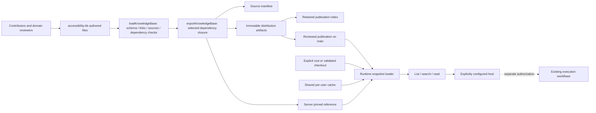
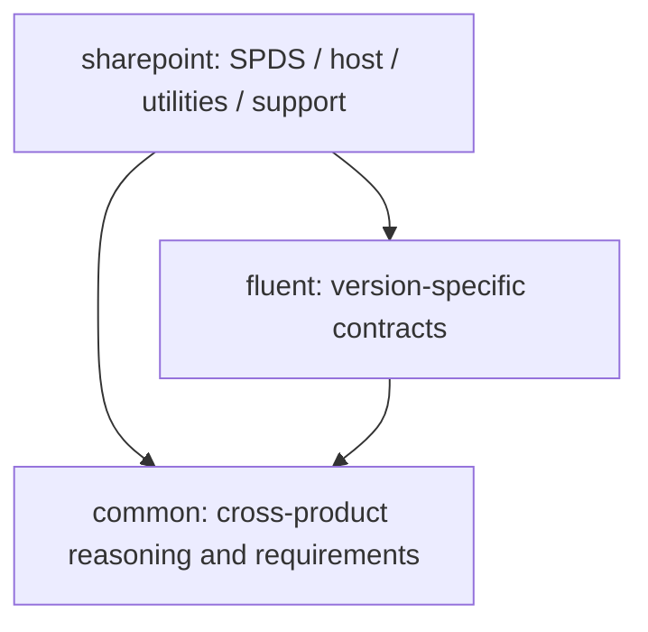
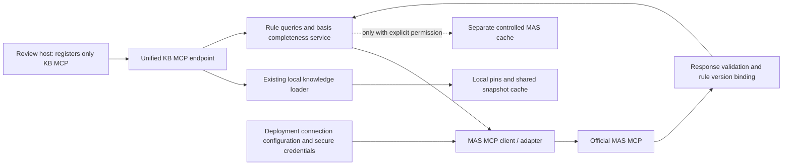

# Accessibility Knowledge Base: Technical Design and Collaborative Extension Guide

English | [简体中文](TECH-DESIGN.zh-CN.md)

Source coverage: [AgentOW migration audit](AGENTOW-MIGRATION-AUDIT.md).
Preserved archives are not equivalent to completed migration into the new KB.

This document is for content contributors, component/product experts, KB reviewers, and service maintainers.
It describes the implementation and extension constraints of the current schema v1 and standalone service 0.1.0,
without presenting planned capabilities as delivered features. For installation and host registration, see the
[service README](README.md); for content review policy, see the
[contribution guidelines](../accessibility-kb/governance/contribution.md).

**Target architecture addendum: one KB endpoint provides both local knowledge and authoritative MAS rules.**
Sections 1–10 describe the implemented local snapshot service; section 11 defines MAS integration for colleagues
to implement later. This change updates the design only: it adds no MAS connection, tools, configuration parsing,
or runtime gates.

## 1. Goals and Boundaries

The KB organizes cross-product knowledge, framework contracts, and product constraints into content that can be
cited, reviewed, and distributed by dependency closure. The goal is not to put all material in one long document,
but to enable collaborators to answer:

- Which layer, version, and knowledge entry should be read for the current task?
- Does a conclusion come from a specification, component contract, product support statement, or unreviewed methodological advice?
- What context or sources are missing, and which verification still requires a real environment?
- When one knowledge entry changes, which packages, references, and evaluations need to be updated together?

**Current boundary:** this is a standalone KB + read-only stdio MCP. It does not register or rewrite any existing
plugin. Existing plugins retain their original knowledge, skills, configuration, run logs, browsers, and workflows.
This service does not read A11y workflow configuration, own execution providers, or perform fixes, tests, browser
operations, or assistive technology (AT) operations. A `procedure` guides reasoning and planning; it is not an
automatically executable workflow.

**Not currently provided:** automatic synchronization of official sources, web crawling, semantic/vector retrieval,
automatic task-based package selection, automatic content approval, automatic plugin integration, or quantified
guarantees of agent effectiveness. All 32 initial entries are draft; Common 20, Fluent 4, and SharePoint 8 form
the current seed set, not a long-term count limit or a completeness commitment.

**Future goal:** ship the MAS MCP client/adapter with the standalone KB service so that hosts register only one
KB MCP, rather than each host orchestrating KB and MAS separately. The KB service manages MAS connections
internally; the runtime environment still supplies credentials securely. This is read-only access to an authoritative
source, not a fix/publish provider, and does not change existing plugin workflows. It is not implemented today:
registering `sources.mas` must not be treated as having connected to MAS.

## 2. Overall Structure and Data Flow



Do not confuse these three distinct structures:

1. **Package dependency graph:** determines which packages are exported; versions must match exactly and the graph must be acyclic.
2. **Entry relationship graph:** `relations` points to knowledge IDs to understand together; it does not automatically read recursively or execute anything.
3. **Source records:** `sourceIds` points to source metadata within the same package; the service does not fetch source URLs.

### 2.1 Locations and Maintenance Responsibilities

| Location | Purpose | Who edits it / whether generated |
|---|---|---|
| [KB catalog](../accessibility-kb/catalog.json) | Register all content packages and their descriptor locations | Update when adding a package |
| [Common descriptor](../accessibility-kb/packages/common/package.json) | Versions, sources, and entry inventory for common knowledge | Common content contributors |
| [Fluent descriptor](../accessibility-kb/packages/fluent/package.json) | Fluent version contracts, dependencies, and entries | Framework experts |
| [SharePoint descriptor](../accessibility-kb/packages/sharepoint/package.json) | SPDS, utilities, host, and support constraints | Product experts |
| [Package schema](../accessibility-kb/schemas/package.schema.json) / [support matrix schema](../accessibility-kb/schemas/support-matrix.schema.json) | Authoring data shape | Protocol maintainers; not an ordinary content change |
| [Contribution guidelines](../accessibility-kb/governance/contribution.md) / [effectiveness evaluation rubric](../accessibility-kb/evaluations/README.md) | Review rules and criteria for evaluating knowledge effectiveness | Content governance and evaluation owners |
| [KB source manifest](../accessibility-kb/manifest.json) | Content hashes for the entire authored KB | Build-generated; do not edit manually |
| [Content validation/export](tools/knowledge-base.mjs) | Ajv schema, file inventory, relationship, source, and closure validation | Build maintainers |
| [Reference tools](tools/knowledge-reference.mjs) | Create pins; resolve local references for maintainers | Build maintainers; not distributed with the minimal runtime |
| [Standalone builder](tools/build.mjs) | Select distribution packages, generate artifacts, and retain history | Release maintainers |
| [Service reference](references/knowledge.json) | Currently selected versions, manifest pin, URL, and raw pin for the service | Build-generated; do not edit manually |
| [Distribution index](../knowledge-distribution/index.json) | Manifest pin → raw SHA-256 for all retained artifacts | Build-generated; retain history |
| [Runtime loader](src/runtime/knowledge.mjs) | Location resolution, downloading, caching, semantic and integrity validation | Runtime maintainers |
| [MCP handler](src/runtime/knowledge-mcp.mjs) / [stdio entry point](cli.mjs) | Three read-only tools and transport | Runtime maintainers |
| [Standalone CI](../.github/workflows/knowledge.yml) | Validate the KB separately from the existing marketplace | Service maintainers |
| This document | Design, extension steps, and responsibility boundaries | Maintainers; not included in knowledge snapshots |

**Do not mix standalone KB content with existing plugin knowledge.** Content for this design belongs in the
standalone [accessibility-kb](../accessibility-kb/README.md), without changing
[existing plugin knowledge](../src/knowledge/README.md) or generated plugin copies.
The standalone builder does not invoke the [marketplace builder](../tools/build.mjs).

## 3. Knowledge Layers: What to Add and Where



Arrows mean “depends on.” `common` must not depend on any product package; do not pull an entire product
package back into Common just to cite a product case. Fluent should not contain SharePoint-specific business
assumptions. Dependencies use exact versions such as `0.1.0`; `^0.1.0`, `latest`, and version ranges are unsupported.

### 3.1 Content Placement Quick Reference

The following directories are content organization conventions, not a template that must be created in full at once;
individual files must be declared in the descriptor.

| Content to add | Location / existing starting point | `kind` | What to make explicit |
|---|---|---|---|
| General semantics, keyboard, focus, forms, dynamic content, and visual principles | Common `topics/`, such as [keyboard-focus](../accessibility-kb/packages/common/topics/keyboard-focus.md) | `topic` | Scope, boundaries, and common misuse |
| Applicability and differences in authority of sources such as MAS/WCAG | Common `requirements/`, extending [authority-and-applicability](../accessibility-kb/packages/common/requirements/authority-and-applicability.md) | `requirement-guidance` | Exact clauses, versions, normative vs. explanatory material, and sources not yet connected |
| Root-cause identification and which layer should change | Common `analysis/`, such as [root-cause](../accessibility-kb/packages/common/analysis/root-cause.md) | `analysis` | Reasoning from symptoms to the responsible layer, rather than patching each symptom |
| Implementation responsibilities across components | Common `implementation/`, such as [component-contract](../accessibility-kb/packages/common/implementation/component-contract.md) | `implementation-contract` | Existing component capabilities, caller responsibilities, and async/error branches |
| Static, dynamic, design, and test verification methods | Common `verification/` | `verification` | What can and cannot be proved, and what evidence is required |
| Knowledge-use steps for Find/Fix/Prevent/Review/Add-tests | Common `procedures/` | `procedure` | Reading order, decisions, and verification plans; no grant of execution authority |
| Reusable positive and negative cases | The owning package's `cases/` | `case` | Scenario, counterexample, correct layer, verification, and inapplicable cases; sanitized |
| Fluent V8 vs. V9 API/behavior differences | Fluent `v8/`, `v9/`, `selection/` | `implementation-contract` | Actual versions and documentation clauses; do not infer across major versions |
| SPDS components and SharePoint utility/host constraints | SharePoint `spds/`, `utilities/`, `verification/` | `implementation-contract` for contracts; `verification` for verification | Boundary between general components and product wrappers |
| Product support statements, versions, and grounds for exceptions | SharePoint `profiles/`, such as [support-policy](../accessibility-kb/packages/sharepoint/profiles/support-policy.md) | `product-profile` | Record support statements, applicability, actual verification, and exceptions separately |
| Whether knowledge improves agent judgment | [Evaluations rubric](../accessibility-kb/evaluations/README.md) | Not a product knowledge entry | Positive/negative samples, false positives/negatives, evidence calibration, and fixes at the wrong layer |

One issue may span several layers: Common describes “how to choose a focus return target when closing a dialog,”
Fluent describes “what contract a specific Dialog version provides,” and SharePoint describes “which responsibilities
the host/wrapper utilities cover.” Connect them through `relations` instead of copying the general rule three times.
When sources conflict, record context gaps and have an authorized domain reviewer determine the applicable clauses;
the service must not automatically assume that one source overrides another.

### 3.2 Highest-Priority Gaps to Address

| Work item | Primary location | Completion criteria |
|---|---|---|
| Confirm the authorized access interface, versions, and caching permissions for company requirements | Common `sources.mas` and requirements entries | Reviewable clauses and authorization; no placeholder text presented as MAS |
| Review actual HTML/ARIA/WCAG/APG clauses | Common sources and corresponding topics/contracts | Map each claim to its applicable version; APG examples are not the sole mandatory implementation |
| Add actual Fluent V8/V9 component contracts and negative examples | Fluent sources, `v8/`, `v9/`, `selection/` | Confirm APIs, versions, and responsibility boundaries instead of extrapolating from another version |
| Add SPDS, announcement/focus utilities, and host behavior | SharePoint sources, `spds/`, `utilities/` | Authorized documentation and reviewed versions available; no guessed API signatures |
| Connect the official product support inventory | SharePoint `profiles/` | Official basis for each product version, rule, and exception |
| Assign owners/reviewers and evaluate knowledge effectiveness | Each entry's `owner`/`review` and the evaluations rubric | Traceable review and representative positive/negative cases, not merely passing the schema |

This is a collaborative backlog, not a claim that these materials have already been obtained. Original private
materials, run evidence, account details, and environment information remain in authorized external systems;
the repository contains only distributable summaries and references to supporting material accessible with authorization.

## 4. Data Model and Reference Contract

### 4.1 Package, Entry, and Source

| Object | Fields and semantics |
|---|---|
| package | `schemaVersion`, `id`, `version`, `dependencies`, `sources`, `entries`; arbitrary unknown fields are not allowed |
| entry identity | `id` is unique across the KB and starts with its package ID; `path` is relative to the package directory. Identity is separate from file location |
| entry classification | `kind` must use the schema enum; directory names are not a retrieval or authorization mechanism |
| entry context | `appliesTo` is a nonempty string array recording versions/products/platforms; the current service does not automatically filter by it |
| entry sources | `sourceIds` may reference only IDs in this package's `sources`. Use `relations` for cross-package reading associations; do not borrow another package's source IDs directly |
| entry relationships | Targets of `relations` and `deprecatedBy` must exist in the package or its dependency closure |
| entry lifecycle | `status` is `draft` / `approved` / `deprecated`; approval information belongs in the descriptor, not merely a “reviewed” label in the body |
| source | `id` is unique within the package; `authority`, `status`, `locator`, `revision`, and `note` distinguish source type and readiness |

A valid ID is `common.topic.keyboard-focus`. Package names and ID segments start with a lowercase letter,
followed only by lowercase letters, digits, or hyphens; entries must include a dot-separated namespace.
The six `source.authority` categories are `company-requirements`, `normative-standard`,
`informative-guidance`, `component-contract`, `product-support`, and `historical-reference`.

### 4.2 Lifecycle Is Not an Automated Workflow

- Source not connected: `connection-pending`; `locator`/`revision` may be `null`; explain what is missing.
- Candidate material available but not reviewed: `review-pending`; a URL does not mean it supports the current conclusion.
- Reviewed source: `reviewed` requires nonempty `locator` and `revision`; the validator checks shape, while a reviewer verifies the actual clauses.
- Historical material: `historical`; it cannot directly support approved entries.
- Promoting an entry from draft to approved requires an actual owner, a reviewer other than `unassigned`, a review date,
  and evidence references; at least one relevant source is required, and all sources must be reviewed. A purely
  methodological draft may temporarily have no source, but that does not make it eligible for approval.
- Substantive source or framework changes: **manually** return affected entries to draft and review them again;
  there is no automatic invalidation analysis.
- Deprecating an entry: retain its old ID, set `status: deprecated`, and provide a valid `deprecatedBy`.
  Current policy does not support deprecation without a replacement target; do not silently give the same ID a different meaning.

The service always returns `contentApprovalVerified: false` and `independentBehaviorVerified: false`.
Even when entry metadata says approved, neither field becomes true: the service has not performed human review
or behavioral verification.

### 4.3 File and Link Rules

- Every content body must be declared in `entries`; even a README in a package directory must be an entry.
  Do not drop in unregistered notes, images, scripts, or fixtures; the strict file inventory rejects them.
- Content bodies currently support Markdown; JSON is supported only for `kind: product-profile` + `dataSchema: support-matrix`.
  Any new JSON type, image, or binary attachment requires protocol design, not just adding a file.
- Relative Markdown links within a package may point to whole files; local `#heading` anchors, cross-package
  relative links, out-of-bounds paths, and unsupported URIs are currently rejected. Use stable IDs for cross-package relationships.
- The global shared file set is fixed: the KB root README, catalog, two schemas, contribution guidelines, and
  evaluation rubric. Every export includes them, so they must not contain required links that depend on an unselected product package.
- Adding a global KB file requires updating both authoring `commonFiles` and runtime `COMMON_FILES`, plus
  closure tests. Ordinary design documents should live in the service directory, like this document, without expanding distribution content.
- The runtime rejects Windows path case collisions, device names, symbolic links, and file/directory conflicts.
  Use simple relative `/` paths for content; passing authoring validation does not mean full runtime validation has passed.

## 5. Playbook: Add a Knowledge Entry

The following examples demonstrate **draft metadata**; they do not add reviewed rules.
Suppose you want to add a cross-product topic on “focus handling after asynchronous completion”:

1. First check the existing [keyboard-focus](../accessibility-kb/packages/common/topics/keyboard-focus.md)
  and [dynamic-content](../accessibility-kb/packages/common/topics/dynamic-content.md) entries.
  Prefer improving an existing entry with the same semantics; add an ID only for a new, independently citable topic.
2. Create `topics/async-focus.md` in the Common package and describe its scope and gaps using the body template below.
3. Add the following object to `entries` in the
  [Common package descriptor](../accessibility-kb/packages/common/package.json). The example references existing
  candidate sources `wcag` / `apg`; the basis for each claim in the body still needs verification.

```json
{
  "id": "common.topic.async-focus",
  "path": "topics/async-focus.md",
  "kind": "topic",
  "status": "draft",
  "owner": "unassigned",
  "appliesTo": ["web", "async-ui"],
  "sourceIds": ["wcag", "apg"],
  "relations": ["common.topic.keyboard-focus", "common.topic.dynamic-content"]
}
```

4. If a new source is needed, add a record to `sources` in **the same package**. A candidate source that is not
  yet connected can be represented as follows. Do not mark it reviewed or attach it to unrelated entries to create
  the impression that they have a supporting basis.

```json
{
  "id": "async-focus-contract",
  "authority": "component-contract",
  "status": "connection-pending",
  "locator": null,
  "revision": null,
  "note": "Authorized source, applicable version, and exact clauses remain to be confirmed; no reviewed contract content is currently provided."
}
```

5. Update the reading navigation in the package overview; if another entry must be read together with this one,
   add its `relations` as well. Relationships are not automatically bidirectional and do not read content for the caller.
6. Follow section 9 for versioning, generation, and evaluation. Check that the new entry is visible through `list/read`
   and that Common-only exports still have no product package dependencies. Update count assertions to reflect
   justified content changes; do not simply delete boundary tests.

### Recommended Body Outline

```markdown
# Title

## Scope and Inapplicable Cases
Products/frameworks/versions/platforms, and context that must be obtained first.

## Sources and Current Status
Specific source IDs, clauses/versions, and whether material is normative or illustrative; explicitly label unreviewed content as draft.

## Semantics or User Outcomes to Preserve
Explain why this is needed, rather than listing only an attribute or a fixed implementation.

## Reasoning and Implementation Responsibilities
What the component already does and what the caller owns; async, error, cancellation, and recovery branches.

## Positive Examples, Counterexamples, and Common Incorrect Fixes
Use minimal, sanitized examples; do not assume an example applies to every component version.

## Verification and Evidence Boundaries
What source code can establish, what requires actual execution, and how to mark a gap when verification is unavailable.

## Related Knowledge and Open Items
List stable IDs and unresolved source/version/owner questions.
```

This outline is authoring advice; these headings are not currently validated. Actual execution steps, tenant details,
UPNs, DevBox rosters, authentication information, and user run evidence must not be committed as knowledge content.

## 6. Playbook: Add a Product or Framework Package

Add a package only when the content has its own applicability domain or maintenance responsibility; do not create
a package for every topic. Consider the example package `product-example`, which does not yet exist:

1. Add `{"id":"product-example","path":"packages/product-example/package.json"}` to `packages` in the
   [catalog](../accessibility-kb/catalog.json).
2. Create the corresponding package descriptor and README content. The following descriptor represents a minimal draft package:

```json
{
  "schemaVersion": 1,
  "id": "product-example",
  "version": "0.1.0",
  "dependencies": {"common": "0.1.0"},
  "sources": [],
  "entries": [
    {
      "id": "product-example.overview",
      "path": "README.md",
      "kind": "topic",
      "status": "draft",
      "owner": "unassigned",
      "appliesTo": ["product-example"],
      "sourceIds": [],
      "relations": ["common.overview"]
    }
  ]
}
```

3. `dependencies` must match the actual package versions in the current KB. The example's `0.1.0` is not a
   permanently valid default. If using Fluent contracts, depend on Fluent explicitly; do not add a product dependency
   to Common to bypass validation.
4. Add bodies, sources, and relationships entry by entry as described in section 5. An ordinary new package does not require a schema change.
5. **Decide whether to publish it and which service selects it.** Catalog registration only includes it in the source
   manifest; it does not mean the existing service will read it.

The current [builder](tools/build.mjs) has fixed publication selections of `[['common'], ['sharepoint']]`,
and the service reference is always generated by `createKnowledgeReference(kb, ['sharepoint'])`:

| Desired result | Required changes |
|---|---|
| Include content for future improvement without exposing it to the current service | Add catalog registration, descriptor, and bodies; the source manifest changes, but the existing service selection does not |
| Distribute the new product closure separately | Add a builder selection; add export, pin, and isolation tests for that closure. This does not automatically switch the current service |
| Let the same service also read the new package | Select it explicitly when generating the service reference and generate a **combined artifact with the same selection**; single-package artifacts alone are insufficient |
| Make it a required dependency of an existing product package | Update genuine dependencies and versions; existing selections include it recursively. Do not fabricate a semantic dependency solely for distribution |

Do not turn SharePoint into an aggregator for every product. Multiple independent package sets, configurable
selection, or multiple service configurations require separate future design; there is currently no CLI argument
for users to switch freely among these sets.

## 7. Playbook: Support Matrices and Schema Extensions

The existing example is the [SharePoint support matrix](../accessibility-kb/packages/sharepoint/profiles/support-matrix.json).
It distinguishes product support statements, rule applicability, and actual verification; “unsupported” is not an automatic exemption.

- Without an official source, retain `status: awaiting-official-source` and `products: []`.
  Do not populate guessed products, support outcomes, or exception lists.
- Once a source is available, change the matrix to `sourced`, assign an owner, and populate product versions.
  Each product's source must be a reviewed `product-support` source in the same package, with locator/revision
  matching the source record verbatim.
- Populate each rule's `requirementId`, `applicability`, `supportStatus`, `verificationStatus`, `basis`,
  `verificationEvidence`, and `exception`; verified requires an evidence reference.
- `requirementId` is an official rule identifier, not necessarily a KB entry ID. Clause authenticity, exemption
  authorization, and whether dates remain valid require human verification; schema validity does not mean
  the service independently verified the evidence or exemption.
- Update sources/versions for existing records and review them again; do not carry old verification outcomes
  unconditionally into new versions.

Adding a `kind`, `dataSchema`, or structured format requires coordinated changes to:

1. The [JSON schema](../accessibility-kb/schemas/package.schema.json) and any required new schema;
2. Shape, semantic, and file validation in the [authoring validator](tools/knowledge-base.mjs);
3. Corresponding fields, enums, semantics, and the shared file set in the [runtime validator](src/runtime/knowledge.mjs);
4. Schema/version policy, exported content, and compatibility documentation;
5. Positive and negative authoring/runtime tests, including cases where recomputing hashes must not bypass semantic restrictions.

Ajv is used only for development builds. The installed runtime validates independently using built-in Node modules;
it does not automatically execute new schemas or arbitrary input code. **Changing only the JSON schema is an incomplete protocol change.**

## 8. Consumer Layer: Retrieval, Validation, and Security Boundaries

This section's guarantees about queries not being uploaded, fixed download locations, and caching apply to the
**current local snapshot tools**. Future explicit MAS queries will send necessary query fields to the configured
MAS service; see section 11 for those boundaries. Do not apply local snapshot privacy promises or integrity pins
directly to live sources.

| Tool | Input | Current behavior |
|---|---|---|
| `a11y_kb_knowledge_list` | `{}` | Returns entries and source metadata for the selected closure; does not automatically filter out draft/deprecated entries |
| `a11y_kb_knowledge_search` | `query`, 1–256 characters | Local case-insensitive token matching; all terms must appear in the ID/body; at most 20 results, each with an excerpt of at most 580 characters |
| `a11y_kb_knowledge_read` | `id`, 1–256 characters | Reads one complete declared entry, sources, hashes, and a `kb:<id>@<version>` citation |

Search is not semantic retrieval and has no relevance learning or ranking by authority level. Callers should first
establish scope, then read the complete body, related IDs, and source status. Source metadata, source URLs, and
relationships are not execution instructions.

Loader order: explicit absolute root → identity-validated development checkout → shared per-user cache →
fixed HTTPS artifact. Invalid explicit configuration, an existing but corrupt cache, or a mismatched local pin
produces an error; the loader does not fall back to another version or guess success. Content is revalidated on
every call; editing source files does not enable hot reload that bypasses the pin.

Only the selected **complete package closure** is downloaded; queries are not sent to the download endpoint.
Each HTTPS download is limited to 15 seconds/8 MiB, with at most 1000 files; arbitrary URLs, redirects,
credentials, and path escapes are prohibited. Each stdio frame is limited to 1 MiB. As content grows, first monitor
artifact size and tool output size; exceeding limits requires package partitioning/distribution protocol design,
not simply disabling validation.

## 9. Versioning, Generation, and Publication

### 9.1 Four Kinds of Version/Identity

| Identifier | Meaning |
|---|---|
| `schemaVersion` | Data protocol version; assess an upgrade when changing the parsing contract |
| Each package's `version` | Content package version; maintainers explicitly update it for reviewed releases, and builds do not auto-increment it |
| Service package `version` | MCP/loader implementation version, not the knowledge package version |
| manifest/raw SHA-256 | Exact snapshot and transport-byte identity, not knowledge approval |

Suggested release convention: use patch for small compatible corrections, minor for new compatible entries, and
consider major for incompatible semantic/ID contract changes. Current code checks only a three-part numeric
format, not the business semantics of SemVer; PR review must enforce those. Changing content at the same version
also changes its pin and does not establish compatibility or waive version review.

After upgrading Common, update every exact version dependency that directly references it; if Fluent itself also
upgrades, update SharePoint's Fluent dependency too. Review which downstream approved conclusions are affected
by dependency changes.

### 9.2 Build Process

Run the following in order from the repository root:

```powershell
npm ci --prefix knowledge-server
npm run build --prefix knowledge-server
npm test --prefix knowledge-server
npm run check --prefix knowledge-server
npm test
npm run check
```

The first set of commands builds/validates the standalone KB; the last two check that the existing marketplace
has not been broken. Root-level `npm run build` is not the KB builder. External workflows and AT are outside
the verification scope of these local commands.

The standalone build validates authored files → computes dependency closures → generates a canonical manifest →
serializes a `{schemaVersion, manifest, files}` artifact → generates references. Each file has a content SHA-256;
the selected manifest has a `manifestSha256`; the full artifact has a separate raw SHA-256. The full source
manifest and the manifest of a selected closure are **not necessarily identical**.

Generated changes include the source manifest, service reference, new content-addressed JSON, and distribution
index. Do not handwrite hashes, overwrite old artifacts, or delete old versions to “clean the build.” Globally shared
README, schema, and governance documents also contribute to content hashes, so changing them may change
the pins of every selection.

The build first validates all retained history, publishes files with no-replace semantics, updates the index, and
finally updates consumer references; run only one authoring build at a time. Recovery is possible when the complete
current artifact has been written but the index has not; unknown files and missing/corrupt history still explicitly
block progress. This is not a promise that every interruption can be repaired automatically.

### 9.3 Publication Gates

1. A content reviewer confirms sources, versions, permissions, applicability, and private-material boundaries.
2. Local validation and CI pass; review new content, dependency changes, generated pins, and retention of old artifacts.
3. Merge/publish through a PR, not by pushing directly to main; do not bundle cleanup unrelated to the KB.
4. Actually access the reference's HTTPS URL and verify its raw SHA-256 before claiming cold installation works.
  The URL points to a content-addressed file on main; “local build succeeded” does not mean the URL is published.
5. In an explicitly authorized host, verify MCP registration, tool discovery, full reads, and cold/warm caching.
  An offline cache miss must fail; a valid cache hit can work. Simulated transports in automated tests do not replace real host acceptance.
6. Consumers update the service/reference at a safe transition point. Old references continue reading old artifacts;
  for rollback, use the complete reviewed old reference/runtime set. Do not edit hashes or delete caches to fabricate compatibility.

## 10. Testing and Collaborative Acceptance

The table below identifies tests to reuse and extend when making changes; it does not claim exhaustive coverage
of all field combinations. When extending support matrices, lifecycles, or package selection, add corresponding
negative runtime cases and explicitly verify that the artifact's package set matches the service reference;
do not merely update the number of passing tests.

| Change | Tests to add/check |
|---|---|
| New entries/sources/relationships | [Knowledge-base tests](tests/knowledge-base.test.mjs): descriptors, undeclared files, sources and approval, links, and closures |
| New packages or selections | [Reference tests](tests/knowledge-reference.test.mjs): selected/unselected content, versions, explicit roots, and pins |
| Schema, integrity, paths, or caching | [Runtime tests](tests/knowledge-runtime.test.mjs): corruption, out-of-bounds paths, symlinks, incorrect URLs, semantic violations, and concurrency |
| Tool inputs/outputs | [MCP tests](tests/knowledge-mcp.test.mjs): isolated installation, exact IDs, full bodies, sources, and refusal to execute |
| Distribution/publication | [Standalone tests](tests/standalone.test.mjs): old-reference cold starts, artifact retention, interruption recovery, and unchanged existing files |
| Whether knowledge improves judgment | [Effectiveness evaluation rubric](../accessibility-kb/evaluations/README.md): separately authorized real evaluations, not replaceable by unit tests |

Initial tests include assertions for 32/20 entries and fixed example IDs. When adding content, update justified
counts and expected sets while retaining negative assertions: Common must not leak product knowledge,
unselected packages must not be readable, and missing sources must not yield approved entries. Evaluations must
include at least one genuine-risk sample, one clean counterexample, one missing-context scenario, and one
version/product-inapplicable scenario. Record false positives/negatives, fix layers, evidence calibration, and
regression risks; if something was not run, say so rather than fabricating results.

### Pre-submission Checklist

- [ ] Content belongs to the correct package; common knowledge introduces no product dependency and does not duplicate another package's body.
- [ ] Every file, stable ID, sourceId, and relation is registered and valid.
- [ ] Bodies explain scope, responsibilities, positive/negative examples, and verification gaps; source URLs are not treated as reviewed evidence.
- [ ] Owners/reviewers, versions, and source statuses are truthful; draft content has not been worded to appear as an official requirement.
- [ ] Distribution selection and service references for new packages are explicit; “catalog registration succeeded” is not treated as “the service can read it.”
- [ ] Schema extensions cover both build/runtime without weakening tests that reject invalid input.
- [ ] Build/test/check all pass; generated changes are reviewed and all committed historical artifacts are retained.
- [ ] Required human content/effectiveness reviews are completed or explicitly marked pending; no private run data is committed.
- [ ] Existing plugins and workflows are outside this change's scope; local tests do not masquerade as publication or real-host checks.

Prefer one PR focused on a domain topic or a group of related contracts, with domain owners reviewing content
and service maintainers reviewing schema, package selection, or runtime protocol changes. For a first contribution,
improving an existing draft entry is easier to validate than simultaneously changing package structure, retrieval
protocol, and knowledge bodies.

## 11. Planned: One KB Endpoint with MAS Rule Capabilities

### 11.1 Agreed Direction and Interfaces Still to Confirm

**Agreed goal:** callers connect only to KB MCP, using it both to query local knowledge and to query authoritative
rules through the KB's internal MAS adapter. MAS is the required rule basis within applicable review scope;
local methods, cases, guessed WCAG mappings, and component support statements cannot replace missing MAS clauses.

| Area | Current implementation | Target implementation |
|---|---|---|
| External endpoint | One local knowledge MCP | The same KB MCP, with explicit additional read-only MAS interfaces |
| MAS source | Pending metadata in the Common package | Built-in MAS MCP client/adapter; manage source metadata separately from actual responses |
| Connection configuration | No MAS configuration parsing | Ship nonsensitive templates with the service; specify trusted connections at deployment, with no live source enabled by default |
| Authentication | Local snapshots need no MAS identity | KB authenticates as a MAS client through the official mechanism; the runtime environment supplies credentials securely |
| Standards basis | Local draft usage guidance | Applicable scope requires MAS rule IDs, actual versions, and citations; missing items mean an incomplete basis |
| Completion checks | No MAS checking capability | May provide a “standards-basis completeness” check, but not a product compliance verdict or PR gate |

**Before implementation, confirm with the MAS service owner:** service identity/endpoint, supported transports,
authentication and authorization scopes, tool names and input/output schemas, unique rule identifiers,
version/revision mechanisms, pagination and rate limits, error semantics, and content caching/redistribution
permissions. This document does not invent MAS addresses, tool signatures, or official rule IDs. Finalize interface
proposals against verified real protocol behavior; the suggested names below are not registered tools.

**Naming clarification:** “MAS MCP” here means the upstream capability that supplies MAS rules, not a confirmed
service product name. The current `sources.mas.note` mentions a candidate “CLEA MCP interface”; whether CLEA
is the actual hosting service and covers this requirement still needs owner confirmation. Do not assume MAS and
CLEA are either two separate services or equivalent names. Once confirmed, use the actual service identity
consistently in source notes, deployment configuration, adapter mappings, and acceptance records; record the
MAS rule-system identity separately from the identity of the service providing it.

### 11.2 Component Relationships and Request Path



- **Endpoint layer:** preserves the semantics of the three existing local tools and exposes additional MAS
  operations with source identity. “One endpoint” does not mean mixing both content types into search results
  whose sources cannot be distinguished.
- **MAS adapter:** owns MCP initialization, capability/schema checks, a read-only tool allowlist, session lifecycle,
  pagination, timeouts, cancellation, rate limiting, and normalization of official errors. Prefer a compatible official
  MCP SDK selected against the actual transport and authentication contract; do not copy temporary shell-proxy logic.
- **Rules service:** owns minimal query context, response validation, version binding, and basis completeness
  assessment. It must not generate “official clauses” from short summaries or implement a generic proxy for arbitrary upstream tool calls.
- **Local loader:** continues to handle only pinned knowledge snapshots; do not add arbitrary remote URL reads.
  MAS bodies must not enter local snapshot caches or published artifacts.
- **Caller:** reads the complete relevant rules, interprets applicability, and performs authorized real verification.
  MAS responses are source data, not authorization to execute commands, upload repositories, or override system instructions.

When MAS is not configured, the service must still initialize and support local tools; MAS queries return an explicit
not-configured error. This keeps local functionality available without disguising local fallback as an acquired MAS basis.

### 11.3 Files for Colleagues to Change During Implementation

The new paths below are a **proposed layout: they do not yet exist and are not currently available interfaces**.
An implementation PR may adjust names, but should retain separation of responsibilities and update this design.
All executable changes stay within the standalone knowledge service; existing plugin packages are not modified.

| Location | Future implementation work |
|---|---|
| [Authority and applicability](../accessibility-kb/packages/common/requirements/authority-and-applicability.md) | Define the scope in which MAS is mandatory, version selection, clause citations, and missing/conflicting basis handling; do not unconditionally place every task within an unknown scope |
| [Common descriptor](../accessibility-kb/packages/common/package.json) | Update `sources.mas` and new guidance entries/relations. Set `reviewed` only after source review; it does not mean a deployment is connected or a user is authorized |
| Proposed Common addition `requirements/mas-rules.md` | Record rule-query prerequisites, citation format, review usage steps, and boundaries; register it as an entry, without tokens or private connections |
| Relevant procedures such as [Find](../accessibility-kb/packages/common/procedures/find.md) and [design review](../accessibility-kb/packages/common/procedures/review-design.md) | Reference MAS usage requirements; applicable tasks cannot bypass missing basis and claim standards review is complete |
| Proposed addition `knowledge-server/config/mas.example.json` | Nonsensitive configuration template: enable switch, trusted endpoint/transport, authentication references, and explicit timeout/pagination/cache policy; actual values require owner confirmation |
| Proposed addition `knowledge-server/src/mas/config.mjs` | Load and strictly validate deployment configuration; reject unknown/unsafe settings and never accept connections or credentials from model tool arguments |
| Proposed addition `knowledge-server/src/mas/client.mjs` | Dedicated MAS MCP client: capability handshake, read-only tool mapping, identity, and session lifecycle |
| Proposed addition `knowledge-server/src/mas/rules.mjs` | Normalize rule/search responses; handle version binding, applicable context, source errors, and basis completeness checks |
| [MCP handler](src/runtime/knowledge-mcp.mjs) / [entry point](cli.mjs) | Inject the MAS service and add tools/error boundaries; do not replace existing tool names or static behavior |
| [Package](package.json) / [lockfile](package-lock.json) | If the MCP SDK/authentication requires runtime dependencies, declare and lock them explicitly and update installation instructions; do not continue claiming a zero-dependency MAS runtime |
| Proposed additions `knowledge-server/tests/mas-config.test.mjs`, `mas-client.test.mjs`, `mas-rules.test.mjs` | Positive/negative tests for configuration, protocol, versions, and errors; synthetic inputs must not masquerade as live qualification |
| [MCP tests](tests/knowledge-mcp.test.mjs) / [standalone tests](tests/standalone.test.mjs) | One host endpoint, local-tool compatibility, minimal installation, and isolation when MAS is unavailable |
| [Contribution guidelines](../accessibility-kb/governance/contribution.md), [evaluation rubric](../accessibility-kb/evaluations/README.md), [README](README.md), and this document | Approval/confidentiality policy, misuse counterexamples, actual registration methods, runtime dependencies, and verified capabilities |

Connection settings do not belong in entry/source descriptors or the [generated reference](references/knowledge.json).
`sources.mas.locator` locates the rule source; it is not a general transport/auth configuration field. If rule responses
require a new structured protocol, define a separate schema and its validation; do not insert ad hoc unknown fields
such as endpoints or tokens into the content schema. Content changes still generate new snapshots and retain
old pins as described in section 9.

### 11.4 Configuration and Authentication: Ship Capabilities, Not Identities

The package provides the adapter, schemas, configuration templates, and default information permitted for
distribution; **actual deployment values remain outside the repository**. A future explicit environment variable
(for example, `A11Y_ASSIST_MAS_CONFIG`, with its name to be finalized during implementation) could point to an
absolute configuration path. This variable is not recognized today; setting it now will not make MAS available.

At minimum, the configuration contract specifies an explicit enabled state, transport, trusted target, authentication
method reference, request deadline, retry/pagination limits, allowed read-only capabilities, and caching policy.
Invalid configuration must fail before MAS use, without guessing an address, skipping authentication, or switching
sources. Whether a configuration error fails the entire startup remains to be finalized by error type; unconfigured
or disabled MAS must not block the existing local knowledge tools.

- Endpoints come from trusted administrator/user configuration; the model cannot specify URLs or arbitrary
  execution commands through query arguments. If the official service supports only stdio, permit only trusted
  configured executables and fixed arguments; never execute commands from rule bodies.
- Use officially supported authentication with explicit audience/scopes; do not blindly forward host tokens upstream.
  When user login is required, use the host/official authorization flow; never ask for secrets in model conversation.
- Credentials come from secure storage or the runtime environment, never templates, logs, artifacts, error bodies,
  or test fixtures. Logs contain only permitted diagnostic metadata; sanitize upstream errors before returning them.
- A MAS query sends necessary domain fields to that service, such as rule ID, version, product/platform context,
  or minimal query text. By default, do not send source code, work items, account/machine inventories, or whole
  conversations. Free text needs length and data boundaries, and callers must be clearly told it will be sent upstream.
- Enable only official read-only query capabilities; do not expose rule updates, tenant administration, file reads,
  provider execution, or similar functionality.

### 11.5 External Capabilities and Rule Responses (Proposed, Not Implemented)

The following additions are proposed within the same KB MCP. Final names/parameters require review against
the actual MAS protocol:

| Proposed KB tool | Purpose | Key restrictions |
|---|---|---|
| `a11y_kb_mas_status` | Report states such as unconfigured, disabled, awaiting authentication, unavailable, or confirmed queryable | Distinguish configured from actually probed successfully; success includes verification scope/time, not readiness inferred from configuration alone |
| `a11y_kb_mas_search` | Find candidate MAS clauses by rule/product context | Return candidates and pagination/completeness information; top-N results are not all applicable requirements |
| `a11y_kb_mas_read` | Read the complete basis by exact rule ID and requested version | Explicitly fail or report incompleteness if that version is unavailable or the response is summarized/truncated; do not automatically substitute latest |
| `a11y_kb_mas_check_basis` | Check whether the caller's submitted basis set has the required sources/versions/context | Checks basis completeness only; caller-supplied IDs do not prove rules were read, and no product PASS is issued |

A proposed common response envelope identifies `source: mas`, source identity from the configured service, rule ID,
actual standard version/revision, official locator, retrieval time, full-body/summary classification, content completeness,
and applicable context. A hash can identify received bytes but does not by itself prove official authenticity or
complete rule coverage. Mark information not returned by the official service as unknown, rather than inferring it
in the adapter; missing required fields must prevent the basis check from passing.

Pin the rule version and acquired basis references for a review. If the upstream offers only a floating latest or cannot
provide a traceable revision, report insufficient version basis rather than silently mixing revisions. Confirm reference
retention/caching permissions first; if storing bodies is not permitted, retain only permitted IDs, versions, and
references and revalidate at use time. Do not treat a new query result as the original result. Identity-dependent
query results must not be reused across users/tenants.

### 11.6 “Must Follow MAS”: Policy and Enforcement Boundaries

**Policy belongs in the knowledge layer, basis checks in the service layer; consumers still own review execution
and publication gates.** This design does not silently change existing workflow gates.

For tasks confirmed to be subject to MAS, callers first obtain scope/standard version, inspect candidates and read
the complete relevant rules, record rule IDs, versions, applicability, and grounds for exceptions, and only then form
review conclusions. Request context when scope cannot be confirmed; “unknown” is not “inapplicable.” Exceptions
need formally authorized grounds; lack of component support does not automatically grant an exemption.

Basis checks should return explicit `complete` / `incomplete` results and gap reasons (final enum pending protocol
review). `complete` means only that the **specified scope and submitted basis set** satisfy the check. It does not
prove that search covered all MAS rules or that a product implementation complies, and does not authorize automatic
Bug closure or PR publication. To enforce a block on downstream review completion, the consumer must explicitly
invoke and enforce the check; merely adding a tool cannot guarantee callers will use it.

| Situation | Required outcome |
|---|---|
| Unconfigured/disabled/insufficient authentication | MAS is unavailable or authentication is required; local knowledge remains usable but cannot replace MAS |
| Timeout, rate limit, upstream error | Bounded failure/retries with distinguishable errors; never a success-shaped empty rule set |
| No search results | Explicitly means no match for this query only, not proof that the task has no applicable rules |
| Unfinished pagination or truncated results | Mark incomplete; do not claim all standards are covered |
| Requested rule or version does not exist | Exact failure; no substitution with approximate rules, WCAG mappings, or latest |
| Source conflict/revision change/unknown scope | Preserve conflicts and gaps and request confirmation; do not automatically adjudicate or mix the basis |
| Complete basis but no real verification performed | Report only standards-basis readiness; runtime behavior remains unverified, with no compliance PASS |

### 11.7 Isolating MAS Caching from Static Publication

For the first version, **disable persistent MAS body caching** and process data only within explicitly authorized
request/session scope. Implement caching only after the service owner explicitly permits storage, validity periods,
revocation, user isolation, and redistribution. Cache keys must account for service identity, authorization context,
rule ID, and version; both content and access must be controlled.

Place caches in a separate controlled location outside the repository, not in the local public snapshot cache, Git,
KB manifest, or knowledge-distribution. Offline operation, expiry, permission changes, and unverifiable revisions
must not silently reuse old clauses as current MAS. If the official service allows offline pinned versions, separately
define validity periods and a policy explicitly selected by the caller. Static snapshot pins and live MAS basis use
separate source identities; never write live responses directly into files associated with an old pin.

### 11.8 Phased Delivery and Acceptance

1. **Protocol confirmation:** complete the endpoint/transport/auth/schema/version/permission checklist with the
   owner and obtain authorized interface examples. Keep implementation blocked without a real contract;
   mocks cannot substitute for official readiness.
2. **Adapter implementation:** implement configuration, secure authentication, handshake, allowlisted tools, and
   response validation while maintaining local-tool compatibility. Separately review new SDK/runtime dependencies
   and the minimal installation package; update zero-dependency claims and installation instructions.
3. **Rule semantics:** implement version binding, complete rule reads, pagination, and standards-basis checks;
   update Common policy and guidance.
4. **Automated tests:** use a clearly labeled synthetic MAS server to cover success, unknown tools/schemas,
   authentication/timeouts/rate limits, incomplete pagination, version drift, missing fields, error sanitization,
   rejection of arbitrary URLs/tools, and cross-identity cache isolation. When returned bodies contain instruction
   injection, verify that no commands execute, no secrets are forwarded, and authorization does not expand.
5. **Single-endpoint integration:** an isolated host registers only KB and can use MAS tools; all three local tools
   remain usable when MAS is unconfigured/offline. Confirm that MAS tools are not actually supplied through a
   second endpoint registered separately by the host.
6. **Real qualification:** in an explicitly authorized environment, use the real MAS service to verify authentication,
   original rule text/versions, citations, and failure modes; record reviewable results. Then run positive/negative
   evaluations demonstrating “missing MAS does not yield false completion,” “incorrect versions are not applied,”
   and “a complete basis does not equal product compliance.”

Only after this acceptance is complete should the corresponding capabilities in the README and this section
change from “planned” to supported. This design update does not change the pending status of `sources.mas`,
register proposed tools, generate MAS configuration, or change snapshot pins. It does not imply that the official
service is connected or that standards have been reviewed and approved.