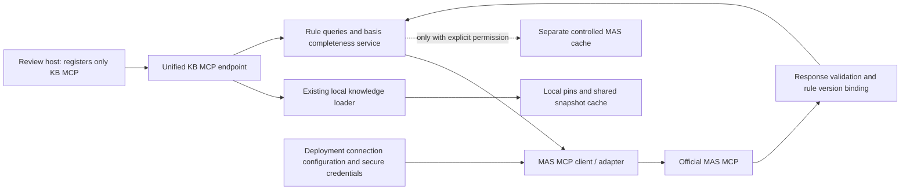

# Accessibility Knowledge Base: Technical Design and Collaborative Extension Guide

English | [简体中文](TECH-DESIGN.zh-CN.md)

This design serves content contributors, domain reviewers, and service maintainers. Sections 1–10 describe
the implemented local snapshot service; section 11 defines planned MAS integration and extension requirements.
MAS connections, tools, configuration parsing, and runtime gates are **not implemented**.
See the [service README](README.md) for installation/host registration, [contribution guidelines](../accessibility-kb/governance/contribution.md)
for review policy, and [implementation plan](TASKS.md) for delivery tasks. Version authority is in section 9.

## 1. Goals and Boundaries

The KB is the single maintained repository for new accessibility knowledge: citable, reviewable entries distributed
by dependency closure. It identifies the applicable layer/version, authority and context gaps, verification needs,
and the packages, references, and evaluations affected by a change.

| Scope | Contract |
|---|---|
| Current service | Standalone KB + read-only stdio MCP; no existing plugin registration or rewrite. Existing knowledge, skills, configuration, run logs, browsers, and workflows remain unchanged. |
| Execution ownership | Callers such as Bug Bash review source, perform separately authorized execution, conclude, and report. KB does not read A11y workflow configuration, own providers, fix, test, or operate browsers/AT; a `procedure` guides reasoning, not execution. |
| Consumer migration target | After readiness and consumer acceptance, all knowledge consumers use the host's unified Knowledge MCP; retire `a11y-knowledge`, `a11y-knowledge-odsp`, and duplicate embedded knowledge. Current installations are not migrated. |
| MAS target | One host-registered KB endpoint with an internal read-only MAS adapter, not an Execution MCP or fix/publish provider; design and secure deployment boundaries are in section 11. |
| Not provided | Automatic official-source synchronization, crawling, semantic/vector retrieval, task-based package selection, content approval, plugin integration, or quantified agent-effectiveness guarantees. |

The current 35 entries (Common 20, Fluent 4, SharePoint 11) contain rules, API responsibilities, exceptions, and
positive/negative examples, all still draft. Provenance is not approval or installed-version qualification (section 4.2).

## 2. Overall Structure and Data Flow

```mermaid
flowchart LR
  Author[Contributors / reviewers: authored KB]
  Author --> Validate[loadKnowledgeBase: schema / links / sources / dependency checks]
  Validate --> Export[exportKnowledgeBase: selected dependency closure]
  Export --> Release[Manifest / artifacts / retained index / service pin: section 9]
  Release --> Loader[Local root / checkout / cache / fixed HTTPS: section 8]
  Loader --> Host[Read-only MCP: explicitly configured host]
  Host -. separate authorization .-> Workflow[Existing execution workflows]
```



The acyclic **package graph** selects exact-version exports; **entry relations** and **active sources** bind reading
associations and evidence metadata, respectively (section 4).

### 2.1 Locations and Maintenance Responsibilities

| Location | Purpose | Who edits it / whether generated |
|---|---|---|
| [KB catalog](../accessibility-kb/catalog.json) | Register all content packages and their descriptor locations | Update when adding a package |
| [Common](../accessibility-kb/packages/common/package.json), [Fluent](../accessibility-kb/packages/fluent/package.json), [SharePoint](../accessibility-kb/packages/sharepoint/package.json) descriptors | Versions, dependencies, sources, and entry inventories | Respective content/domain owners; placement in section 3 |
| [Package schema](../accessibility-kb/schemas/package.schema.json) / [support matrix schema](../accessibility-kb/schemas/support-matrix.schema.json) | Authoring data shape | Protocol maintainers; not an ordinary content change |
| Contribution guidelines / evaluation rubric (intro and section 10) | Review policy / knowledge-effectiveness criteria | Governance / evaluation owners |
| [Content validation/export](tools/knowledge-base.mjs) | Ajv schema, file inventory, relationship, source, and closure validation | Build maintainers |
| [Reference tools](tools/knowledge-reference.mjs) | Create pins; resolve local references for maintainers | Build maintainers; not distributed with the minimal runtime |
| [Standalone builder](tools/build.mjs) | Generate [source manifest](../accessibility-kb/manifest.json), [service reference](references/knowledge.json), artifacts, and [retained index](../knowledge-distribution/index.json) | Release maintainers; generated outputs and publication rules in section 9 |
| [Runtime loader](src/runtime/knowledge.mjs) | Location resolution, downloading, caching, semantic and integrity validation | Runtime maintainers |
| [MCP handler](src/runtime/knowledge-mcp.mjs) / [stdio entry point](cli.mjs) | Three read-only tools and transport | Runtime maintainers |
| [Standalone CI](../.github/workflows/knowledge.yml) / this design | Separate KB validation / extension contract | Service maintainers; design stays outside snapshots |

Author content in [accessibility-kb](../accessibility-kb/README.md), not [existing plugin knowledge](../src/knowledge/README.md)
or generated plugin copies. The standalone builder does not invoke the [marketplace builder](../tools/build.mjs).

## 3. Knowledge Layers: What to Add and Where

Dependency direction: SharePoint → Fluent + Common; Fluent → Common. Common never depends on products,
even for a product case; Fluent excludes SharePoint business assumptions. Exact versions/selections are in section 9.
**Scope** (`common` / `fluent` / `sharepoint`) and **knowledge type** (standards / patterns / cases / fixes / examples)
are independent axes, not extra packages or required directories. WCAG/WAI-ARIA normative requirements belong
in Common; APG is distinct informative guidance. Scoped implementation/product responsibilities belong in Fluent/SharePoint.
Authoring `kind` and discovery categories are separate contracts (sections 4.1 and 8.1).

### 3.1 Content Placement Quick Reference

Directories are conventions, not a required full template; register individual files under section 4 and use section 5's body outline.

| Content / owning location | `kind` | Distinct responsibility |
|---|---|---|
| [Common topics](../accessibility-kb/packages/common/topics) | `topic` | Semantics, keyboard/focus, forms, dynamic content, visual principles |
| [Common requirements](../accessibility-kb/packages/common/requirements) | `requirement-guidance` | MAS/WCAG authority and applicability, normative vs. explanatory clauses |
| [Common analysis](../accessibility-kb/packages/common/analysis) | `analysis` | Root cause → responsible layer, not symptom patches |
| [Common implementation](../accessibility-kb/packages/common/implementation) | `implementation-contract` | Component/caller duties, including async/error branches |
| [Common verification](../accessibility-kb/packages/common/verification) | `verification` | Static, dynamic, design, and test methods with evidence limits |
| [Common procedures](../accessibility-kb/packages/common/procedures) | `procedure` | Find/Fix/Prevent/Review/Add-tests reading order, decisions, verification plans |
| Owning package's cases | `case` | Sanitized positive/negative scenarios, correct fix layer, applicability and verification |
| [Fluent](../accessibility-kb/packages/fluent/README.md): V8/V9/selection | `implementation-contract` | Version-backed API/behavior contracts; no cross-major inference |
| [SharePoint](../accessibility-kb/packages/sharepoint/README.md): SPDS/utilities/verification | `implementation-contract` / `verification` | General components vs. product wrappers, utilities, and host constraints |
| [SharePoint profiles](../accessibility-kb/packages/sharepoint/profiles) | `product-profile` | Separate support, applicability, actual verification, and exceptions (section 7) |
| Effectiveness evaluations (section 10) | Not a knowledge entry | Agent judgment and wrong-layer fixes, not product guidance |

For dialog focus, put target-selection principles in Common, version-specific Dialog contracts in Fluent, and
host/wrapper duties in SharePoint; connect them with `relations` instead of duplicating the rule.

### 3.2 Expand Existing Knowledge

Start from the owning overview/body, including [Common](../accessibility-kb/packages/common/README.md), rather than
duplicating its inventory. Add missing interactions, exceptions, or positive/negative cases there; create IDs only for
independently citable material. Preserve component/host duties and one announcement/focus owner; verify installed
exports, providers, overrides, and version-backed signatures instead of guessing undocumented APIs.
Registration/review follows sections 4–7; release follows section 9. Source acquisition for MAS remains section 11.

## 4. Data Model and Reference Contract

### 4.1 Package, Entry, and Source

| Object | Fields and semantics |
|---|---|
| package | `schemaVersion`, `id`, `version`, `dependencies`, `sources`, `entries`; arbitrary unknown fields are not allowed |
| entry identity | `id` is unique across the KB and starts with its package ID; `path` is relative to the package directory. Identity is separate from file location |
| entry classification | `kind` must use the existing schema enum; optional `discoveryTags` contains 1–3 unique values from `pattern`, `fix`, `example`. Directory names do not assign categories or authority |
| entry context | `appliesTo` is a nonempty string array recording versions/products/platforms; list/search can filter by an exact label, without automatic applicability or version inference |
| entry sources | `sourceIds` references only this package's active `sources`; `[]` means no active citation. Bind only sources whose clauses support the claim, not pending targets as substitutes. Cross-package reading uses `relations`, never borrowed source IDs |
| entry relationships | Targets of `relations` and `deprecatedBy` must exist in the package or its dependency closure |
| entry lifecycle | `status` is `draft` / `approved` / `deprecated`; approval information belongs in the descriptor, not merely a “reviewed” label in the body |
| source | `id` is unique within the package; `authority`, `status`, `locator`, `revision`, and `note` distinguish source type and readiness |

A valid ID is `common.topic.keyboard-focus`. Package names and ID segments start with a lowercase letter,
followed only by lowercase letters, digits, or hyphens; entries must include a dot-separated namespace.
The six `source.authority` categories are `company-requirements`, `normative-standard`,
`informative-guidance`, `component-contract`, `product-support`, and `historical-reference`.

Packages own current content, source bindings, and review status. Historical attribution is not supporting evidence;
maintenance requires neither a historical checkout nor a separate source-to-entry map. Source URLs are metadata,
not fetched content; `relations` is neither automatically bidirectional nor recursive reading or execution.

### 4.2 Lifecycle Is Not an Automated Workflow

| State/change | Requirement |
|---|---|
| `connection-pending` | Explain missing connection; `locator`/`revision` may be `null`. Registration is not connectivity, authorization, or approval. |
| `review-pending` | Candidate material exists; a URL alone does not establish support for a conclusion. |
| `reviewed` source | Nonempty `locator` and `revision`; validation checks shape, reviewers verify clauses. |
| Historical source | `historical-reference` / `historical` is allowed, but cannot directly support approved entries. |
| Entry → `approved` | Actual owner, reviewer other than `unassigned`, review date, evidence references, and at least one relevant source, all reviewed. A source-free methodological draft is not approvable. |
| Substantive source/framework change | Manually return affected entries to draft and re-review; no automatic invalidation analysis. |
| Entry → `deprecated` | Retain the old ID and supply valid `deprecatedBy`; no replacement-free deprecation or silent reassignment of meaning. |

Authorized domain reviewers resolve conflicting clauses with context gaps recorded; the service does not assign
automatic precedence. It always returns `contentApprovalVerified: false` and `independentBehaviorVerified: false`,
even for approved metadata: it performs neither human review nor behavioral verification.

### 4.3 File and Link Rules

- Declare every body, including package READMEs, in `entries`; strict inventory rejects unregistered notes, images, scripts, or fixtures.
- Bodies support Markdown, or JSON only for `kind: product-profile` + `dataSchema: support-matrix`. New JSON types/images/binaries require protocol design (section 7).
- In-package relative Markdown links may target whole files, not local `#heading` anchors, cross-package relative links, out-of-bounds paths, or unsupported URIs. Use stable IDs across packages.
- The fixed global shared set is the KB root README, catalog, two schemas, contribution guidelines, and evaluation rubric. Every export includes it; required links must not depend on unselected products.
- New global files require authoring `commonFiles`, runtime `COMMON_FILES`, and closure-test updates. Keep ordinary design documents in the service directory, outside snapshots.
- Runtime rejects Windows case collisions, device names, symlinks, and file/directory conflicts. Use simple relative `/` paths; authoring validation does not replace runtime validation.
- Private materials, actual execution steps, tenants, UPNs, DevBox rosters, credentials, and user run evidence stay in authorized external systems, not knowledge bodies.

## 5. Playbook: Add a Knowledge Entry

Example: a cross-product “focus after asynchronous completion” topic, using **draft metadata** under section 4.

1. Check [keyboard-focus](../accessibility-kb/packages/common/topics/keyboard-focus.md) and [dynamic-content](../accessibility-kb/packages/common/topics/dynamic-content.md) for overlap (section 3.2).
2. Create the Common body at the example path, using the outline below.
3. Add this object to the [Common descriptor](../accessibility-kb/packages/common/package.json). `wcag` / `apg` are existing candidate sources; verify each supporting clause.

```json
{
  "id": "common.topic.async-focus",
  "path": "topics/async-focus.md",
  "kind": "topic",
  "status": "draft",
  "owner": "unassigned",
  "appliesTo": ["web", "async-ui"],
  "sourceIds": ["wcag", "apg"],
  "relations": ["common.topic.keyboard-focus", "common.topic.dynamic-content"]
}
```

4. If needed, add a candidate to the same package's `sources`; apply the binding and lifecycle rules in section 4:

```json
{
  "id": "async-focus-contract",
  "authority": "component-contract",
  "status": "connection-pending",
  "locator": null,
  "revision": null,
  "note": "Authorized source, applicable version, and exact clauses remain to be confirmed; no reviewed contract content is currently provided."
}
```

5. Update overview navigation and any required reading `relations` on the relevant entries.
6. Follow section 9 for generation/release and section 10 for evaluation; verify `list/read` visibility and Common-only isolation, updating justified counts without deleting boundary tests.

### Recommended Body Outline

Use a descriptive title and the following content structure; headings are guidance, not validated schema.

| Body area | Required explanation |
|---|---|
| Scope and inapplicable cases | Products/frameworks/versions/platforms and missing prerequisite context |
| Sources and status | Source IDs, clauses/versions, normative vs. illustrative material, explicit draft labels |
| Semantics/user outcomes | Why the outcome matters, not just an attribute or fixed implementation |
| Reasoning and responsibilities | Component vs. caller duties; async, error, cancellation, and recovery branches |
| Positive/negative examples and incorrect fixes | Minimal, sanitized examples with version applicability limits |
| Verification/evidence | What source proves, what needs execution, and gaps when verification is unavailable |
| Related knowledge/open items | Stable IDs and unresolved source/version/owner questions |

## 6. Playbook: Add a Product or Framework Package

Add a package only when the content has its own applicability domain or maintenance responsibility; do not create
a package for every topic. Consider the example package `product-example`, which does not yet exist:

1. Add `{"id":"product-example","path":"packages/product-example/package.json"}` to `packages` in the
   [catalog](../accessibility-kb/catalog.json).
2. Create the corresponding package descriptor and README content. The following descriptor represents a minimal draft package:

```json
{
  "schemaVersion": 1,
  "id": "product-example",
  "version": "0.1.1",
  "dependencies": {"common": "0.1.1"},
  "sources": [],
  "entries": [
    {
      "id": "product-example.overview",
      "path": "README.md",
      "kind": "topic",
      "status": "draft",
      "owner": "unassigned",
      "appliesTo": ["product-example"],
      "sourceIds": [],
      "relations": ["common.overview"]
    }
  ]
}
```

3. Match actual dependency versions (section 9); the example version is not a permanent default. Explicitly depend on Fluent if using its contracts, without reversing Common's dependency boundary.
4. Add bodies, sources, and relationships as in section 5; an ordinary package needs no schema change.
5. Choose publication and service selection using section 9.2. Catalog registration changes the source manifest, not automatically the service's readable package set.

## 7. Playbook: Support Matrices and Schema Extensions

The existing example is the [SharePoint support matrix](../accessibility-kb/packages/sharepoint/profiles/support-matrix.json).
It distinguishes product support statements, rule applicability, and actual verification; “unsupported” is not an automatic exemption.

- Without an official source: `status: awaiting-official-source`, `products: []`; no guessed products, support outcomes, or exceptions.
- With a source: set `sourced`, assign an owner, and populate product versions. Each product cites a same-package reviewed `product-support` source, matching locator/revision verbatim.
- Each rule supplies `requirementId`, `applicability`, `supportStatus`, `verificationStatus`, `basis`, `verificationEvidence`, and `exception`; verified requires evidence.
- `requirementId` identifies an official rule, not necessarily a KB entry. Humans verify clause authenticity, authorized exemptions, and date validity; schema validity is not independent evidence verification.
- Update sources/versions and re-review existing records; do not automatically carry verification into new versions.

A new `kind`, `dataSchema`, or format requires coordinated [JSON schema](../accessibility-kb/schemas/package.schema.json)
and any new schema, [authoring](tools/knowledge-base.mjs) shape/semantic/file validation, and [runtime](src/runtime/knowledge.mjs)
fields/enums/semantics/shared-file validation; also update version policy, exports, compatibility docs, and positive/negative
tests that reject semantic violations even after hashes are recomputed.
Ajv is development-only; installed runtime validation uses built-in Node modules and executes neither new schemas
nor arbitrary input code. **A schema-only edit is an incomplete protocol change.**

## 8. Consumer Layer: Retrieval, Validation, and Security Boundaries

Privacy, fixed downloads, and integrity pins here apply only to **local snapshots**; live MAS query/data boundaries
are specified separately in sections 11.4 and 11.7.

| Tool | Input | Current behavior |
|---|---|---|
| `a11y_kb_knowledge_list` | Optional filters below; `{}` still works | Complete filtered `entries`, full selected-closure `sources`, applied `filters`, `facets`, `totalMatches`; does not automatically filter out draft/deprecated entries |
| `a11y_kb_knowledge_search` | Required `query`, 1–256 characters, plus optional filters below | Local case-insensitive whitespace-token matching; all terms must appear in the ID/body; at most 20 `matches`, each with an excerpt of at most 580 characters; `totalMatches` counts all hits before truncation |
| `a11y_kb_knowledge_read` | Required `id`, 1–256 characters; no discovery filters | Reads one complete declared entry, its cited sources, hashes, and a `kb:<id>@<version>` citation |

### 8.1 Exact Discovery Filters and Result Semantics

Categories do not add `kind` values: `standard` derives from directly cited `normative-standard` sources,
`case` from `kind: case`, and `pattern` / `fix` / `example` only from curated `discoveryTags`.
All supplied filters compose with **AND**, for both list and search; search additionally requires every query term.

| Filter | Matching contract |
|---|---|
| `category` | One of `standard`, `pattern`, `case`, `fix`, `example`; categories may overlap on an entry |
| `standard` | Exact package-local source ID, such as `wcag` or `aria`, with `authority: normative-standard`; not a standard title, version, criterion ID or coverage assertion |
| `sourceId` | Exact package-local source ID, including informative `apg`; use `packageId` to disambiguate IDs reused across packages |
| `packageId` | Exact package ID within the pinned selection; does not include dependency entries in the results automatically |
| `appliesTo` | Exact member of the entry's applicability labels, such as `fluent-v9`; no aliases, wildcards, case normalization or version inference |

`sourceId`, `standard` and the normative requirement of `category: standard` must be satisfied by the **same
directly cited source record**. For example, an entry citing both WCAG and APG does not match
`sourceId: apg` together with `category: standard`, or with `standard: wcag`. There is no source/category/label
inheritance through package dependencies or `relations`, and no inference of installed versions or source revisions.

| Result field | Semantics |
|---|---|
| List/search entries | Include `packageId`, derived `categories`, and full `matchedSources`: directly cited records satisfying source/normative filters, or all citations (possibly empty) without those restrictions. |
| List `sources` | Full selected source catalog, not just matched sources. |
| List `facets` | Counts over the **entire fully filtered result**, not the unfiltered KB or top-20 search page: categories including zeros, packages, exact applicability labels, and package-qualified full cited-source records/counts. Source facets count all citations on matching entries, not only `matchedSources`; overlapping categories/labels need not sum to `totalMatches`. |
| Search metadata | Applied `filters` excludes `query`; no facets or full top-level source catalog. |

Seven entries have body-curated tags; APG citations, contract kind, suggestive titles, or case relations do not assign tags:

| Entry ID | `discoveryTags` |
|---|---|
| `common.topic.dynamic-content` | `pattern`, `example` |
| `common.case.dialog-focus`, `fluent.v8.component-contract`, `fluent.v9.component-contract`, `sharepoint.spds.component-contract` | `pattern`, `fix`, `example` |
| `sharepoint.utilities.announcements-and-focus` | `pattern`, `example` |
| `sharepoint.case.duplicate-announcement` | `fix`, `example` |

`fix` denotes corrective guidance; `example` can be hypothetical or a counterexample, and `case` does not certify
a reproduced historical incident. Labels confer no authority; neither categories nor citations prove full norm/criterion coverage, approval, compliance, or behavioral evidence.
Entries without tags are valid: they have no pattern/fix/example category matches, while directly cited
normative sources and `kind: case` still determine standard/case matches.

| Outcome | Contract |
|---|---|
| Valid query, no match | `entries: []` / `matches: []`, `totalMatches: 0`; no conformance or inapplicability verdict. Syntactically valid unknown IDs/labels yield no match, not aliases/fallback. |
| Invalid arguments | MCP `isError: true` for unknown keys, missing query/ID, arrays/null rather than objects, wrong types, blank/over-256 strings, malformed Unicode, categories, or identifiers. `standard`, `sourceId`, `packageId` match lowercase ASCII letter followed by lowercase ASCII letters/digits/hyphens. Unknown read IDs also error. |
| Successful tools | Section 4.2 verification flags; list/search additionally require `fullEntryReadRequired: true`. |

### 8.2 Usable Local Tool Examples

After initialization, send these current-KB requests separately using a compatible service and matching snapshot.

Discover Common entries directly citing WCAG as a normative source, with an exact web label:

```json
{"jsonrpc":"2.0","id":1,"method":"tools/call","params":{"name":"a11y_kb_knowledge_list","arguments":{"category":"standard","standard":"wcag","sourceId":"wcag","packageId":"common","appliesTo":"web"}}}
```

Browse informative APG citations without pretending APG is normative:

```json
{"jsonrpc":"2.0","id":2,"method":"tools/call","params":{"name":"a11y_kb_knowledge_list","arguments":{"sourceId":"apg","packageId":"common"}}}
```

Find curated Fluent V9 corrective guidance; `MessageBar` must also occur in the entry ID/body:

```json
{"jsonrpc":"2.0","id":3,"method":"tools/call","params":{"name":"a11y_kb_knowledge_search","arguments":{"query":"MessageBar","category":"fix","packageId":"fluent","appliesTo":"fluent-v9"}}}
```

Read the full returned entry before applying the guidance:

```json
{"jsonrpc":"2.0","id":4,"method":"tools/call","params":{"name":"a11y_kb_knowledge_read","arguments":{"id":"fluent.v9.component-contract"}}}
```

This valid request deliberately returns no entries: the same source cannot be both informative APG and normative:

```json
{"jsonrpc":"2.0","id":5,"method":"tools/call","params":{"name":"a11y_kb_knowledge_list","arguments":{"category":"standard","sourceId":"apg","packageId":"common"}}}
```

Search has no relevance learning/authority ranking. Establish scope and read full bodies, related IDs, and source status;
section 1 governs execution. Snapshot loading and limits are independent of discovery:

| Loader boundary | Contract |
|---|---|
| Resolution order | Explicit absolute root → identity-validated development checkout → shared per-user cache → fixed HTTPS artifact. |
| Invalid state | Explicit configuration errors, existing corrupt cache, or mismatched local pin fail without version fallback or guessed success. Revalidate every call; source edits cannot hot-reload past a pin. |
| Transfer | Selected **complete closure** only; queries never reach the download endpoint. Maximum 15 seconds/8 MiB/1000 files; no arbitrary URLs, redirects, credentials, or path escapes. |
| Transport/growth | Stdio frame: 1 MiB. Monitor artifact/output size; exceeding limits needs partitioning/distribution design, not disabled validation. |

## 9. Versioning, Generation, and Publication

### 9.1 Four Kinds of Version/Identity

| Identifier | Meaning |
|---|---|
| `schemaVersion` | Data protocol version; assess an upgrade when changing the parsing contract |
| Each package's `version` | Content package version; maintainers explicitly update it for reviewed releases, and builds do not auto-increment it |
| Service package `version` | MCP/loader implementation version, not the knowledge package version |
| manifest/raw SHA-256 | Exact snapshot and transport-byte identity, not knowledge approval |

Release convention: patch for compatible corrections, minor for compatible additions, consider major for incompatible
semantic/ID changes. Code checks three-part numeric format only; reviewers enforce SemVer meaning.

Current baseline: schema v1; Common, Fluent, and SharePoint `0.1.1`; standalone service `0.1.0`.
Fluent depends on Common `0.1.1`; SharePoint depends on both Common and Fluent `0.1.1`.
Dependencies match exactly; `^0.1.1`, `latest`, and ranges are unsupported. All content/discovery-metadata changes
require section 9.2's generated outputs; building does not publish URLs or update installations.

**Compatibility:** tagged snapshots require `discoveryTags` support; older strict runtimes reject unknown fields,
while this runtime also accepts untagged snapshots. Versions alone do not prove compatibility: use exact hashes
and matching runtime/reference sets for install/update/rollback, retaining immutable artifacts (section 9.3).
Common upgrades require all direct exact dependencies to change; Fluent upgrades also require SharePoint's Fluent
dependency update. Review affected downstream approvals under section 4.2.

### 9.2 Build Process

The [builder](tools/build.mjs) publishes fixed selections `[['common'], ['sharepoint']]`; the service reference uses
`createKnowledgeReference(kb, ['sharepoint'])`.

| Selection change | Required action |
|---|---|
| Author only | Catalog + descriptor + bodies update the source manifest, not the service selection. |
| Publish a separate product closure | Add a builder selection and export/pin/isolation tests; this does not switch the service. |
| Read additional packages in the same service | Explicitly select them in its reference and generate a **combined artifact with the same selection**; separate single-package artifacts are insufficient. |
| Add a real product dependency | Update genuine dependencies/versions; existing selections include it recursively. Never fabricate dependencies for distribution or make SharePoint an all-product aggregator. |

Configurable/multiple independent selections or service configurations need future design; no current CLI switch selects them.
Run the following in order from the repository root:

```powershell
npm ci --prefix knowledge-server
npm run build --prefix knowledge-server
npm test --prefix knowledge-server
npm run check --prefix knowledge-server
npm test
npm run check
```

The first set of commands builds/validates the standalone KB; the last two check that the existing marketplace
has not been broken. Root-level `npm run build` is not the KB builder. External workflows and AT are outside
the verification scope of these local commands.

Build: validate authored files → compute closures → canonical manifest → `{schemaVersion, manifest, files}` artifact →
references. Per-file SHA-256, selected `manifestSha256`, and raw artifact SHA-256 are distinct; full-source and closure manifests need not match.
Generated outputs: whole-KB source hashes; service reference (selected versions, manifest pin, URL, raw pin);
content-addressed JSON; index mapping manifest pin → raw SHA-256. Shared README/schema/governance edits can change every selection's pin.

Never handwrite hashes, overwrite artifacts, or delete retained versions. Run one authoring build at a time:
validate all retained history → no-replace artifact publication → index → consumer references. A complete current
artifact written before its index is recoverable; unknown files or missing/corrupt history block progress.
This does not promise automatic recovery from every interruption.

### 9.3 Publication Gates

1. Review sources, versions, permissions, applicability, and private-material boundaries (section 4).
2. Pass local validation/CI; review content, dependencies, pins, and retained artifacts.
3. Publish through a focused PR, not direct main pushes or unrelated cleanup.
4. Verify the reference's actual content-addressed HTTPS URL on main and raw SHA-256 before claiming cold installation; a local build is not publication.
5. In an authorized real host, verify registration, discovery, full reads, cold/warm caches, offline miss failure and valid-hit operation; simulated transport is not acceptance.
6. Update at safe transition points. Old references keep reading old artifacts; rollback uses a complete reviewed old runtime/reference set, never edited hashes or deleted caches to fabricate compatibility.

## 10. Testing and Collaborative Acceptance

Reuse and extend these categories; they are not exhaustive field-combination coverage. Matrix/lifecycle/selection
changes need runtime negatives and exact artifact/reference package-set checks, not just revised pass counts.

| Change | Tests to add/check |
|---|---|
| New entries/sources/relationships | [Knowledge-base tests](tests/knowledge-base.test.mjs): descriptors, undeclared files, sources and approval, links, and closures |
| New packages or selections | [Reference tests](tests/knowledge-reference.test.mjs): selected/unselected content, versions, explicit roots, and pins |
| Schema, integrity, paths, or caching | [Runtime tests](tests/knowledge-runtime.test.mjs): corruption, out-of-bounds paths, symlinks, incorrect URLs, semantic violations, and concurrency |
| Tool inputs/outputs | [MCP tests](tests/knowledge-mcp.test.mjs): isolated installation, exact IDs, full bodies, sources, and refusal to execute |
| Distribution/publication | [Standalone tests](tests/standalone.test.mjs): old-reference cold starts, artifact retention, interruption recovery, and unchanged existing files |
| Documentation | [Documentation tests](tests/documentation.test.mjs): bilingual numbering, links/anchors, authoring schemas, executable local examples, and planned-only MAS tool names |
| Whether knowledge improves judgment | [Effectiveness evaluation rubric](../accessibility-kb/evaluations/README.md): separately authorized real evaluations, not replaceable by unit tests |

Check exact IDs and section 1's counts (full closure 35, Common-only 20); retain Common product-isolation,
unselected-package rejection, and missing-source approval negatives. Evaluations need at least one genuine risk,
clean counterexample, missing-context scenario, and version/product-inapplicable scenario; record false positives/negatives,
fix layers, evidence calibration, regression risks, and anything not run.

### Pre-submission Checklist

- [ ] Sections 1–3: correct ownership/layer, no duplicate bodies or plugin/workflow changes.
- [ ] Sections 4–5: registered files/IDs/sources/relations; truthful lifecycle, scoped bodies, examples, gaps, and no private data.
- [ ] Sections 6–9: explicit selections, matched artifacts/references, dual-validator schema changes, passing build/test/check, reviewed pins, and retained history.
- [ ] Sections 9.3–10: content/effectiveness reviews completed or explicitly pending; publication and authorized real-host checks distinguished from local tests.

Keep PRs focused on a domain or related contracts. Domain owners review content; service maintainers review
schema, selection, and runtime protocol. Improving an existing draft is the smallest first contribution.

## 11. Planned: One KB Endpoint with MAS Rule Capabilities

### 11.1 Agreed Direction and Interfaces Still to Confirm

The section 1 target separates pending Common source metadata from live responses. Local snapshots need no MAS
identity; live tools/basis checks require the confirmed contract below, not merely `sources.mas` registration.

**Implementation prerequisite:** confirm service identity/endpoint, transports, authentication/authorization scopes,
tool names and input/output schemas, unique rule IDs, versions/revisions, pagination/rate limits, errors, and
caching/redistribution permissions with the MAS service owner. Do not invent addresses, signatures, or official IDs.

“MAS MCP” names the upstream MAS-rule capability, not a confirmed service product. `sources.mas.note` mentions
a candidate “CLEA MCP interface”; owner confirmation must establish whether CLEA hosts the required capability.
Do not assume two services or equivalent names. Record MAS rule-system identity separately from provider identity;
use the confirmed provider consistently in source notes, deployment configuration, adapter mappings, and acceptance records.

### 11.2 Component Relationships and Request Path



| Component | Responsibility |
|---|---|
| Endpoint | Preserve all three local tool semantics; expose distinct MAS operations with identifiable sources, not indistinguishable merged search results. |
| MAS adapter | MCP initialization, capability/schema checks, read-only allowlist, sessions, pagination, timeouts, cancellation, rate limits, and normalized official errors. Prefer an official SDK compatible with confirmed transport/auth, not temporary shell-proxy logic. |
| Rules service | Minimal context, response validation, version binding, basis completeness; no synthesized “official clauses” from summaries or generic arbitrary-tool proxy. |
| Local loader | Pinned snapshots only, with no arbitrary remote URL reads; MAS data isolation is defined in section 11.7. |
| Caller | Section 11.6 review/verification duties; responses are data, never command/repository-upload authorization or system-instruction overrides. |

### 11.3 Adding Files and Extending Functionality

New paths below are a **proposed layout, not existing files or available interfaces**. Implementation may adjust
names while retaining responsibilities and updating this design. Executable changes stay within the standalone service, not plugins.

| Location | Future implementation work |
|---|---|
| [Authority/applicability](../accessibility-kb/packages/common/requirements/authority-and-applicability.md); proposed Common addition requirements/mas-rules.md | Document section 11.6 policy, query prerequisites, version/citation format, and review usage; register the new entry. |
| Common descriptor (section 2.1); [Find](../accessibility-kb/packages/common/procedures/find.md) / [design review](../accessibility-kb/packages/common/procedures/review-design.md) | Bind sources/guidance/relations under section 4; procedures reference MAS policy. |
| Proposed knowledge-server/config/mas.example.json and knowledge-server/src/mas/config.mjs | Ship nonsensitive template and strict loader for section 11.4; reject unknown/unsafe settings. |
| Proposed knowledge-server/src/mas/client.mjs and knowledge-server/src/mas/rules.mjs | Implement the adapter/rules split in section 11.2 and response semantics in section 11.5. |
| MCP handler / entry point (section 2.1) | Inject MAS with section 11.2's tool/error boundaries. |
| [Package](package.json) / [lockfile](package-lock.json) | Declare/lock any SDK/auth runtime dependencies; review minimal installation and update installation/zero-dependency claims. |
| Proposed knowledge-server/tests/mas-config.test.mjs, mas-client.test.mjs, mas-rules.test.mjs; [MCP](tests/knowledge-mcp.test.mjs) / [standalone tests](tests/standalone.test.mjs) | Cover section 11.8 protocol, local compatibility, single endpoint, isolated minimal installation, and unavailable MAS. |
| Governance/evaluations (section 2.1), service README, and this design | Approval/confidentiality, misuse cases, registration, dependencies, and qualified capability status. |

Connection settings belong neither in descriptors nor the [generated reference](references/knowledge.json).
`sources.mas.locator` locates rules, not transport/auth settings. New structured rule responses need a separate
schema/validation, not ad hoc endpoint/token fields in content. Content publication remains section 9.

### 11.4 Configuration and Authentication: Ship Capabilities, Not Identities

Ship adapter/schemas/templates/permitted defaults with **live sources disabled** and deployment values outside the
repository. Proposed `A11Y_ASSIST_MAS_CONFIG` would name an absolute config path; it is provisional and unrecognized today.

The contract must specify enabled state, transport, trusted target, auth-method reference, deadline, retry/pagination
limits, read-only allowlist, and cache policy. Invalid settings fail before MAS use: no guessed address, skipped auth,
or source substitution. Startup-wide failure policy remains to be finalized by error type; unconfigured/disabled MAS
must allow initialization and local tools, with explicit unavailable/not-configured MAS errors.

- **Trusted target:** fixed administrator/user-configured endpoint, never model-supplied URLs/commands/credentials. For official stdio-only services, use trusted executables and fixed arguments, never rule-body commands.
- **Authentication:** official flow with explicit audience/scopes; no blind host-token forwarding. User login uses host/official authorization, never secrets in model conversation.
- **Secrets/diagnostics:** secure storage or runtime environment only; no credentials in templates, logs, artifacts, errors, or fixtures. Log permitted diagnostic metadata and sanitize upstream errors.
- **Query data:** disclose upstream transmission of necessary rule IDs, versions, product/platform context, or minimal text. Bound free-text length/data; default excludes source code, work items, account/machine inventories, and whole conversations.
- **Capabilities:** official read-only queries only; no rule updates, tenant administration, file reads, or provider execution.

### 11.5 External Capabilities and Rule Responses (Proposed, Not Implemented)

These tools are **proposed, not registered**; finalize names/parameters against the confirmed upstream protocol:

| Proposed KB tool | Purpose | Key restrictions |
|---|---|---|
| `a11y_kb_mas_status` | Unconfigured, disabled, auth-required, unavailable, or confirmed queryable | Configuration is not a successful probe; success identifies verification scope/time. Local availability follows section 11.4. |
| `a11y_kb_mas_search` | Rule/product-context candidates with pagination/completeness | No match means this query only, not no applicable rules; top-N/unfinished pagination cannot imply full coverage. |
| `a11y_kb_mas_read` | Complete rule by exact ID/requested version | Missing rule/version fails; summaries/truncation are incomplete. Never substitute approximate rules, WCAG mappings, or latest. |
| `a11y_kb_mas_check_basis` | Submitted sources/versions/context completeness | Missing required fields fail; caller-supplied IDs do not prove reading. Scope/completion limits are in section 11.6. |

The response envelope must identify `source: mas`, configured-service identity, rule ID, actual standard version/revision,
official locator, retrieval time, body/summary classification, completeness, and applicable context. Hashes identify bytes,
not official authenticity or full rule coverage. Unreturned information is unknown, never inferred by the adapter.

Bind each review to its rule version and acquired references. Floating latest or untraceable revisions mean insufficient
version basis, not silent revision mixing. A re-query is not the original result; retention/revalidation rules are in section 11.7.

### 11.6 “Must Follow MAS”: Policy and Enforcement Boundaries

**Knowledge owns policy, the service checks basis completeness, and consumers own execution/publication gates.**
For confirmed MAS scope, obtain scope/version → inspect candidates/read full rules → record IDs, versions,
applicability, and authorized exception grounds → conclude. Unknown scope needs context, not “inapplicable.”
Local methods/cases, guessed WCAG mappings, or component support cannot replace MAS clauses or grant exemptions.

Return `complete` / `incomplete` and gaps (enum pending review), scoped to the **specified scope and submitted basis set**,
not exhaustive discovery, product compliance, Bug closure, or PR publication. Consumers must invoke/enforce any
completion block; adding a tool neither guarantees use nor changes workflow gates. Tool-specific failures are in section 11.5.

| Situation | Required outcome |
|---|---|
| Timeout, rate limit, upstream error | Bounded failure/retries with distinguishable errors; never a success-shaped empty rule set |
| Source conflict/revision change/unknown scope | Preserve conflicts and gaps and request confirmation; do not automatically adjudicate or mix the basis |
| Complete basis but no real verification performed | Report only standards-basis readiness; runtime behavior remains unverified, with no compliance PASS |

### 11.7 Isolating MAS Caching from Static Publication

Initially **disable persistent MAS body caching**; process data only in authorized request/session scope. Owner
permission must precede storage, validity-period, revocation, user-isolation, and redistribution policies. Without body
storage permission, retain only permitted IDs/versions/references and revalidate at use time. Never reuse identity-dependent
results across users/tenants; cache keys bind service identity, authorization context, rule ID, and version, with controlled content/access.

Use a separate controlled location outside the repository, public snapshot cache, Git, KB manifest, and distribution
artifacts. Offline/expired/permission-changed/unverifiable data cannot silently stand in for current clauses.
Officially permitted offline pins need separately defined validity periods and explicit caller policy selection.
Live MAS and static snapshots have distinct source identities; never write live responses into old-pinned files.

### 11.8 Phased Delivery and Acceptance

1. **Confirm protocol:** complete section 11.1 with the owner and authorized examples; implementation stays blocked without a real contract, not unblocked by mocks.
2. **Implement adapter:** sections 11.2–11.4 configuration/auth/handshake/allowlist/validation and section 11.3 dependency/minimal-package review; retain local compatibility.
3. **Implement rule semantics:** sections 11.5–11.7 version binding, full reads, pagination, basis checks, Common policy, and data isolation.
4. **Synthetic tests:** clearly labeled server covers success, unknown tools/schemas, auth/timeouts/rate limits, unfinished pagination, version drift, missing fields, sanitized errors, arbitrary URL/tool rejection, and cross-identity cache isolation. Injected instructions in bodies must execute no commands, forward no secrets, and expand no authorization.
5. **Single-endpoint integration:** isolated host registers only KB, uses MAS, and retains all three local tools when MAS is unconfigured/offline; no hidden second host-registered endpoint.
6. **Real qualification:** explicitly authorized real MAS validates auth, original text/versions, citations, and failures with reviewable results. Positive/negative evaluations must show missing MAS never yields false completion, wrong versions are not applied, and complete basis is not product compliance.

Only completed acceptance permits the README and design to label the corresponding capability supported rather than planned.