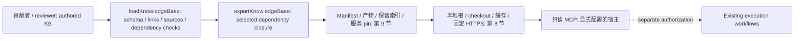
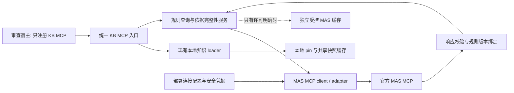

# Accessibility Knowledge Base：技术设计与协作扩展指南

[English](TECH-DESIGN.md) | 简体中文

本文面向内容贡献者、领域 reviewer 和服务维护者。第 1–10 节描述已实现的本地快照服务；
第 11 节定义计划中的 MAS 接入架构与扩展要求。MAS 连接、工具、配置解析和运行时闸门**尚未实现**。
安装/宿主注册见 [服务 README](README.md)，审核政策见 [贡献规范](../accessibility-kb/governance/contribution.md)，
交付任务见 [实施计划](TASKS.md)。版本以第 9 节为准。

## 1. 目标与边界

KB 是新增无障碍知识的唯一维护仓库：条目可引用、可审核、按依赖闭包分发，明确适用层次/版本、
依据权威性、上下文缺口、验证需求，以及修改影响的包、引用和评估。

| 范围 | 契约 |
|---|---|
| 当前服务 | 独立 KB + 只读 stdio MCP；不注册或改写现有插件，其知识、skills、配置、运行日志、浏览器和工作流保持不变。 |
| 执行责任 | Bug Bash 等调用方审查源码、执行另行授权的操作、作出结论并报告。KB 不读 A11y workflow 配置、不拥有 provider、不修复/测试/操作浏览器或 AT；`procedure` 指导推理，不执行工作流。 |
| 消费者迁移目标 | 就绪并通过消费者验收后，知识消费者使用宿主统一 Knowledge MCP，退役 `a11y-knowledge`、`a11y-knowledge-odsp` 及重复内嵌知识；不迁移当前安装。 |
| MAS 目标 | 宿主只注册一个 KB 入口，由内部只读 MAS adapter 提供规则；不是 Execution MCP 或修复/发布 provider。设计与安全部署边界见第 11 节。 |
| 不提供 | 官方来源自动同步、爬取、语义/向量检索、按任务自动选包、内容自动审批、插件自动接入或量化的 agent 效果保证。 |

当前 35 条内容（Common 20、Fluent 4、SharePoint 11）包含规则、API 责任、例外与正反例，
全部仍为 draft；来源可追溯不等于批准或安装版本资格验证（第 4.2 节）。

## 2. 整体结构与数据流



无环的**包依赖图**选择精确版本导出；**条目关系**与**活跃来源**分别绑定阅读关联与依据元数据（第 4 节）。

### 2.1 目录与维护责任

| 位置 | 用途 | 谁修改 / 是否生成 |
|---|---|---|
| [KB catalog](../accessibility-kb/catalog.json) | 注册所有内容包及其描述符位置 | 新增包时修改 |
| [Common](../accessibility-kb/packages/common/package.json)、[Fluent](../accessibility-kb/packages/fluent/package.json)、[SharePoint](../accessibility-kb/packages/sharepoint/package.json) 描述符 | 版本、依赖、来源与条目清单 | 各内容/领域 owner；放置规则见第 3 节 |
| [包 schema](../accessibility-kb/schemas/package.schema.json) / [支持矩阵 schema](../accessibility-kb/schemas/support-matrix.schema.json) | authoring 数据形状 | 协议维护者；不是普通内容修改 |
| 贡献规范 / 评估 rubric（引言及第 10 节） | 审核政策 / 知识效果标准 | 治理 / 评估负责人 |
| [内容校验/导出](tools/knowledge-base.mjs) | Ajv schema、文件清单、关系、来源及闭包校验 | 构建维护者 |
| [引用工具](tools/knowledge-reference.mjs) | 创建 pin；维护者解析本地引用 | 构建维护者；不随最小运行时分发 |
| [独立构建器](tools/build.mjs) | 生成 [源清单](../accessibility-kb/manifest.json)、[服务引用](references/knowledge.json)、产物和 [保留索引](../knowledge-distribution/index.json) | 发布维护者；生成与发布规则见第 9 节 |
| [运行时 loader](src/runtime/knowledge.mjs) | 位置解析、下载、缓存、语义与完整性校验 | 运行时维护者 |
| [MCP handler](src/runtime/knowledge-mcp.mjs) / [stdio 入口](cli.mjs) | 三个只读工具及传输 | 运行时维护者 |
| [独立 CI](../.github/workflows/knowledge.yml) / 本设计 | 独立 KB 校验 / 扩展契约 | 服务维护者；设计不进入快照 |

正文写入 [accessibility-kb](../accessibility-kb/README.md)，不写入 [现有插件知识](../src/knowledge/README.md)
或生成副本；独立构建器不调用 [marketplace 构建器](../tools/build.mjs)。

## 3. 知识分层：增加什么，放到哪里

依赖方向：SharePoint → Fluent + Common；Fluent → Common。Common 不依赖产品，引用产品案例也不例外；
Fluent 不包含 SharePoint 业务前提。精确版本/选择见第 9 节。**适用范围**（`common` / `fluent` / `sharepoint`）
与**知识类型**（标准 / 模式 / 案例 / 修复 / 示例，即 standards / patterns / cases / fixes / examples）
是独立维度，不是额外包或必需目录。WCAG/WAI-ARIA 规范性要求归 Common，APG 是不同的
informative 指导；有范围的实现/产品责任归 Fluent/SharePoint。写作 `kind` 与发现类别分开定义（第 4.1、8.1 节）。

### 3.1 内容放置速查表

目录是约定，不必一次建全；按第 4 节登记文件、按第 5 节组织正文。

| 内容 / 所属位置 | `kind` | 特有责任 |
|---|---|---|
| [Common topics](../accessibility-kb/packages/common/topics) | `topic` | 语义、键盘/焦点、表单、动态内容、视觉原则 |
| [Common requirements](../accessibility-kb/packages/common/requirements) | `requirement-guidance` | MAS/WCAG 权威性与适用性，规范与解释条款区别 |
| [Common analysis](../accessibility-kb/packages/common/analysis) | `analysis` | 根因 → 责任层，不修补表面症状 |
| [Common implementation](../accessibility-kb/packages/common/implementation) | `implementation-contract` | 组件/调用方责任，包括异步/错误分支 |
| [Common verification](../accessibility-kb/packages/common/verification) | `verification` | 静态、动态、设计、测试方法及证据限制 |
| [Common procedures](../accessibility-kb/packages/common/procedures) | `procedure` | Find/Fix/Prevent/Review/Add-tests 阅读顺序、决策和验证计划 |
| 所属包的 cases | `case` | 脱敏正反场景、正确修复层、适用性和验证 |
| [Fluent](../accessibility-kb/packages/fluent/README.md)：V8/V9/selection | `implementation-contract` | 有版本依据的 API/行为契约，不跨 major 推断 |
| [SharePoint](../accessibility-kb/packages/sharepoint/README.md)：SPDS/utilities/verification | `implementation-contract` / `verification` | 通用组件与产品包装层、工具和宿主约束 |
| [SharePoint profiles](../accessibility-kb/packages/sharepoint/profiles) | `product-profile` | 分开记录支持、适用性、实际验证、例外（第 7 节） |
| 效果评估（第 10 节） | 不是知识条目 | agent 判断和错误修复层，而非产品指导 |

以对话框焦点为例：Common 写目标选择原则，Fluent 写特定版本 Dialog 契约，SharePoint 写
宿主/包装层责任；用 `relations` 关联，不复制规则。

### 3.2 扩展现有知识

从所属概览/正文（含 [Common](../accessibility-kb/packages/common/README.md)）出发，不复制其内容清单；
在原条目补交互、例外或正反例，仅为可独立引用的内容新增 ID。保留组件/宿主职责与唯一播报/焦点 owner，
核实安装版本导出、provider、覆盖行为及有版本依据的签名，不猜未记录的 API。
登记/审核见第 4–7 节，发布见第 9 节；MAS 来源接入仍见第 11 节。

## 4. 数据模型与引用契约

### 4.1 Package、entry 和 source

| 对象 | 字段与语义 |
|---|---|
| package | `schemaVersion`、`id`、`version`、`dependencies`、`sources`、`entries`；不允许随意加未知字段 |
| entry 身份 | `id` 全 KB 唯一且以本包 ID 开头；`path` 相对本包目录。ID 与文件位置分离 |
| entry 分类 | `kind` 必须使用现有 schema 枚举；可选 `discoveryTags` 包含 1–3 个唯一值，限 `pattern`、`fix`、`example`。目录名不赋予类别或权威性 |
| entry 上下文 | `appliesTo` 是非空字符串数组，记录版本/产品/平台；list/search 可按精确标签过滤，不自动推断适用性或版本 |
| entry 来源 | `sourceIds` 仅引用本包活跃 `sources`，`[]` 表示无活跃引用。仅绑定条款支持声明的来源，不以待接入目标替代缺失引用；跨包阅读用 `relations`，不借别包 source ID |
| entry 关联 | `relations`、`deprecatedBy` 的目标必须存在于本包或它的依赖闭包内 |
| entry 生命周期 | `status` 为 `draft` / `approved` / `deprecated`；审批信息写在描述符，不靠正文一个“已审核”标签 |
| source | `id` 在包内唯一；`authority`、`status`、`locator`、`revision`、`note` 区分来源性质与就绪程度 |

合法 ID 如 `common.topic.keyboard-focus`。包名和 ID 段以小写字母开头，后续只允许
小写字母、数字、连字符；条目必须包含点分隔的命名空间。
`source.authority` 的六类为 `company-requirements`、`normative-standard`、
`informative-guidance`、`component-contract`、`product-support`、`historical-reference`。

包负责当前内容、来源绑定与审核状态。历史署名不构成依据，维护不需要历史 checkout 或独立的
来源到条目映射。source URL 只是元数据，不会被抓取；`relations` 不自动双向、递归读取或执行。

### 4.2 生命周期不是自动工作流

| 状态/变更 | 要求 |
|---|---|
| `connection-pending` | 说明连接缺口；`locator`/`revision` 可为 `null`。登记不代表连通、授权或批准。 |
| `review-pending` | 已有候选资料；URL 本身不证明支持当前结论。 |
| `reviewed` 来源 | 非空 `locator`、`revision`；校验器查形状，reviewer 核实条款。 |
| 历史来源 | 允许 `historical-reference` / `historical`，但不能直接支撑 approved 条目。 |
| 条目 → `approved` | 实际 owner、非 `unassigned` reviewer、审核日期、证据引用，至少一个相关来源且全部 reviewed；无来源的方法草稿不可批准。 |
| 来源/框架实质变化 | 人工退回受影响条目至 draft 并重审；无自动失效分析。 |
| 条目 → `deprecated` | 保留旧 ID，提供有效 `deprecatedBy`；不支持无替代目标的废弃或悄悄重定义 ID。 |

有权限的领域 reviewer 在记录上下文缺口后解决条款冲突，服务不自动指定优先级。
即使 metadata 为 approved，服务也始终返回 `contentApprovalVerified: false`、
`independentBehaviorVerified: false`：它不执行人工审核或行为验证。

### 4.3 文件和链接规则

- 每个正文（含包 README）均在 `entries` 声明；严格清单拒绝未登记笔记、图片、脚本或 fixture。
- 正文支持 Markdown，JSON 仅限 `kind: product-profile` + `dataSchema: support-matrix`；新 JSON 类型/图片/二进制需协议设计（第 7 节）。
- 包内相对 Markdown 链接可指向完整文件，不接受本地 `#heading`、跨包相对链接、越界路径或不支持的 URI；跨包用稳定 ID。
- 全局共享集合固定为 KB 根 README、catalog、两个 schema、贡献规范、评估 rubric；每个导出都包含它，必需链接不得依赖未选中产品。
- 新全局文件须更新 authoring `commonFiles`、runtime `COMMON_FILES` 和闭包测试；普通设计文档放服务目录，不进入快照。
- 运行时拒绝 Windows 大小写碰撞、设备名、symlink、文件/目录冲突；使用简单相对 `/` 路径，authoring 校验不能替代 runtime 校验。
- 私有资料、真实执行步骤、tenant、UPN、DevBox roster、凭据及用户运行证据留在授权外部系统，不写入知识正文。

## 5. 操作手册：新增一条知识

以跨产品“异步完成后焦点处理”为例，使用第 4 节约束下的**草稿元数据**。

1. 检查 [keyboard-focus](../accessibility-kb/packages/common/topics/keyboard-focus.md) 和 [dynamic-content](../accessibility-kb/packages/common/topics/dynamic-content.md) 是否重叠（第 3.2 节）。
2. 在示例路径创建 Common 正文，使用下方骨架。
3. 向 [Common 描述符](../accessibility-kb/packages/common/package.json) 添加以下对象。`wcag` / `apg` 是已有候选来源，须逐条核实支撑条款。

```json
{
  "id": "common.topic.async-focus",
  "path": "topics/async-focus.md",
  "kind": "topic",
  "status": "draft",
  "owner": "unassigned",
  "appliesTo": ["web", "async-ui"],
  "sourceIds": ["wcag", "apg"],
  "relations": ["common.topic.keyboard-focus", "common.topic.dynamic-content"]
}
```

4. 如需新来源，在同包 `sources` 添加候选记录，遵循第 4 节绑定和生命周期规则：

```json
{
  "id": "async-focus-contract",
  "authority": "component-contract",
  "status": "connection-pending",
  "locator": null,
  "revision": null,
  "note": "待确认授权来源、适用版本与精确条款；当前不提供已审核的契约内容。"
}
```

5. 更新 overview 导航及相关条目必需的阅读 `relations`。
6. 按第 9 节生成/发布、第 10 节评估；验证 `list/read` 可见性和 Common-only 隔离，合理更新计数，不删除边界测试。

### 推荐的正文骨架

使用描述性标题及以下结构；标题是写作指导，不是经过校验的 schema。

| 正文区域 | 应解释的内容 |
|---|---|
| 适用范围与不适用情况 | 产品/框架/版本/平台及缺失的前置上下文 |
| 来源与状态 | 来源 ID、条款/版本、规范与示例区别、明确的 draft 标识 |
| 语义/用户结果 | 结果为何重要，而不只是属性或固定实现 |
| 判断与责任 | 组件与调用方职责，异步、错误、取消和恢复分支 |
| 正反例与误修 | 最小脱敏示例，以及版本适用限制 |
| 验证/证据 | 源码能证明什么、哪些需要执行、不可验证时的 gap |
| 关联知识/待完善项 | 稳定 ID 和未解决的来源/版本/owner 问题 |

## 6. 操作手册：新增一个产品或框架包

只有内容具有独立适用域/维护责任时才新增包，不要为每一个主题建包。
以尚不存在的示例包 `product-example` 为例：

1. 在 [catalog](../accessibility-kb/catalog.json) 的 `packages` 添加
   `{"id":"product-example","path":"packages/product-example/package.json"}`。
2. 创建对应包描述符和 README 正文。以下是能表达一个最小 draft 包的描述符：

```json
{
  "schemaVersion": 1,
  "id": "product-example",
  "version": "0.1.1",
  "dependencies": {"common": "0.1.1"},
  "sources": [],
  "entries": [
    {
      "id": "product-example.overview",
      "path": "README.md",
      "kind": "topic",
      "status": "draft",
      "owner": "unassigned",
      "appliesTo": ["product-example"],
      "sourceIds": [],
      "relations": ["common.overview"]
    }
  ]
}
```

3. 匹配实际依赖版本（第 9 节），示例版本不是永久默认值。使用 Fluent 契约就显式依赖 Fluent，不逆转 Common 的依赖边界。
4. 按第 5 节添加正文、来源与关系；普通新包无需改 schema。
5. 按第 9.2 节选择发布与服务选包方式；catalog 登记改变 source manifest，不自动改变服务可读的包集合。

## 7. 操作手册：支持矩阵和 schema 扩展

现有例子是 [SharePoint support matrix](../accessibility-kb/packages/sharepoint/profiles/support-matrix.json)。
它区分产品支持声明、规则适用性和实际验证，不把“不支持”写成自动豁免。

- 无官方来源：`status: awaiting-official-source`、`products: []`，不猜产品、支持结果或例外。
- 有来源：设为 `sourced`、分配 owner、填产品版本；每个产品引用本包 reviewed 的 `product-support` 来源，locator/revision 逐字匹配。
- 每条 rule 填 `requirementId`、`applicability`、`supportStatus`、`verificationStatus`、`basis`、`verificationEvidence`、`exception`；verified 必须有证据。
- `requirementId` 是官方规则 ID，不一定是 KB entry。人工核实条款真实性、授权豁免和日期有效性；schema 合法不是独立证据验证。
- 更新已有记录的来源/版本并重审，不把旧验证自动沿用到新版本。

新 `kind`、`dataSchema` 或格式须同步修改 [JSON schema](../accessibility-kb/schemas/package.schema.json) 及所需新 schema、
[authoring](tools/knowledge-base.mjs) 形状/语义/文件校验、[runtime](src/runtime/knowledge.mjs) 字段/枚举/语义/共享文件校验，
并更新版本策略、导出、兼容文档和正反测试，确保重新计算哈希仍不能绕过语义限制。
Ajv 仅用于开发；安装后的运行时以 Node 内置模块独立校验，不执行新 schema 或任意输入代码。
**只改 schema 是不完整的协议修改。**

## 8. 消费层：检索、校验与安全边界

本节的隐私、固定下载和完整性 pin 仅适用于**本地快照**；实时 MAS 查询/数据边界另见第 11.4、11.7 节。

| 工具 | 入参 | 当前行为 |
|---|---|---|
| `a11y_kb_knowledge_list` | 下述可选过滤器；仍可用 `{}` | 完整过滤后 `entries`、所选闭包完整 `sources`、所用 `filters`、`facets`、`totalMatches`；不自动筛掉 draft/deprecated |
| `a11y_kb_knowledge_search` | 必填 `query`，1–256 字符，加下述可选过滤器 | 本地大小写不敏感的空白分词匹配；所有词均须出现在 ID/正文；最多 20 条 `matches`，每条最多 580 字符 excerpt；`totalMatches` 计截断前的全部命中 |
| `a11y_kb_knowledge_read` | 必填 `id`，1–256 字符；不接受发现过滤器 | 读取一个声明的完整条目、所引用来源、哈希和 `kb:<id>@<version>` 引用 |

### 8.1 精确发现过滤器与结果语义

类别不新增 `kind`：`standard` 来自直接引用的 `normative-standard` 来源，`case` 来自 `kind: case`，
`pattern` / `fix` / `example` 仅来自人工策划的 `discoveryTags`。
list 和 search 的所有已提供过滤器均按 **AND** 组合；search 还要求每个查询词都匹配。

| 过滤器 | 匹配契约 |
|---|---|
| `category` | `standard`、`pattern`、`case`、`fix`、`example` 之一；一个条目可属于多个类别 |
| `standard` | 精确的包内 source ID，如 `wcag` 或 `aria`，且 `authority: normative-standard`；不是标准名称、版本、criterion ID 或覆盖声明 |
| `sourceId` | 精确的包内 source ID，包括 informative 的 `apg`；用 `packageId` 消除跨包同名来源歧义 |
| `packageId` | 固定选择中的精确包 ID；不会自动把依赖包条目纳入结果 |
| `appliesTo` | 条目适用性标签中的精确成员，如 `fluent-v9`；无别名、通配符、大小写归一化或版本推断 |

`sourceId`、`standard` 与 `category: standard` 的规范性要求必须由**同一条直接引用的
来源记录**满足。例如，同时引用 WCAG 和 APG 的条目也不匹配 `sourceId: apg` 加
`category: standard`，或 `sourceId: apg` 加 `standard: wcag`。来源、类别和标签不沿包依赖
或 `relations` 继承，也不推断已安装版本或来源修订。

| 返回字段 | 语义 |
|---|---|
| list/search 条目 | 含 `packageId`、派生 `categories`、完整 `matchedSources`：满足来源/规范性过滤的直接引用记录；无这些限制则为全部引用，可为空。 |
| list `sources` | 所选完整来源目录，不限于匹配来源。 |
| list `facets` | 统计**完整过滤结果**，不是未过滤 KB 或 search 前 20 条：类别（含零）、包、精确适用性标签、带包标识的完整来源记录/计数。来源统计匹配条目的全部引用，不只 `matchedSources`；类别/标签重叠，计数和不必等于 `totalMatches`。 |
| search metadata | 所用 `filters` 不含 `query`；无 facets 或顶层完整来源目录。 |

七个条目的标签由正文人工策划；APG 引用、contract kind、相关标题或 case 关系均不自动赋标签：

| Entry ID | `discoveryTags` |
|---|---|
| `common.topic.dynamic-content` | `pattern`、`example` |
| `common.case.dialog-focus`、`fluent.v8.component-contract`、`fluent.v9.component-contract`、`sharepoint.spds.component-contract` | `pattern`、`fix`、`example` |
| `sharepoint.utilities.announcements-and-focus` | `pattern`、`example` |
| `sharepoint.case.duplicate-announcement` | `fix`、`example` |

`fix` 表示纠正性指导；`example` 可以是假设场景或反例，`case` 不认证已复现的历史事件。
标签不赋予权威性；类别或引用均不证明完整规范/criterion 覆盖、批准、合规或行为证据。无标签条目有效：没有 pattern/fix/example
类别匹配，但直接引用的规范性来源和 `kind: case` 仍分别决定 standard/case 匹配。

| 结果 | 契约 |
|---|---|
| 合法查询无匹配 | `entries: []` / `matches: []`、`totalMatches: 0`，不代表合规或不适用。语法合法的未知 ID/标签无匹配，不使用别名/fallback。 |
| 无效参数 | 未知键、缺 query/ID、数组/null 而非对象、类型错误、空白/超过 256 字符、不完整 Unicode、类别/标识符错误均返回 MCP `isError: true`。`standard`、`sourceId`、`packageId` 以小写 ASCII 字母开头，后接小写 ASCII 字母/数字/连字符；未知 read ID 也报错。 |
| 成功工具 | 返回第 4.2 节验证标志；list/search 另要求 `fullEntryReadRequired: true`。 |

### 8.2 可用的本地工具示例

初始化后，使用兼容服务和匹配快照，分别发送这些当前 KB 请求。

发现 Common 中直接引用 WCAG 规范性来源、且具有精确 web 标签的条目：

```json
{"jsonrpc":"2.0","id":1,"method":"tools/call","params":{"name":"a11y_kb_knowledge_list","arguments":{"category":"standard","standard":"wcag","sourceId":"wcag","packageId":"common","appliesTo":"web"}}}
```

浏览 informative APG 引用，不把 APG 当成规范性来源：

```json
{"jsonrpc":"2.0","id":2,"method":"tools/call","params":{"name":"a11y_kb_knowledge_list","arguments":{"sourceId":"apg","packageId":"common"}}}
```

查找经策划的 Fluent V9 纠正性指导；`MessageBar` 还必须出现在条目 ID/正文中：

```json
{"jsonrpc":"2.0","id":3,"method":"tools/call","params":{"name":"a11y_kb_knowledge_search","arguments":{"query":"MessageBar","category":"fix","packageId":"fluent","appliesTo":"fluent-v9"}}}
```

应用指导前读取返回条目的完整正文：

```json
{"jsonrpc":"2.0","id":4,"method":"tools/call","params":{"name":"a11y_kb_knowledge_read","arguments":{"id":"fluent.v9.component-contract"}}}
```

这个合法请求刻意返回空条目：同一来源不能既是 informative APG 又是规范性来源：

```json
{"jsonrpc":"2.0","id":5,"method":"tools/call","params":{"name":"a11y_kb_knowledge_list","arguments":{"category":"standard","sourceId":"apg","packageId":"common"}}}
```

搜索无相关性学习/权威性排序；先确定范围，再读完整正文、关联 ID 和来源状态，执行按第 1 节。
快照加载与限额独立于发现：

| Loader 边界 | 契约 |
|---|---|
| 解析顺序 | 显式绝对根 → 身份校验的开发 checkout → 每用户共享缓存 → 固定 HTTPS artifact。 |
| 无效状态 | 显式配置错误、已有损坏缓存、本地 pin 不匹配均失败，不降级版本或猜成功。每次调用重验；源码编辑不能绕过 pin 热更新。 |
| 传输 | 仅所选**完整闭包**，查询不发下载端；上限 15 秒/8 MiB/1000 文件，禁止任意 URL、重定向、凭据和路径逃逸。 |
| 帧/增长 | Stdio 单帧 1 MiB；监控产物/输出大小，超限需分包/分发设计，不关闭校验。 |

## 9. 版本、生成与发布

### 9.1 四种版本/身份

| 标识 | 含义 |
|---|---|
| `schemaVersion` | 数据协议版本；改变解析契约时评估升级 |
| 每包 `version` | 内容包版本；由维护者为审核发布显式更新，构建不会自动递增 |
| 服务 package `version` | MCP/loader 实现版本，不等于知识包版本 |
| manifest/raw SHA-256 | 精确快照及传输字节身份，不等于知识审批 |

发布约定：兼容修正用 patch，兼容新增用 minor，不兼容语义/ID 修改评估 major；代码仅检查三段数字格式，reviewer 执行 SemVer 语义。

当前基线：schema v1；Common、Fluent、SharePoint `0.1.1`；独立服务 `0.1.0`。
Fluent 依赖 Common `0.1.1`；SharePoint 依赖 Common 和 Fluent `0.1.1`。
依赖精确匹配，不支持 `^0.1.1`、`latest` 或范围；所有内容/发现元数据变化须重生成第 9.2 节产物，构建不发布 URL 或更新安装。

**兼容性：** 带标签快照需 `discoveryTags` 支持；旧严格运行时拒绝未知字段，当前运行时也接受无标签快照。
版本本身不证明兼容；安装/更新/回退使用精确哈希和匹配 runtime/reference，保留不可变产物（第 9.3 节）。
升级 Common 时更新所有直接精确依赖；Fluent 升级也要更新 SharePoint 对它的依赖。按第 4.2 节审核下游批准影响。

### 9.2 构建流程

当前 [构建器](tools/build.mjs) 固定发布 `[['common'], ['sharepoint']]`，服务引用使用
`createKnowledgeReference(kb, ['sharepoint'])`。

| 选择变化 | 必须采取的操作 |
|---|---|
| 仅编写内容 | catalog + 描述符 + 正文更新 source manifest，不改变服务选择。 |
| 单独发布产品闭包 | 增加构建选择和导出/pin/隔离测试；不会自动切换服务。 |
| 同一服务读取更多包 | 在引用中显式选中，并生成**同样选择的联合 artifact**；分开的单包产物不够。 |
| 新增真实产品依赖 | 更新真实依赖/版本，由现有选择递归包含；不得为分发伪造依赖或将 SharePoint 变为全产品聚合包。 |

可配置/多个独立选择或服务配置需要后续设计，当前无 CLI 切换参数。
在仓库根目录依次执行：

```powershell
npm ci --prefix knowledge-server
npm run build --prefix knowledge-server
npm test --prefix knowledge-server
npm run check --prefix knowledge-server
npm test
npm run check
```

第一套命令构建/校验独立 KB；最后两条验证未破坏现有 marketplace。
根目录 `npm run build` 不是 KB builder。外部工作流或 AT 不属于这些本地命令的验证范围。

构建：校验 authored 文件 → 计算闭包 → 规范化 manifest → `{schemaVersion, manifest, files}` artifact → 引用。
每文件 SHA-256、所选 `manifestSha256`、产物 raw SHA-256 各异；全量源与闭包 manifest 不必相同。
生成输出：全 KB 源哈希；服务 reference（所选版本、manifest pin、URL、raw pin）；内容寻址 JSON；
manifest pin → raw SHA-256 索引。共享 README/schema/治理修改可能改变所有选择的 pin。

不手写哈希、覆盖产物或删除保留版本。一次只运行一个 authoring build：校验全部保留历史 → no-replace
发布产物 → 索引 → 消费引用。完整当前产物已写入而索引未更新时可恢复；未知文件、缺失/损坏历史会阻断。
这不保证任何中断均能自动恢复。

### 9.3 发布闸门

1. 审核来源、版本、权限、适用性和私有资料边界（第 4 节）。
2. 本地校验/CI 通过，审核内容、依赖、pin 和保留产物。
3. 通过聚焦的 PR 发布，不直接推 main 或混入无关清理。
4. 核实引用实际指向 main 的内容寻址 HTTPS URL 及 raw SHA-256，再声称冷安装可用；本地构建不是发布。
5. 在授权真实宿主验证注册、发现、完整读取、冷/暖缓存、离线未命中失败和有效命中可用；模拟 transport 不是验收。
6. 在安全切换点更新；旧引用继续读旧产物，回退使用完整已审核旧 runtime/reference，不改哈希或删缓存伪造兼容。

## 10. 测试与协作验收

复用并扩展下列类别，不表示穷尽字段组合。矩阵/生命周期/选择变更需要 runtime 反例和精确的
artifact/reference 包集合检查，不只是调整通过计数。

| 改动 | 应补/检查的测试 |
|---|---|
| 新条目/来源/关系 | [knowledge-base tests](tests/knowledge-base.test.mjs)：描述符、未声明文件、来源与审批、链接和闭包 |
| 新包或选择 | [reference tests](tests/knowledge-reference.test.mjs)：选中/未选中内容、版本、显式根及 pin |
| schema、完整性、路径或缓存 | [runtime tests](tests/knowledge-runtime.test.mjs)：损坏、越界、symlink、错误 URL、语义违规及并发 |
| 工具输入/输出 | [MCP tests](tests/knowledge-mcp.test.mjs)：隔离安装、精确 ID、完整正文、来源与拒绝执行 |
| 分发/发布 | [standalone tests](tests/standalone.test.mjs)：旧引用冷启动、产物保留、中断恢复和现有文件不变 |
| 文档 | [documentation tests](tests/documentation.test.mjs)：双语编号、链接/锚点、写作示例 schema、可执行本地示例及仅为提案的 MAS 工具名 |
| 知识是否改善判断 | [效果评估 rubric](../accessibility-kb/evaluations/README.md)：单独授权的真实评估，不能用 unit test 代替 |

核对精确 ID 和第 1 节计数（完整闭包 35、Common-only 20），保留 Common 产品隔离、未选中包拒绝读取、
缺来源不可批准的反例。评估至少包含真实风险、干净反例、缺上下文、版本/产品不适用各一例；
记录误报/漏报、修复层次、证据校准、回归风险及未运行项目。

### 提交前清单

- [ ] 第 1–3 节：归属/层次正确，无重复正文或插件/workflow 变更。
- [ ] 第 4–5 节：文件/ID/来源/关系已登记；生命周期真实，正文含范围、正反例和 gap，无私有数据。
- [ ] 第 6–9 节：选择明确、artifact/reference 匹配、schema 覆盖双校验器、build/test/check 通过、pin 已审核且历史保留。
- [ ] 第 9.3–10 节：内容/效果审核完成或明确待办；发布及授权真实宿主检查与本地测试分开。

PR 聚焦一个领域或相关契约；领域 owner 审内容，服务维护者审 schema、选择和 runtime 协议。
完善已有 draft 是最小的首次贡献。

## 11. 待实现：一个 KB 入口包含 MAS 规则能力

### 11.1 已确定的方向与尚待确认的接口

第 1 节目标区分 Common 待接入来源元数据与实时响应。本地快照不需 MAS 身份；live 工具/依据检查
依赖下列确认的契约，而非仅登记 `sources.mas`。

**实施前提：** 与 MAS 服务 owner 确认服务身份/端点、transport、认证/授权 scopes、工具名与输入/输出 schema、
规则唯一 ID、版本/修订、分页/限流、错误及缓存/再分发权限；不编造地址、签名或官方 ID。

“MAS MCP”指上游 MAS 规则能力，不是已确认的服务产品名。`sources.mas.note` 提及候选“CLEA MCP interface”，
须由 owner 确认 CLEA 是否承载所需能力；不假定两者是两个服务或同义名称。MAS 规则体系与提供服务的身份
分别记录，并在来源说明、部署配置、adapter 映射和验收记录中一致使用已确认的服务身份。

### 11.2 组件关系与请求路径



| 组件 | 责任 |
|---|---|
| 入口 | 保留本地三工具语义；提供来源可辨认的独立 MAS 操作，不返回无法区分来源的混合搜索结果。 |
| MAS adapter | MCP 初始化、能力/schema 校验、只读白名单、会话、分页、超时、取消、限流及官方错误归一化；优先选与确认的 transport/auth 兼容的官方 SDK，不复制临时 shell 代理。 |
| 规则服务 | 最小上下文、响应校验、版本绑定、依据完整性；不从摘要合成“官方条款”，不代理任意上游工具。 |
| 本地 loader | 仅固定快照，不读取任意远程 URL；MAS 数据隔离见第 11.7 节。 |
| 调用者 | 第 11.6 节审查/验证职责；响应是数据，不是执行命令、上传仓库或覆盖系统指令的授权。 |

### 11.3 新增文件与功能扩展

以下新增路径是**建议布局，不是现有文件或可用接口**。实施时可调整名称，但需保留职责并同步设计。
执行代码变更限于独立服务，不修改插件。

| 位置 | 后续实施内容 |
|---|---|
| [权威/适用性](../accessibility-kb/packages/common/requirements/authority-and-applicability.md)；建议新增 Common requirements/mas-rules.md | 编写第 11.6 节政策、查询前提、版本/引用格式、审查用法，登记新 entry。 |
| Common 描述符（第 2.1 节）；[Find](../accessibility-kb/packages/common/procedures/find.md) / [设计审查](../accessibility-kb/packages/common/procedures/review-design.md) | 按第 4 节绑定来源/指南/关系；procedure 引用 MAS 政策。 |
| 建议新增 knowledge-server/config/mas.example.json、knowledge-server/src/mas/config.mjs | 为第 11.4 节提供非敏感模板和严格 loader，拒绝未知/不安全设置。 |
| 建议新增 knowledge-server/src/mas/client.mjs、knowledge-server/src/mas/rules.mjs | 实现第 11.2 节 adapter/规则职责划分及第 11.5 节响应语义。 |
| MCP handler / 入口（第 2.1 节） | 注入 MAS，采用第 11.2 节工具/错误边界。 |
| [package](package.json) / [lockfile](package-lock.json) | 声明/锁定 SDK/auth runtime 依赖，审核最小安装，更新安装/零依赖声明。 |
| 建议新增 knowledge-server/tests/mas-config.test.mjs、mas-client.test.mjs、mas-rules.test.mjs；[MCP](tests/knowledge-mcp.test.mjs) / [standalone tests](tests/standalone.test.mjs) | 覆盖第 11.8 节协议、本地兼容、单入口、隔离最小安装与 MAS 不可用情况。 |
| 治理/评估（第 2.1 节）、服务 README 和本文 | 审批/保密、误用案例、注册、依赖与已验证能力状态。 |

连接设置不进入描述符或 [生成 reference](references/knowledge.json)；`sources.mas.locator` 定位规则，不配置 transport/auth。
新的结构化规则响应需独立 schema/校验，不能向内容临时塞 endpoint/token 字段。内容发布仍按第 9 节。

### 11.4 配置与认证：能力随包，身份不随包

包内提供 adapter、schema、模板和允许的默认信息，**默认不启用 live 来源**，部署实值留在仓库外。
建议的 `A11Y_ASSIST_MAS_CONFIG` 可指向绝对配置路径，但名称待定、当前不识别。

契约须规定 enabled、transport、可信目标、auth 方式引用、deadline、重试/分页上限、只读白名单和缓存政策。
错误配置在 MAS 使用前失败，不猜地址、跳过认证或换来源；是否使整体启动失败仍需按错误类型定稿。
未配置/禁用 MAS 必须允许初始化和本地工具使用，MAS 返回明确不可用/未配置错误。

- **可信目标：** 管理员/用户配置的固定 endpoint，不接受模型提供 URL/命令/凭据。官方仅有 stdio 时使用可信可执行文件和固定参数，不执行规则正文命令。
- **认证：** 官方流程与明确 audience/scopes，不盲目转发宿主 token；用户登录走宿主/官方授权，不在模型对话输入 secret。
- **凭据/诊断：** 仅安全存储或运行环境供给；不写模板、日志、artifact、错误或 fixture。仅记录允许的诊断元数据，清理上游错误。
- **查询数据：** 告知调用者必要规则 ID、版本、产品/平台上下文或最小文本将发送上游。自由文本限制长度/数据；默认排除源码、工作项、账户/机器清单和整段对话。
- **能力：** 仅官方只读查询，不更新规则、管理租户、读文件或执行 provider。

### 11.5 对外能力与规则返回（提案，尚未实现）

以下工具**仅为提案、尚未注册**，名称/参数须按已确认的上游协议定稿：

| 建议 KB 工具 | 目的 | 关键限制 |
|---|---|---|
| `a11y_kb_mas_status` | 未配置、禁用、需认证、不可用或已确认可查询 | 配置不等于探测成功；成功注明验证范围/时间，本地可用性按第 11.4 节。 |
| `a11y_kb_mas_search` | 规则/产品上下文候选与分页/完整性 | 无匹配只针对本次查询，不是无适用规则；top-N/未完分页不表示完整覆盖。 |
| `a11y_kb_mas_read` | 精确 ID/请求版本的完整规则 | 缺规则/版本则失败；摘要/截断标不完整。不用近似规则、WCAG 映射或 latest 替代。 |
| `a11y_kb_mas_check_basis` | 提交来源/版本/上下文的完整性 | 缺必需字段则失败，调用方填写 ID 不证明已读；范围/完成限制见第 11.6 节。 |

响应 envelope 须标明 `source: mas`、已配置服务身份、规则 ID、实际标准版本/修订、官方 locator、
检索时间、正文/摘要属性、完整性和适用上下文。哈希只标识字节，不证明官方真实性或完整规则覆盖。
未返回信息标为未知，不由 adapter 推断。

每次审查绑定规则版本和已取得的引用；浮动 latest 或不可追溯修订意味着版本依据不足，不静默混用。
重新查询不是原结果；保留/重新校验规则见第 11.7 节。

### 11.6 “必须遵循 MAS”的政策与可执行边界

**知识层负责政策，服务检查依据完整性，消费方负责执行/发布门禁。**
已确认适用 MAS 时：取得范围/版本 → 查候选并完整读规则 → 记录 ID、版本、适用性和获授权例外依据 → 作结论。
范围未知须补上下文，不是“不适用”；本地方法/案例、猜测的 WCAG 映射或组件支持不能替代 MAS 条款或授予豁免。

返回 `complete` / `incomplete` 和 gap（enum 待评审），仅限**指定范围和提交依据集合**，不代表穷尽发现、
产品合规、关闭 Bug 或发布 PR。消费方须调用/执行完成阻断；新增工具不保证被使用，也不改变 workflow gate。
工具特定失败见第 11.5 节。

| 情况 | 必须表现的结果 |
|---|---|
| 超时、限流、上游错误 | 有界失败/重试，返回可区分错误；不能返回成功形状的空规则集 |
| 来源冲突/修订变化/范围未知 | 保留冲突和缺口，请求确认；不自动裁定或混合依据 |
| 依据完整但未执行真实验证 | 只返回标准依据就绪；运行行为仍未验证，不输出合规 PASS |

### 11.7 MAS 缓存与静态发布隔离

首版**禁用持久 MAS 正文缓存**，只在授权请求/会话范围处理数据。存储、有效期、撤销、用户隔离和
再分发政策须先获 owner 许可。无正文存储许可时，仅保留允许的 ID/版本/引用，使用时重验。
身份相关结果不得跨用户/租户复用；缓存 key 绑定服务身份、授权上下文、规则 ID 和版本，内容/访问均受控。

缓存使用仓库外独立受控位置，不进入公共快照缓存、Git、KB manifest 或分发产物。离线、过期、权限变化或
不可验证的数据不能静默冒充当前条款；获官方许可的离线 pin 另需有效期和调用方显式选择的政策。
实时 MAS 与静态快照的来源身份独立，不将实时响应写入旧 pin 文件。

### 11.8 分阶段交付与验收

1. **确认协议：** 与 owner 完成第 11.1 节并取得授权示例；无真实契约则实施仍 blocked，mock 不能解除阻断。
2. **实现 adapter：** 第 11.2–11.4 节配置/auth/握手/白名单/校验及第 11.3 节依赖/最小包审核；保留本地兼容。
3. **实现规则语义：** 第 11.5–11.7 节版本绑定、完整读取、分页、依据检查、Common 政策和数据隔离。
4. **合成测试：** 明确标记的 server 覆盖成功、未知工具/schema、auth/超时/限流、未完分页、版本漂移、缺字段、错误脱敏、任意 URL/工具拒绝、跨身份缓存隔离；正文指令诱导不得执行命令、转发 secret 或扩大授权。
5. **单入口集成：** 隔离宿主只注册 KB 即可用 MAS；MAS 未配置/离线时本地三工具可用，不依赖隐藏的第二个宿主注册入口。
6. **真实 qualification：** 明确授权的真实 MAS 验证认证、原文/版本、引用和失败，留下可审核结果；正反评估须证明缺 MAS 不虚报完成、错误版本不套用、完整依据不是产品合规。

仅在验收完成后，README 和设计中对应能力才能由待实现改为已支持。
