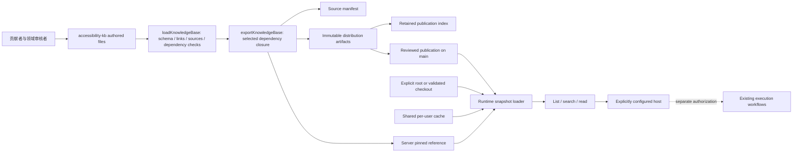
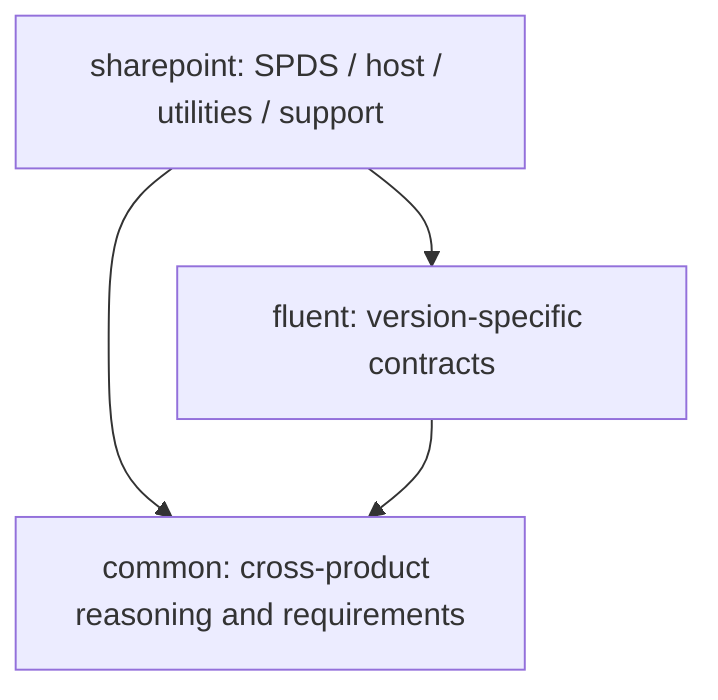
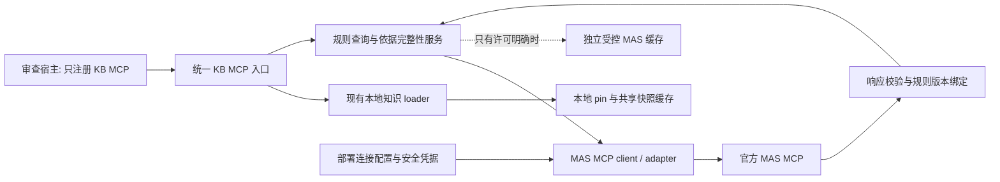

# Accessibility Knowledge Base：技术设计与协作扩展指南

[English](TECH-DESIGN.md) | 简体中文

本文面向内容贡献者、组件/产品专家、KB reviewer 和服务维护者。
描述 schema v1、authored 内容包 0.1.1 与独立服务 0.1.0，不把计划中的能力当作已交付功能。
安装和宿主注册见 [服务 README](README.md)；内容审核政策见
[贡献规范](../accessibility-kb/governance/contribution.md)。

**目标架构补充：一个 KB 入口同时提供本地知识与 MAS 权威规则能力。**
第 1–10 节描述已实现的本地快照服务；第 11 节定义同事后续要实现的 MAS 接入。
MAS 补充部分仅为设计，MAS 连接、工具、配置解析和运行时闸门尚未实现。

## 1. 目标与边界

KB 是新增无障碍知识的唯一维护仓库。Common 负责跨产品知识，Fluent 负责框架契约，
SharePoint 负责产品约束；内容可引用、可审核、可按依赖闭包分发。
目标不是把所有资料放进一个长文档，而是让协作者能够回答：

- 当前任务应读哪一层、哪个版本、哪条知识？
- 一项结论来自规范、组件契约、产品支持声明，还是未经审核的方法建议？
- 缺少哪些上下文或来源，哪些验证仍需要真实环境？
- 改动一条知识后，哪些包、引用和评估需要一起更新？

**当前边界：** 这是独立 KB + 只读 stdio MCP，不注册或改写任何现有插件。
已有插件的知识、skills、配置、运行日志、浏览器和工作流保持各自原有行为。
本服务不读 A11y workflow 配置，不拥有执行 provider，也不执行修复、测试、浏览器或 AT。
`procedure` 是推理和计划指导，不是可自动执行的 workflow。

**最终替代目标：** 服务就绪并通过消费者验收后，所有需要无障碍知识的 plugin 应通过宿主的
统一 Knowledge MCP 获取知识，退役 `a11y-knowledge`、`a11y-knowledge-odsp` 和重复内嵌知识。
这是后续迁移，不是当前安装行为的变更。Bug Bash 等调用方仍负责审查源码、执行另行授权的操作、
作出结论并生成报告。服务提供知识发现和读取，不提供 Execution MCP 或 MAS 接入。

**当前不提供：** 官方来源自动同步、网页爬取、语义/向量检索、按任务自动挑选包、
内容自动审批、插件自动接入或已量化的 agent 效果保证。当前 35 条内容（Common 20、
Fluent 4、SharePoint 11）包含具体无障碍规则、API 责任、例外与正反例，状态仍为 draft：
来源可追溯不等于官方批准或当前安装版本的资格验证。

**后续目标：** MAS MCP 客户端/适配器随独立 KB 服务提供，宿主只注册一个 KB MCP；
不用让每个宿主分别编排 KB 和 MAS。MAS 连接由 KB 服务内部管理，凭据仍由运行环境
安全提供。它属于只读权威来源访问，不是修复/发布 provider，不改变现有插件 workflow。
当前未实现，不能将“登记了 sources.mas”当作“已经连接 MAS”。

## 2. 整体结构与数据流



三个不同的结构不能混淆：

1. **包依赖图**：决定导出哪些包，要求版本精确匹配且无环。
2. **条目关系图**：`relations` 指向要一起理解的知识 ID；不会自动递归读取或执行。
3. **活跃来源记录：** `sourceIds` 仅指向本包的活跃来源元数据；服务不会抓取来源 URL。

活跃目录保留现有官方来源记录及待接入/待审核目标；登记不等于批准。
许多草稿条目为 `sourceIds: []`，表示没有引用活跃来源。
当前内容、来源绑定与审核状态由 KB 包负责维护；历史署名不构成支撑来源，
也不要求另行维护来源到条目的映射。

### 2.1 目录与维护责任

| 位置 | 用途 | 谁修改 / 是否生成 |
|---|---|---|
| [KB catalog](../accessibility-kb/catalog.json) | 注册所有内容包及其描述符位置 | 新增包时修改 |
| [Common 描述符](../accessibility-kb/packages/common/package.json) | 通用知识的版本、来源、条目清单 | 通用内容贡献者 |
| [Fluent 描述符](../accessibility-kb/packages/fluent/package.json) | Fluent 版本契约、依赖和条目 | 框架专家 |
| [SharePoint 描述符](../accessibility-kb/packages/sharepoint/package.json) | SPDS、工具、宿主与支持约束 | 产品专家 |
| [包 schema](../accessibility-kb/schemas/package.schema.json) / [支持矩阵 schema](../accessibility-kb/schemas/support-matrix.schema.json) | authoring 数据形状 | 协议维护者；不是普通内容修改 |
| [贡献规范](../accessibility-kb/governance/contribution.md) / [效果评估 rubric](../accessibility-kb/evaluations/README.md) | 审核规则和知识效果的评价标准 | 内容治理与评估负责人 |
| [KB 源清单](../accessibility-kb/manifest.json) | 整个 authored KB 的内容哈希 | 构建生成，不手改 |
| [内容校验/导出](tools/knowledge-base.mjs) | Ajv schema、文件清单、关系、来源及闭包校验 | 构建维护者 |
| [引用工具](tools/knowledge-reference.mjs) | 创建 pin；维护者解析本地引用 | 构建维护者；不随最小运行时分发 |
| [独立构建器](tools/build.mjs) | 选择分发包，生成产物并保留历史 | 发布维护者 |
| [服务引用](references/knowledge.json) | 服务当前选择的版本、manifest pin、URL 和 raw pin | 构建生成，不手改 |
| [分发索引](../knowledge-distribution/index.json) | 所有保留产物的 manifest pin → raw SHA-256 | 构建生成；保留历史 |
| [运行时 loader](src/runtime/knowledge.mjs) | 位置解析、下载、缓存、语义与完整性校验 | 运行时维护者 |
| [MCP handler](src/runtime/knowledge-mcp.mjs) / [stdio 入口](cli.mjs) | 三个只读工具及传输 | 运行时维护者 |
| [独立 CI](../.github/workflows/knowledge.yml) | KB 与现有 marketplace 分别校验 | 服务维护者 |
| 本文 | 设计、扩展步骤与职责边界 | 维护者；不进入知识快照 |

**不要把独立 KB 与现有插件知识混写。** 本设计的内容写入独立的
[accessibility-kb](../accessibility-kb/README.md)，不修改
[现有插件知识](../src/knowledge/README.md) 或生成的插件副本。
独立构建器也不调用 [marketplace 构建器](../tools/build.mjs)。

## 3. 知识分层：增加什么，放到哪里



箭头表示“依赖”。`common` 不允许依赖任何产品包；不能为了引用一个产品案例，
把整个产品包反向拉入 Common。Fluent 不应包含 SharePoint 专属业务前提。
依赖使用精确版本，例如 `0.1.1`，不支持 `^0.1.1`、`latest` 或版本范围。

知识组织有两个独立维度：**适用范围**（`common` / `fluent` / `sharepoint`）与
**知识类型**（标准 / 模式 / 案例 / 修复 / 示例，即 standards / patterns / cases / fixes / examples）。
类型不是新增包，也不是协议要求的新目录。WCAG 和 WAI-ARIA 的规范性要求归 Common；
Fluent 和 SharePoint 描述有范围的实现与产品责任。APG 属于 informative 指导，
与这些规范性要求不同，即使同一条目同时引用两者，也不能混为一谈。

发现 API 使用单数 category：`standard`、`pattern`、`case`、`fix`、`example`，不新增 `kind` 值。
`kind` 仍是条目的主要写作角色；可选、人工策划的 `discoveryTags` 仅提供
`pattern` / `fix` / `example`。`case` 类别由 `kind: case` 派生；`standard` 类别由
直接引用的 `authority: normative-standard` 来源派生。来源引用或类别均不证明完整规范或
criterion 覆盖、批准、合规，也不证明存在已验证的真实历史修复。

### 3.1 内容放置速查表

以下目录是内容组织约定，不是必须一次建全的模板；具体文件要在描述符中声明。

| 想补充的内容 | 放置位置 / 现有起点 | `kind` | 应写清楚 |
|---|---|---|---|
| 通用语义、键盘、焦点、表单、动态内容、视觉原则 | Common `topics/`，如 [keyboard-focus](../accessibility-kb/packages/common/topics/keyboard-focus.md) | `topic` | 适用范围、边界与常见误用 |
| MAS/WCAG 等依据的适用性与权威差异 | Common `requirements/`，从 [authority-and-applicability](../accessibility-kb/packages/common/requirements/authority-and-applicability.md) 扩展 | `requirement-guidance` | 精确条款、版本、规范/解释区别、未接通的来源 |
| 根因定位和应该修改哪一层 | Common `analysis/`，如 [root-cause](../accessibility-kb/packages/common/analysis/root-cause.md) | `analysis` | 现象到责任层的推理，而非见到症状就加补丁 |
| 跨组件实现职责 | Common `implementation/`，如 [component-contract](../accessibility-kb/packages/common/implementation/component-contract.md) | `implementation-contract` | 组件已有能力、调用方责任、异步/错误分支 |
| 静态、动态、设计、测试验证方法 | Common `verification/` | `verification` | 能证明什么、不能证明什么、需要何种证据 |
| Find/Fix/Prevent/Review/Add-tests 的知识使用步骤 | Common `procedures/` | `procedure` | 阅读顺序、决策与验证计划；不授予执行权限 |
| 可复用正反案例 | 所属包的 `cases/` | `case` | 场景、反例、正确层次、验证及不适用情况；脱敏 |
| Fluent V8 与 V9 API/行为差异 | Fluent `v8/`、`v9/`、`selection/` | `implementation-contract` | 实际版本及文档条款；不同 major 不互相猜测 |
| SPDS 组件和 SharePoint 工具/宿主约束 | SharePoint `spds/`、`utilities/`、`verification/` | 契约用 `implementation-contract`；验证用 `verification` | 通用组件与产品包装层的边界 |
| 产品支持声明、版本和例外依据 | SharePoint `profiles/`，如 [support-policy](../accessibility-kb/packages/sharepoint/profiles/support-policy.md) | `product-profile` | 支持声明、适用性、实际验证和例外分别记录 |
| 知识是否让 agent 判断得更好 | [evaluations rubric](../accessibility-kb/evaluations/README.md) | 不是产品知识条目 | 正负样本、误报/漏报、证据校准、错误修复层 |

同一个问题可能拆成多层：Common 写“关闭对话框时如何选择焦点返回目标”，
Fluent 写“特定版本 Dialog 提供什么契约”，SharePoint 写“宿主/包装工具覆盖了哪些职责”。
通过 `relations` 关联，不复制三份通用规则。来源相互冲突时记录上下文缺口，
由有权限的领域 reviewer 决定适用条款；不能由服务自动假定某来源覆盖另一来源。

### 3.2 扩展现有知识

从已有正文出发，不另建重复清单。各包概览提供阅读路由，
描述符绑定稳定条目 ID、来源与维护责任。

| 领域 / 起点 | 应保留的已实现覆盖 | 有用的下一步贡献 |
|---|---|---|
| [Common 概览](../accessibility-kb/packages/common/README.md) | 渲染语义；完整的异步可见/程序化/焦点结果；消失控件焦点；本地化消息；有范围的扫描与替换案例 | 在所属主题添加缺失交互或反例，再关联验证与流程 |
| [Fluent 选型](../accessibility-kb/packages/fluent/selection/components-and-utilities.md)、[V8](../accessibility-kb/packages/fluent/v8/component-contract.md)、[V9](../accessibility-kb/packages/fluent/v9/component-contract.md) | 组件到文档映射；V8 `delayedRender`/`Announced`；V9 intent/`AriaLiveAnnouncer`/`useAnnounce`；恢复焦点与 shim 边界 | 核实安装版本的导出、provider 与覆盖行为；保留唯一播报/焦点责任方 |
| [SharePoint 概览](../accessibility-kb/packages/sharepoint/README.md) | Table/DataGrid 与 stable/LazyComponents 选型；SPDS 组合；共享播报和焦点；中性主题 provider 与替换检查 | 扩展具体宿主场景，保留产品范围与调用方义务 |
| [RTE](../accessibility-kb/packages/sharepoint/utilities/rich-text-accessibility.md)、[拖动/重排](../accessibility-kb/packages/sharepoint/utilities/drag-and-drop.md)、[格式化](../accessibility-kb/packages/sharepoint/utilities/localization-and-formatting.md) | 检查器能力、移动状态协议、完整计数/ReactNode 资源及 RTL 例外 | 在固定来源仅给出名称/行为之处补有版本依据的签名或边界案例，不猜缺失 API 细节 |
| Common requirements 与 SharePoint profiles | 来源/适用性政策，以及独立的支持/验证维度 | 获取官方条款/支持声明、分配 reviewer、记录审核证据；MAS 实施仍见第 11 节 |

每项贡献在所属正文中说明有范围的规则、例外与正反验证案例，并引用适用的源条款和版本。
仅在当前来源的条款支持声明时，在包描述符中绑定该来源；不以待接入目标代替缺失引用。
为资格验证取得独立来源审核，不编造批准状态。内容维护不需要检出历史仓库，
也不需要另行维护来源到条目的映射。
私有资料、凭据与运行证据留在授权外部系统。
按第 4–7 节登记，按第 9 节协调版本与发布。

## 4. 数据模型与引用契约

### 4.1 Package、entry 和 source

| 对象 | 字段与语义 |
|---|---|
| package | `schemaVersion`、`id`、`version`、`dependencies`、`sources`、`entries`；不允许随意加未知字段 |
| entry 身份 | `id` 全 KB 唯一且以本包 ID 开头；`path` 相对本包目录。ID 与文件位置分离 |
| entry 分类 | `kind` 必须使用现有 schema 枚举；可选 `discoveryTags` 包含 1–3 个唯一值，限 `pattern`、`fix`、`example`。目录名不赋予类别或权威性 |
| entry 上下文 | `appliesTo` 是非空字符串数组，记录版本/产品/平台；list/search 可按精确标签过滤，不自动推断适用性或版本 |
| entry 来源 | `sourceIds` 只能引用本包活跃 `sources` 中的 ID。跨包阅读关联用 `relations`，不能直接借用别包来源 ID |
| entry 关联 | `relations`、`deprecatedBy` 的目标必须存在于本包或它的依赖闭包内 |
| entry 生命周期 | `status` 为 `draft` / `approved` / `deprecated`；审批信息写在描述符，不靠正文一个“已审核”标签 |
| source | `id` 在包内唯一；`authority`、`status`、`locator`、`revision`、`note` 区分来源性质与就绪程度 |

合法 ID 如 `common.topic.keyboard-focus`。包名和 ID 段以小写字母开头，后续只允许
小写字母、数字、连字符；条目必须包含点分隔的命名空间。
`source.authority` 的六类为 `company-requirements`、`normative-standard`、
`informative-guidance`、`component-contract`、`product-support`、`historical-reference`。

### 4.2 生命周期不是自动工作流

- 来源未接通：`connection-pending`，`locator`/`revision` 可以为 `null`，说明缺什么。
- 有候选资料但未审核：`review-pending`；有 URL 并不意味着支持当前结论。
- 审核来源：`reviewed` 必须有非空 `locator` 和 `revision`；校验器检查形状，实际条款由 reviewer 核实。
- 历史资料：schema 允许 `historical-reference` / `historical`；历史资料不能直接支撑 approved 条目。
- 条目从 draft 升 approved：实际 owner、非 `unassigned` reviewer、审核日期、证据引用；
  至少一个相关来源且全部为 reviewed。纯方法草稿可以暂时没有 source，但不能因此审批通过。
- 来源或框架发生实质变化：**人工**把受影响条目退回 draft、重新审核；没有自动失效分析。
- 废弃条目：保留旧 ID，`status: deprecated` 并提供有效 `deprecatedBy`。
  当前政策不支持无替代目标的 deprecation；不要悄悄把同一 ID 改成另一含义。

服务始终返回 `contentApprovalVerified: false`、`independentBehaviorVerified: false`。
即使条目 metadata 是 approved，这两个字段也不会变成 true：服务没有执行人工审核或行为验证。

### 4.3 文件和链接规则

- 每个正文必须在 `entries` 声明；包目录里的 README 也必须是一个 entry。
  不要直接丢进未登记的笔记、图片、脚本或 fixture；严格文件清单会拒绝它们。
- 正文当前支持 Markdown；JSON 仅支持 `kind: product-profile` + `dataSchema: support-matrix`。
  任意新的 JSON 类型、图片或二进制附件都需要协议设计，不是新增一个文件即可。
- 本包内部可用相对 Markdown 链接指向完整文件；当前拒绝本地 `#heading` 锚点、
  跨包相对链接、越界路径及不支持的 URI。跨包关系用稳定 ID。
- 全局共享文件集合是固定的：KB 根 README、catalog、两个 schema、贡献规范和评估 rubric。
  每个导出都带这些文件，因此它们不能包含依赖某个未选中产品包的必需链接。
- 新增全局 KB 文件需要同时更新 authoring 的 `commonFiles` 和 runtime 的 `COMMON_FILES`，
  并补闭包测试；普通设计说明应像本文一样放在服务目录，不扩大分发内容。
- Windows 路径的大小写碰撞、设备名、符号链接、文件/目录冲突会被运行时拒绝。
  内容路径用简单的相对 `/` 路径；authoring 校验通过不等于完整运行时校验已通过。

## 5. 操作手册：新增一条知识

以下例子是**草稿元数据示范**，不是新增了经审核的规则。
假设要补充跨产品的“异步完成后焦点处理”主题：

1. 先检查现有 [keyboard-focus](../accessibility-kb/packages/common/topics/keyboard-focus.md)
   和 [dynamic-content](../accessibility-kb/packages/common/topics/dynamic-content.md)。
   相同语义优先完善原条目；可独立引用的新主题才新增 ID。
2. 新建 Common 包内的 `topics/async-focus.md`，按下方正文模板写出范围与缺口。
3. 在 [Common package descriptor](../accessibility-kb/packages/common/package.json) 的 `entries`
   中加入如下对象。示例引用已有候选来源 `wcag` / `apg`；仍需逐条核实正文依据。

```json
{
  "id": "common.topic.async-focus",
  "path": "topics/async-focus.md",
  "kind": "topic",
  "status": "draft",
  "owner": "unassigned",
  "appliesTo": ["web", "async-ui"],
  "sourceIds": ["wcag", "apg"],
  "relations": ["common.topic.keyboard-focus", "common.topic.dynamic-content"]
}
```

4. 如需补新来源，在**同一个包**的 `sources` 加记录。尚未接通的候选来源可以如下表示，
   不能把它标成 reviewed，也不要给不相关条目挂上它来制造“有依据”的印象。

```json
{
  "id": "async-focus-contract",
  "authority": "component-contract",
  "status": "connection-pending",
  "locator": null,
  "revision": null,
  "note": "待确认授权来源、适用版本与精确条款；当前不提供已审核的契约内容。"
}
```

5. 更新本包 overview 的阅读导航；如果另一个条目必须一起读，再增加它的 `relations`。
   关系不自动双向，也不会替调用方读取正文。
6. 按第 9 节处理版本、生成与评估。检查新增条目通过 `list/read` 可见，而 Common-only
   导出仍不依赖任何产品包。计数断言需要随有依据的内容变化更新，不要直接删掉边界测试。

### 推荐的正文骨架

```markdown
# 标题

## 适用范围与不适用情况
产品/框架/版本/平台，以及必须先取得的上下文。

## 来源与当前状态
具体来源 ID、条款/版本、规范或示例的性质；未审核内容明确写为 draft。

## 需要维持的语义或用户结果
描述为什么需要它，而非只列某个属性或固定实现。

## 判断与实现责任
组件已做什么，调用方负责什么；异步、错误、取消和恢复分支。

## 正例、反例与常见误修
用最小、脱敏的示例说明；不要假定示例对所有组件版本都成立。

## 验证与证据边界
源码能判断什么，哪些必须实际运行；无法验证时如何标记 gap。

## 相关知识与待完善项
列稳定 ID、未解决的来源/版本/owner 问题。
```

该骨架是写作建议，当前不校验这些标题。真实执行步骤、tenant、UPN、DevBox roster、
认证信息和用户运行证据不能作为知识正文入库。

## 6. 操作手册：新增一个产品或框架包

只有内容具有独立适用域/维护责任时才新增包，不要为每一个主题建包。
以尚不存在的示例包 `product-example` 为例：

1. 在 [catalog](../accessibility-kb/catalog.json) 的 `packages` 添加
   `{"id":"product-example","path":"packages/product-example/package.json"}`。
2. 创建对应包描述符和 README 正文。以下是能表达一个最小 draft 包的描述符：

```json
{
  "schemaVersion": 1,
  "id": "product-example",
  "version": "0.1.1",
  "dependencies": {"common": "0.1.1"},
  "sources": [],
  "entries": [
    {
      "id": "product-example.overview",
      "path": "README.md",
      "kind": "topic",
      "status": "draft",
      "owner": "unassigned",
      "appliesTo": ["product-example"],
      "sourceIds": [],
      "relations": ["common.overview"]
    }
  ]
}
```

3. `dependencies` 必须匹配当前库中的实际包版本。例子的 `0.1.1` 不是永远有效的默认值。
   如果使用 Fluent 契约，显式依赖 Fluent；不能在 Common 中加入产品依赖来绕过校验。
4. 按第 5 节逐条加正文、来源与关系。普通新包不需要修改 schema。
5. **决定是否发布、由哪个服务选择。** 注册 catalog 只让 source manifest 包含它，
   不代表现有服务就会读取它。

当前 [构建器](tools/build.mjs) 的发布选择固定为 `[['common'], ['sharepoint']]`，
服务引用固定由 `createKnowledgeReference(kb, ['sharepoint'])` 生成：

| 希望的结果 | 必须修改什么 |
|---|---|
| 只收录供后续完善，不让当前服务使用 | 加 catalog/描述符/正文；source manifest 变化，现有服务选择不变 |
| 单独分发新产品闭包 | 构建器增加新选择；补该闭包的导出、pin 和隔离测试。当前服务不因此自动切换 |
| 同一个服务同时读新包 | 生成服务引用时显式选中它，并生成**同样选择的联合 artifact**；只生成单包 artifact 不够 |
| 作为已有产品包必需依赖 | 更新真实依赖与版本；已有选择会递归包含它。不能为了分发而伪造语义依赖 |

不要把 SharePoint 变成所有产品的聚合包。多个独立包集合、选择配置化或多个服务
配置是后续单独设计的工作；目前没有 CLI 参数让用户任意切换这些集合。

## 7. 操作手册：支持矩阵和 schema 扩展

现有例子是 [SharePoint support matrix](../accessibility-kb/packages/sharepoint/profiles/support-matrix.json)。
它区分产品支持声明、规则适用性和实际验证，不把“不支持”写成自动豁免。

- 没有官方来源时保持 `status: awaiting-official-source`，`products: []`。
  不填推测出来的产品、支持结果或例外清单。
- 有来源后，矩阵改为 `sourced`，分配 owner 并填产品版本。每个产品的 source 必须是
  本包已 reviewed 的 `product-support` 来源，locator/revision 必须逐字匹配来源记录。
- 每条 rule 填 `requirementId`、`applicability`、`supportStatus`、`verificationStatus`、
  `basis`、`verificationEvidence`、`exception`；verified 必须有证据引用。
- `requirementId` 是官方规则标识，不要求它是 KB entry ID。条款真实性、豁免是否授权及
  日期是否仍有效需要人工核实；schema 合法不意味着证据或豁免被服务独立验证。
- 已有记录应更新来源/版本并重新审核，不把旧验证结果无条件沿用到新版本。

如果要新增 `kind`、`dataSchema` 或结构化格式，需要同时修改：

1. [JSON schema](../accessibility-kb/schemas/package.schema.json) 和所需新 schema；
2. [authoring validator](tools/knowledge-base.mjs) 的形状/语义/文件校验；
3. [运行时 validator](src/runtime/knowledge.mjs) 中对应字段、枚举、语义和共享文件集合；
4. schema/版本策略、导出内容和兼容性说明；
5. authoring 与 runtime 的正反测试，包括“重新计算哈希也不能绕过语义限制”的情况。

Ajv 只用于开发构建。安装后的运行时用内置 Node 模块独立验证，不会自动执行新的
schema 或任意输入代码。**只改 JSON schema 是不完整的协议修改。**

## 8. 消费层：检索、校验与安全边界

本节的查询不上传、固定下载地址和缓存保证适用于**当前本地快照工具**。
未来显式 MAS 查询会向已配置的 MAS 服务发送必要查询字段；其边界见第 11 节，
不能把本地快照的隐私承诺或完整性 pin 直接套用到实时来源。

| 工具 | 入参 | 当前行为 |
|---|---|---|
| `a11y_kb_knowledge_list` | 下述可选过滤器；仍可用 `{}` | 完整过滤后 `entries`、所选闭包完整 `sources`、所用 `filters`、`facets`、`totalMatches`；不自动筛掉 draft/deprecated |
| `a11y_kb_knowledge_search` | 必填 `query`，1–256 字符，加下述可选过滤器 | 本地大小写不敏感的空白分词匹配；所有词均须出现在 ID/正文；最多 20 条 `matches`，每条最多 580 字符 excerpt；`totalMatches` 计截断前的全部命中 |
| `a11y_kb_knowledge_read` | 必填 `id`，1–256 字符；不接受发现过滤器 | 读取一个声明的完整条目、所引用来源、哈希和 `kb:<id>@<version>` 引用 |

### 8.1 精确发现过滤器与结果语义

list 和 search 的所有已提供过滤器均按 **AND** 组合；search 还要求每个查询词都匹配。

| 过滤器 | 匹配契约 |
|---|---|
| `category` | `standard`、`pattern`、`case`、`fix`、`example` 之一；一个条目可属于多个类别 |
| `standard` | 精确的包内 source ID，如 `wcag` 或 `aria`，且 `authority: normative-standard`；不是标准名称、版本、criterion ID 或覆盖声明 |
| `sourceId` | 精确的包内 source ID，包括 informative 的 `apg`；用 `packageId` 消除跨包同名来源歧义 |
| `packageId` | 固定选择中的精确包 ID；不会自动把依赖包条目纳入结果 |
| `appliesTo` | 条目适用性标签中的精确成员，如 `fluent-v9`；无别名、通配符、大小写归一化或版本推断 |

`sourceId`、`standard` 与 `category: standard` 的规范性要求必须由**同一条直接引用的
来源记录**满足。例如，同时引用 WCAG 和 APG 的条目也不匹配 `sourceId: apg` 加
`category: standard`，或 `sourceId: apg` 加 `standard: wcag`。来源、类别和标签不沿包依赖
或 `relations` 继承，也不推断已安装版本或来源修订。

list/search 条目包含 `packageId`、派生的 `categories` 与完整 `matchedSources` 记录。
`matchedSources` 是该条目引用且满足来源/规范性过滤的来源；没有这些限制时包含全部直接引用
来源，也可能为空。list 顶层 `sources` 仍是所选完整来源目录，不限于匹配的来源。
其 `facets` 统计**当前全部过滤条件下的结果**，不是未过滤 KB，也不是 search 前 20 条：
包括类别（含零计数）、包、精确适用性标签和所引用来源（含包标识的完整记录及计数）。
来源 facet 统计匹配条目的全部引用，而不只统计 `matchedSources`。类别和标签可能重叠，
因此计数之和不必等于 `totalMatches`。search 返回的 `filters` 不含 `query`，
也不返回 facets 或顶层完整来源目录。

当前快照恰有七个经人工策划的带标签条目。标签依据正文，不会因为引用 APG、
属于 implementation contract、标题看起来相关或关联到案例就自动赋予：

| Entry ID | `discoveryTags` |
|---|---|
| `common.topic.dynamic-content` | `pattern`、`example` |
| `common.case.dialog-focus` | `pattern`、`fix`、`example` |
| `fluent.v8.component-contract` | `pattern`、`fix`、`example` |
| `fluent.v9.component-contract` | `pattern`、`fix`、`example` |
| `sharepoint.spds.component-contract` | `pattern`、`fix`、`example` |
| `sharepoint.utilities.announcements-and-focus` | `pattern`、`example` |
| `sharepoint.case.duplicate-announcement` | `fix`、`example` |

`fix` 表示纠正性指导；`example` 可以是假设场景或反例，`case` 不认证已复现的历史事件。
这些标签都不提供批准、权威或行为证据。没有标签的条目有效：没有 pattern/fix/example
类别匹配，但直接引用的规范性来源和 `kind: case` 仍分别决定 standard/case 匹配。

合法但无匹配的查询明确返回 `entries: []` 或 `matches: []` 以及 `totalMatches: 0`，
不是合规结论，也不证明没有适用要求。无效参数返回 MCP 工具 `isError: true`：未知键、
缺少必填 query/ID、用数组/null 代替参数对象、类型错误、空白或超过 256 的字符串、
不完整 Unicode、无效 category 值或标识符格式错误。`standard`、`sourceId`、`packageId`
必须以小写 ASCII 字母开头，且仅含小写 ASCII 字母、数字或连字符；
语法合法但未知的 ID/标签返回无匹配，不使用别名或 fallback。
未知 read ID 报错。所有成功工具都保留 `contentApprovalVerified: false`、
`independentBehaviorVerified: false`；list/search 用 `fullEntryReadRequired: true` 要求完整读取。

### 8.2 可用的本地工具示例

初始化后，将每个 JSON 对象作为独立 MCP 请求发送，使用兼容服务与匹配的固定快照。
ID 均来自当前 KB。

发现 Common 中直接引用 WCAG 规范性来源、且具有精确 web 标签的条目：

```json
{"jsonrpc":"2.0","id":1,"method":"tools/call","params":{"name":"a11y_kb_knowledge_list","arguments":{"category":"standard","standard":"wcag","sourceId":"wcag","packageId":"common","appliesTo":"web"}}}
```

浏览 informative APG 引用，不把 APG 当成规范性来源：

```json
{"jsonrpc":"2.0","id":2,"method":"tools/call","params":{"name":"a11y_kb_knowledge_list","arguments":{"sourceId":"apg","packageId":"common"}}}
```

查找经策划的 Fluent V9 纠正性指导；`MessageBar` 还必须出现在条目 ID/正文中：

```json
{"jsonrpc":"2.0","id":3,"method":"tools/call","params":{"name":"a11y_kb_knowledge_search","arguments":{"query":"MessageBar","category":"fix","packageId":"fluent","appliesTo":"fluent-v9"}}}
```

应用指导前读取返回条目的完整正文：

```json
{"jsonrpc":"2.0","id":4,"method":"tools/call","params":{"name":"a11y_kb_knowledge_read","arguments":{"id":"fluent.v9.component-contract"}}}
```

这个合法请求刻意返回空条目：同一来源不能既是 informative APG 又是规范性来源：

```json
{"jsonrpc":"2.0","id":5,"method":"tools/call","params":{"name":"a11y_kb_knowledge_list","arguments":{"category":"standard","sourceId":"apg","packageId":"common"}}}
```

搜索不是语义检索，也没有相关性学习或依据等级排序；调用方应先确定适用范围，
再读完整正文、关联 ID 和来源状态。来源元数据、source URL 和关系不是执行指令。

Loader 顺序：显式绝对根目录 → 经身份校验的开发 checkout → 每用户共享缓存 →
固定的 HTTPS artifact。无效显式配置、已存在但损坏的缓存或不匹配的本地 pin 都报错，
不降级成另一个版本，不猜测成功。每次调用重新校验内容，不支持修改源文件后绕过 pin 热更新。

只下载选中的**完整包闭包**，查询不会发送到下载端。HTTPS 单次上限 15 秒/8 MiB，
文件数上限 1000；禁止任意 URL、重定向、凭据和路径逃逸。stdio 单帧上限 1 MiB。
内容增长时先监控产物大小和调用输出规模；超出限制需要设计分包/分发协议，不能简单关闭校验。

## 9. 版本、生成与发布

### 9.1 四种版本/身份

| 标识 | 含义 |
|---|---|
| `schemaVersion` | 数据协议版本；改变解析契约时评估升级 |
| 每包 `version` | 内容包版本；由维护者为审核发布显式更新，构建不会自动递增 |
| 服务 package `version` | MCP/loader 实现版本，不等于知识包版本 |
| manifest/raw SHA-256 | 精确快照及传输字节身份，不等于知识审批 |

建议的发布约定：兼容的小修使用 patch，新增兼容条目使用 minor，不兼容语义/ID 契约
修改评估 major。当前代码仅校验三段数字格式，不强制 SemVer 的业务语义；必须由发布审核执行。

Common、Fluent、SharePoint 的版本为 `0.1.1`：
Fluent 精确依赖 Common `0.1.1`，SharePoint 精确依赖 Common 和 Fluent `0.1.1`。
独立定版的服务版本为 `0.1.0`。内容变化（包括发现元数据）仍须重新生成
哈希、manifest、artifact、index 和服务 reference；构建不会自动发布下载 URL 或更新安装。

**兼容性：** 读取带标签快照的运行时必须支持可选 `discoveryTags`；较旧的严格实现会拒绝
未知 entry 字段。当前运行时也接受无标签快照。安装、更新和回退使用匹配的 runtime/reference，
并保留不可变产物。快照哈希标识精确内容，仅凭版本字符串不能确定兼容性。

升级 Common 后，所有直接依赖它的精确版本都要更新；如果 Fluent 自身也升级，
SharePoint 对 Fluent 的依赖也要随之更新。审查依赖变动会影响哪些下游已审核结论。

### 9.2 构建流程

在仓库根目录依次执行：

```powershell
npm ci --prefix knowledge-server
npm run build --prefix knowledge-server
npm test --prefix knowledge-server
npm run check --prefix knowledge-server
npm test
npm run check
```

第一套命令构建/校验独立 KB；最后两条验证未破坏现有 marketplace。
根目录 `npm run build` 不是 KB builder。外部工作流或 AT 不属于这些本地命令的验证范围。

独立 build 会：校验 authored 文件 → 计算依赖闭包 → 生成规范化 manifest →
序列化 `{schemaVersion, manifest, files}` artifact → 生成引用。
每个文件有内容 SHA-256；选择后的 manifest 有 `manifestSha256`；完整 artifact
另有 raw SHA-256。全量 source manifest 与某个选中闭包的 manifest **不一定相同**。

生成变更包括源 manifest、服务 reference、新的内容寻址 JSON 和分发 index。
不手写哈希、不覆盖老 artifact、不删除旧版本以“清理构建”。全局共享 README、
schema 或治理文档也参与内容哈希，因此它们的修改可能改变所有选择的 pin。

构建先验证所有保留历史，使用 no-replace 文件发布，再更新索引，最后更新消费引用；
一次只跑一个 authoring build。完整当前 artifact 已写入而索引未写入时可以恢复；
未知文件、缺失/损坏历史仍会明确阻断，不能据此承诺任何中断都可自动修复。

### 9.3 发布闸门

1. 内容 reviewer 确认来源、版本、权限、适用性和私有资料边界。
2. 本地校验及 CI 通过；审核新增内容、依赖变化、生成 pin 和旧 artifact 保留。
3. 通过 PR 合并/发布，不能直接向 main 推送，也不合并与 KB 无关的清理。
4. 实际访问 reference 指定的 HTTPS URL，核验 raw SHA-256 后再声称冷安装可用。
   URL 指向 main 上的内容寻址文件；“本地构建成功”不代表 URL 已发布。
5. 在明确授权的宿主验证 MCP 注册、工具发现、完整读取，以及 cold/warm cache。
   离线未命中应失败，命中有效缓存可用；自动测试的模拟 transport 不代替真实宿主验收。
6. 消费方在安全切换点更新服务/reference。旧引用继续读旧 artifact；若回退，
   使用整套已审核的旧 reference/运行时，不编辑哈希或删除缓存来伪造兼容。

## 10. 测试与协作验收

下表是修改时应复用和补充测试的位置，不表示当前已穷尽所有字段组合。
扩展支持矩阵、生命周期或包选择时，要新增对应运行时反例，并显式验证
artifact 中的包集合与服务 reference 一致，不能只更新通过的测试数量。

| 改动 | 应补/检查的测试 |
|---|---|
| 新条目/来源/关系 | [knowledge-base tests](tests/knowledge-base.test.mjs)：描述符、未声明文件、来源与审批、链接和闭包 |
| 新包或选择 | [reference tests](tests/knowledge-reference.test.mjs)：选中/未选中内容、版本、显式根及 pin |
| schema、完整性、路径或缓存 | [runtime tests](tests/knowledge-runtime.test.mjs)：损坏、越界、symlink、错误 URL、语义违规及并发 |
| 工具输入/输出 | [MCP tests](tests/knowledge-mcp.test.mjs)：隔离安装、精确 ID、完整正文、来源与拒绝执行 |
| 分发/发布 | [standalone tests](tests/standalone.test.mjs)：旧引用冷启动、产物保留、中断恢复和现有文件不变 |
| 知识是否改善判断 | [效果评估 rubric](../accessibility-kb/evaluations/README.md)：单独授权的真实评估，不能用 unit test 代替 |

当前预期条目集合为完整闭包 35、Common-only 20（Fluent 增加 4，SharePoint 增加 11）。
除数量外还要核对精确 ID。增加内容时，更新合理的计数和预期集合，
同时保留 Common 不泄漏产品知识、未选中包不可读、缺来源不产生 approved 等负面断言。
评估至少包含一个真实风险样例、一个干净反例、一个缺上下文场景，以及一个版本/产品不适用场景。
记录误报/漏报、修复层次、证据校准和回归风险；未运行要写未运行，不能补造结果。

### 提交前清单

- [ ] 内容属于正确包；通用知识没有引入产品依赖，也没有重复另一包正文。
- [ ] 每个文件、稳定 ID、sourceId 和 relation 已登记且有效。
- [ ] 正文解释范围、责任、正反例和验证缺口；source URL 不被当作已审核证据。
- [ ] owner/reviewer、版本和来源状态真实；draft 没有通过文字包装变成官方要求。
- [ ] 新包的分发选择和服务引用已明确，不把“catalog 注册成功”当作“服务可读”。
- [ ] schema 扩展同时覆盖 build/runtime，且未削弱拒绝无效输入的测试。
- [ ] build/test/check 全部通过；审核生成变化且保留所有已提交历史产物。
- [ ] 所需人工内容/效果审核已完成或明确标记待办；无私有运行数据入库。
- [ ] 独立 KB 贡献保持现有插件和 workflow 的职责边界；发布/真实宿主检查不被本地测试冒充。

建议一个 PR 聚焦一个领域主题或一组相关契约，让领域 owner 评审内容，
让服务维护者评审 schema、包选择或运行时协议变化。首次贡献从完善已有 draft 条目开始，
比同时改包结构、检索协议和知识正文更容易验证。

## 11. 待实现：一个 KB 入口包含 MAS 规则能力

### 11.1 已确定的方向与尚待确认的接口

**确定的目标：** 调用者只连接 KB MCP，既能查本地知识，又能通过 KB 内部 MAS
适配器查询权威规则。MAS 是适用审查范围内必须采用的规则依据；本地方法、案例、
WCAG 猜测映射和组件支持声明不能替代缺失的 MAS 条款。

| 项目 | 当前实现 | 目标实现 |
|---|---|---|
| 对外入口 | 一个本地知识 MCP | 同一个 KB MCP，追加明确的 MAS 只读接口 |
| MAS 来源 | Common 包中的 pending 元数据 | 服务内置 MAS MCP client/adapter，来源 metadata 与真实返回分开管理 |
| 连接配置 | 没有 MAS 配置解析 | 随服务提供非敏感模板；部署时指定可信连接，默认不启用 live 来源 |
| 认证 | 本地快照不需要 MAS 身份 | KB 作为 MAS 客户端完成官方认证；运行环境安全供给凭据 |
| 标准依据 | 本地 draft 使用指导 | 适用范围要求 MAS 规则 ID、实际版本及引用；缺失则依据不完整 |
| 完成检查 | 没有 MAS 检查能力 | 可提供“标准依据完整性”检查，但不把它当作产品合规结论或 PR 闸门 |

**实现前必须与 MAS 服务 owner 确认：** 服务身份/端点、支持的 transport、认证与
授权 scopes、工具名及 input/output schema、规则唯一标识、版本/修订机制、分页和
限流、错误语义、内容缓存/再分发权限。本文不编造 MAS 地址、工具签名或官方规则 ID。
接口提案应以真实协议验证结果定稿，不把下文建议名直接当成已注册工具。

**名称澄清：** 本文“MAS MCP”指提供 MAS 规则的上游能力，不是已确认的服务产品名。
当前 `sources.mas.note` 提及候选“CLEA MCP interface”；CLEA 是否为实际承载服务、
是否覆盖本需求，仍需 owner 确认。不要默认 MAS 与 CLEA 是两个服务或互相等同。
确认后在来源说明、部署配置、adapter 映射和验收记录中统一实际服务身份；
规则体系标识 MAS 与提供它的服务身份应分别记录。

### 11.2 组件关系与请求路径



- **入口层**保留三个现有本地工具的语义，额外暴露带来源标识的 MAS 操作。
  “一个入口”不是把两类内容塞进同一个无法区分来源的 search 返回。
- **MAS adapter**负责 MCP 初始化、能力/schema 核对、只读工具白名单、会话生命周期、
  分页、超时、取消、限流及官方错误归一化。优先使用兼容的官方 MCP SDK，
  依真实 transport 和认证契约选型，不复制临时 shell 代理逻辑。
- **规则服务**负责最小查询上下文、响应校验、版本绑定和依据完整性判断；
  不能根据短摘要生成“官方条款”。不实现通用“任意上游工具调用”代理。
- **本地 loader**仍只处理固定知识快照，不给它增加任意远程 URL 读取功能。
  MAS 正文不写进本地 snapshot 的缓存或发布 artifact。
- **调用者**读取完整相关规则、解释适用性并进行获授权的实际验证。
  MAS 返回内容是来源数据，不是允许执行命令、上传仓库或覆盖系统指令的授权。

MAS 未配置时，服务仍能初始化并使用本地工具；MAS 查询返回明确的未配置错误。
这既保持本地功能可用，也防止把本地 fallback 伪装为已取得 MAS 依据。

### 11.3 同事实施时修改哪些文件

以下新增路径是**建议布局，尚不存在，也不是当前可用接口**。实现 PR 可以调整名称，
但应保持职责分离，并同步本设计。所有执行改动限于独立知识服务；不修改现有插件包。

| 位置 | 后续实施内容 |
|---|---|
| [权威与适用性](../accessibility-kb/packages/common/requirements/authority-and-applicability.md) | 明确 MAS 的强制适用范围、版本选择、条款引用、缺失与冲突处理；不能把所有任务无条件套入未知范围 |
| [Common 描述符](../accessibility-kb/packages/common/package.json) | 更新 `sources.mas` 与新指南 entry/relations。`reviewed` 只在来源审核后设置，不代表部署连通或用户已获授权 |
| 建议新增 Common 包内 `requirements/mas-rules.md` | 记录规则查询前提、引用格式、审查使用步骤及边界，并登记为 entry；不保存 token 或私有连接 |
| [Find](../accessibility-kb/packages/common/procedures/find.md)、[设计审查](../accessibility-kb/packages/common/procedures/review-design.md) 等相关 procedure | 引用 MAS 使用要求；适用任务不能绕过缺失依据就声称标准审查完成 |
| 建议新增 `knowledge-server/config/mas.example.json` | 非敏感配置模板：启用开关、可信 endpoint/transport、认证引用、明确的超时/分页/缓存策略；真实值需经 owner 确认 |
| 建议新增 `knowledge-server/src/mas/config.mjs` | 加载并严格验证部署配置；拒绝未知/不安全设置，不从模型工具参数接收连接或凭据 |
| 建议新增 `knowledge-server/src/mas/client.mjs` | 与 MAS MCP 通信的专用 client，能力握手、只读工具映射、身份及会话生命周期 |
| 建议新增 `knowledge-server/src/mas/rules.mjs` | 归一化 rule/search 响应，版本绑定、适用上下文、来源错误与依据完整性检查 |
| [MCP handler](src/runtime/knowledge-mcp.mjs) / [入口](cli.mjs) | 注入 MAS 服务，追加工具和错误边界；不替换原有工具名或静态行为 |
| [package](package.json) / [lockfile](package-lock.json) | 若 MCP SDK/认证需要 runtime 依赖，显式声明、锁定并更新安装说明；不能继续宣称 MAS 运行时零依赖 |
| 建议新增 `knowledge-server/tests/mas-config.test.mjs`、`mas-client.test.mjs`、`mas-rules.test.mjs` | 配置、协议、版本与错误的正反测试，合成输入不得冒充 live qualification |
| [MCP tests](tests/knowledge-mcp.test.mjs) / [standalone tests](tests/standalone.test.mjs) | 一个宿主入口、本地工具兼容、最小安装和 MAS 不可用时的隔离行为 |
| [贡献规范](../accessibility-kb/governance/contribution.md)、[评估 rubric](../accessibility-kb/evaluations/README.md)、[README](README.md) 与本文 | 审批/保密政策、误用反例、真实注册方法、运行时依赖和已验证能力 |

连接设置不写入 entry/source 描述符或 [生成 reference](references/knowledge.json)。
`sources.mas.locator` 是规则来源定位信息，不是通用 transport/auth 配置字段。
如果规则响应需要新的结构化协议，另定义 schema 和对应校验；不要给内容 schema
临时塞进 endpoint、token 等未知字段。内容变化仍按第 9 节生成新快照并保留旧 pin。

### 11.4 配置与认证：能力随包，身份不随包

包内提供适配器、schema、配置模板和经允许分发的默认信息；**部署实值保存在仓库外**。
建议未来通过一个明确的环境变量（如 `A11Y_ASSIST_MAS_CONFIG`，名称待实现定稿）
指向绝对配置路径。该变量当前不被识别；不要现在设置它并期望 MAS 可用。

配置契约至少规定：显式 enabled、transport、可信目标、认证方式引用、请求 deadline、
重试/分页上限、允许调用的只读能力与缓存政策。错误配置要在 MAS 使用前失败，
不自动猜地址、跳过认证或改用另一个来源。配置是否整体 fail startup 需按错误类型
定稿；未配置/禁用则不得阻断现有本地知识工具。

- Endpoint 由管理员/用户可信配置，不允许模型通过查询参数指定 URL 或任意执行命令。
  若官方仅提供 stdio，则仅允许可信配置的可执行文件和固定参数；不能执行来自规则正文的命令。
- 使用官方支持的认证方式，明确 audience/scopes；不能盲目转发宿主 token 给上游。
  需要用户登录时通过宿主/官方授权流程完成，不能要求把 secret 输入模型对话。
- 凭据由安全存储或运行环境提供，禁止写入模板、日志、artifact、错误正文或测试 fixture。
  日志只记录允许的诊断元数据；上游错误消息必须清理后再返回。
- 一次 MAS query 会向该服务发送必要领域字段，例如规则 ID、版本、产品/平台上下文或
  最小查询文本。默认不发送源码、工作项、账户/机器清单或整段对话；自由文本必须有长度
  和数据边界，并明确告知调用者它会发给上游。
- 只启用官方只读查询能力，不暴露更新规则、管理租户、文件读取、provider 执行等功能。

### 11.5 对外能力与规则返回（提案，尚未实现）

建议在同一个 KB MCP 中追加以下能力，最终命名/参数需按真实 MAS 协议评审：

| 建议 KB 工具 | 目的 | 关键限制 |
|---|---|---|
| `a11y_kb_mas_status` | 返回未配置、禁用、待认证、不可用或已确认可查询等状态 | 区分“已配置”和“实际探测成功”；成功需注明验证范围/时间，不能只看配置就报 ready |
| `a11y_kb_mas_search` | 按规则/产品上下文查候选 MAS 条款 | 返回候选及分页/完整性信息，不把 top-N 结果当成所有适用要求 |
| `a11y_kb_mas_read` | 按精确规则 ID 与要求的版本读取完整依据 | 无该版本或返回摘要/截断时明确失败或不完整，不自动换成 latest |
| `a11y_kb_mas_check_basis` | 检查调用方提交的依据集合是否具有所需来源/版本/上下文 | 仅检查依据完整性；不凭调用方自填 ID 宣称已读规则，不签发产品 PASS |

建议统一响应 envelope 标明 `source: mas`、来自已配置服务的来源身份、规则 ID、
实际标准版本/修订、官方 locator、检索时间、正文/摘要属性、内容完整性和适用上下文。
哈希可以标识收到的字节，但不单独证明官方真实性或完整规则覆盖。
官方未返回的信息标为未知，不由 adapter 推测；必需字段缺失时依据检查不得通过。

一次审查固定其规则版本及已取得的依据引用。上游只有浮动 latest 或无法提供可追溯修订时，
返回版本依据不足，不能静默混合多个修订。引用的保存/缓存权限需先确认；若不允许保存正文，
只保存许可范围内的 ID、版本和引用并在使用时重新校验，不能把重查结果当作原结果。
身份相关的查询结果不能跨用户/租户复用。

### 11.6 “必须遵循 MAS”的政策与可执行边界

**政策在知识层，依据检查在服务层，审查执行和发布门禁仍由消费方负责。**
本设计不会悄悄改动现有 workflow gate。

对已确认适用 MAS 的任务：调用者先取得范围/标准版本，查阅候选并读取完整相关规则，
记录规则 ID、版本、适用性及例外依据，再形成审查结论。无法确认适用范围时请求上下文，
不能把“未知”当“不适用”。例外必须有正式授权依据，不因组件不支持就自动豁免。

依据检查应返回明确的 `complete` / `incomplete` 及缺口原因（最终 enum 待协议评审）。
`complete` 只表示**指定范围和提交依据集合**满足检查，不证明搜索覆盖所有 MAS 规则，
不证明产品实现符合规则，也不允许自动关闭 Bug/发布 PR。若要强制禁止下游结束审查，
消费方必须显式调用并执行该检查；仅新增一个工具无法保证调用者必定使用它。

| 情况 | 必须表现的结果 |
|---|---|
| 未配置/禁用/认证不足 | MAS 不可用或需认证；本地知识可用但不能代替 MAS |
| 超时、限流、上游错误 | 有界失败/重试，返回可区分错误；不能返回成功形状的空规则集 |
| 搜索无结果 | 明确仅为该查询无匹配，不证明任务无适用规则 |
| 分页未取完、结果截断 | 标记不完整，不能声称所有标准已覆盖 |
| 指定规则或版本不存在 | 精确失败，不用近似规则、WCAG 映射或 latest 顶替 |
| 来源冲突/修订变化/范围未知 | 保留冲突和缺口，请求确认；不自动裁定或混合依据 |
| 依据完整但未执行真实验证 | 只返回标准依据就绪；运行行为仍未验证，不输出合规 PASS |

### 11.7 MAS 缓存与静态发布隔离

首版建议**禁用持久 MAS 正文缓存**，只在明确授权的请求/会话范围处理数据。
只有得到服务 owner 对存储、有效期、撤销、用户隔离及再分发的明确许可后，才实现缓存。
缓存 key 必须考虑服务身份、授权上下文、规则 ID 和版本；内容和可访问性都须受控。

缓存放在仓库外独立受控位置，不写入本地公共快照缓存、Git、KB manifest 或
knowledge-distribution。offline、过期、权限变化和无法校验修订时不能默默使用旧条款
冒充当前 MAS。若官方允许离线固定版本，再单独定义有效期与调用方明确选择的策略。
静态快照 pin 与实时 MAS 依据是两套来源身份，不能把实时返回直接写入旧 pin 对应文件。

### 11.8 分阶段交付与验收

1. **协议确认**：与 owner 完成 endpoint/transport/auth/schema/版本/权限清单，
   获取获授权的接口示例。没有真实契约就保持实现 blocked，不用 mock 替代正式就绪状态。
2. **适配器实现**：实现配置、安全认证、握手、白名单工具与响应验证；本地工具保持兼容。
   单独审核新增 SDK/runtime 依赖及最小安装包，更新零依赖/安装说明。
3. **规则语义**：实现版本绑定、完整规则读取、分页和标准依据检查；更新 Common 政策和指南。
4. **自动测试**：用明确标记的合成 MAS server 覆盖成功、未知工具/schema、认证/超时/限流、
   不完整分页、版本漂移、缺字段、错误脱敏、任意 URL/工具拒绝、跨身份缓存隔离。
   在返回正文含指令诱导时，确保不执行命令、不转发 secret、不扩大授权。
5. **单入口集成**：一个隔离宿主只注册 KB 即能使用 MAS 工具；未配置/离线时本地三工具
   仍可用。确认 MAS 工具不是由宿主额外注册的第二个入口偷偷完成。
6. **真实 qualification**：在明确授权环境，用真实 MAS 服务验证认证、规则原文/版本、
   引用及失败模式；记录可审核结果。再做“缺 MAS 不虚报完成、错误版本不套用、
   完整依据不等于产品合规”的正负评估。

完成上述验收后，才把 README 和本节对应能力从“待实现”改成已支持。

**延伸阅读**

- [历史来源说明](AGENTOW-MIGRATION-AUDIT.zh-CN.md) — 可选归档历史，不是服务或内容维护的依赖。
